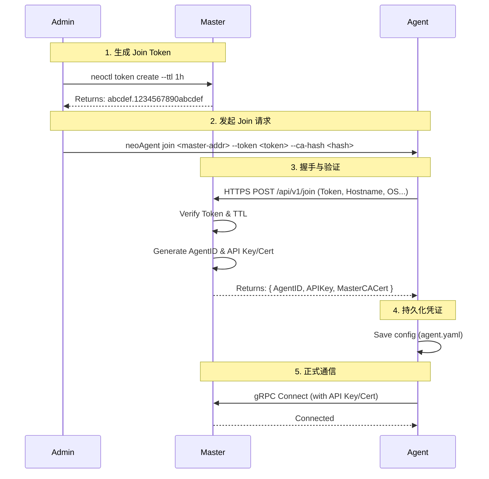

# NeoAgent 注册与接入流程说明 v1.0

## 1. 概述

本文档定义了 NeoAgent 接入 Master 集群的标准流程。
Agent 接入采用 **Join Token** 机制，旨在提供简单、安全且易于自动化的注册体验。

### 1.1 核心原则
- **安全性 (Security)**: 基于 Token 的初始信任，基于 CA Hash 的服务端验证，基于专属凭证的长期通信。
- **简单性 (Simplicity)**: 一行命令完成接入，无需复杂的证书手动分发。
- **自动化 (Automation)**: 支持无人值守的批量部署。

---

## 2. 接入流程 (The Join Flow)

### 2.1 角色定义
- **Master**: 集群控制节点，负责生成 Token、验证 Agent、颁发凭证。
- **Agent**: 待接入的扫描节点，持有 Token 向 Master 发起请求。

### 2.2 流程图



---

## 3. 命令行接口 (CLI)

### 3.1 命令格式

```bash
neoAgent join <master-address> [flags]
```

### 3.2 参数说明

| 参数 | 简写 | 必选 | 说明 | 示例 |
| :--- | :--- | :--- | :--- | :--- |
| `master-address` | - | **Yes** | Master 节点的地址 (IP:Port) | `192.168.1.100:8080` |
| `--token` | `-t` | **Yes** | 加入集群的认证令牌 | `abcdef.1234567890abcdef` |
| `--ca-cert-hash` | - | No | Master CA 证书的 SHA256 哈希，用于防中间人攻击 | `sha256:7c...` |
| `--name` | `-n` | No | 指定 Agent 名称，不填自动生成 | `scanner-node-01` |
| `--group` | `-g` | No | 指定加入的 Agent 分组 | `default` |
| `--tags` | - | No | 节点标签，用于任务调度 (逗号分隔) | `aws,gpu,high-perf` |
| `--advertise-addr` | - | No | Agent 自身的广播地址，用于 Master 回连 | `10.0.0.5:8081` |

### 3.3 示例

**标准接入（推荐）**:
```bash
./neoAgent join 192.168.1.100:8080 \
  --token abcdef.1234567890abcdef \
  --ca-cert-hash sha256:e3b0c44298fc1c149afbf4c8996fb92427ae41e4649b934ca495991b7852b855
```

**不验证 CA 接入（仅限可信内网）**:
```bash
./neoAgent join 192.168.1.100:8080 --token abcdef.1234567890abcdef --insecure-skip-verify
```

---

## 4. 协议细节 (Protocol Details)

### 4.1 Join 请求
- **Method**: `POST`
- **URL**: `https://<master-addr>/api/v1/auth/join`
- **Content-Type**: `application/json`

**Request Body**:
```json
{
  "token": "abcdef.1234567890abcdef",
  "hostname": "scanner-node-01",
  "os": "linux",
  "arch": "amd64",
  "version": "v1.0.0",
  "tags": ["cloud", "region-us"],
  "advertise_addr": "10.0.0.5:8081",
  "group": "default"
}
```

### 4.2 Join 响应

**Response Body (Success 200)**:
```json
{
  "code": 0,
  "msg": "success",
  "data": {
    "agent_id": "agent-uuid-550e8400-e29b",
    "auth_type": "api_key",
    "api_key": "neo_agt_sk_xxxxxxxxxxxx",
    "master_ca_cert": "-----BEGIN CERTIFICATE-----\n..."
  }
}
```

### 4.3 错误码

| HTTP Code | Error Code | 说明 | 处理建议 |
| :--- | :--- | :--- | :--- |
| 401 | `AUTH_INVALID_TOKEN` | Token 无效或不存在 | 检查 Token 拼写 |
| 401 | `AUTH_TOKEN_EXPIRED` | Token 已过期 | 申请新 Token |
| 409 | `AGENT_ALREADY_EXISTS` | Agent 名称或 ID 冲突 | 更换名称或清理旧数据 |
| 403 | `AUTH_PERM_DENIED` | IP 被黑名单拦截 | 检查 Master 防火墙 |

---

## 5. 安全性设计 (Security Considerations)

### 5.1 Token 生命周期
- Token 仅用于**首次握手**。
- Token 具有较短的有效期（默认 24 小时）。
- Token 验证成功后，Master 立即颁发长期有效的 `API Key` 或 `Client Certificate`。
- 后续通信**不再依赖** Token。

### 5.2 防中间人攻击 (MITM Protection)
- Agent 在连接 Master 时，如果提供了 `--ca-cert-hash`，会计算 Master 返回的 TLS 证书公钥的 SHA256 值并进行比对。
- 如果不匹配，Agent **必须** 立即终止连接并报错。

### 5.3 凭证存储
- Agent 接收到 `API Key` 后，应将其加密存储在本地配置文件（如 `config.yaml`）或系统的 Keyring 中。
- 配置文件权限应严格限制（如 Linux 下 `600`）。
