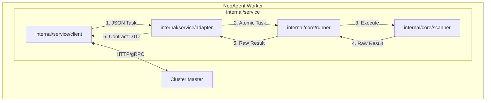

# Agent Server 重构与集群适配方案 (Phase 4.2)

## 1. 核心愿景

**"Don't call us, we'll call you."**

当前的 `cmd/agent/server.go` 是一个被动的 HTTP Server，这在 NAT 后或防火墙后的网络环境中是不可用的。
新的 Server 模式将重构为 **Active Worker (主动工作节点)**。它不再监听端口等待指令，而是主动向 Master 注册并拉取任务。

同时，我们必须纠正一个关键的架构误区：
*   **CLI 模式**: 使用 `Pipeline`。这是为了给人类用户提供"一键式"的自动化体验 (Alive -> Port -> Service)。
*   **Server 模式**: **不使用 Pipeline**。Server 是 Master 的机械臂。Master 负责编排（Orchestration），Worker 负责执行原子操作（Atomic Execution）。Worker 应该直接调用 `core/runner` 执行原子能力，保持最大的灵活性。

---

## 2. 架构设计

### 2.1 整体架构图



### 2.2 核心组件职责

1.  **`service.Client` (通信层)** (原 Communication)
    *   负责与 Master 的网络交互：注册 (Register)、心跳 (Heartbeat)、拉取任务 (Fetch)、上报结果 (Report)。
    *   处理认证 (Token) 和加密。
    *   实现长轮询 (Long Polling) 或 WebSocket 以保证实时性。

2.  **`service.Adapter` (防腐层/适配层)**
    *   **Inbound (Task)**: 将 Master 的 JSON 任务转换为 `internal/core/model.Task`。
    *   **Outbound (Result)**: 将内部的 `ScanResult` 转换为符合 `Master与Agent数据传递契约.md` 的强类型 DTO。
    *   **DTO 存放位置**: `internal/model/adapter` (作为纯数据结构，放在 model 层更合适，避免循环依赖)。

3.  **`core.Runner` (执行引擎)**
    *   **统一入口**: CLI 和 Server 模式**共用**同一个 `RunnerManager`。
    *   **区别**: 仅仅是任务输入的来源不同 (CLI Flags vs Adapter) 和结果输出的去向不同 (Console vs Adapter)。
    *   Server 模式下，直接调用 `runner.NewManager().Execute(task)`，不需要额外的 Engine 封装。

---

## 3. 数据契约实现方案

为了解决 "TaskResult 弱类型" 和 "契约丢失" 的问题，我们将严格遵循 **DTO (Data Transfer Object)** 模式。

### 3.1 目录结构

```text
internal/
├── core/
│   ├── runner/          # [核心] 任务调度与执行器 (CLI与Server共用)
│   └── scanner/         # [核心] 原子扫描能力
│
├── model/
│   └── adapter/         # [契约] DTO 定义 (严格对应 Master 契约)
│       ├── common.go
│       ├── alive.go     # IpAlive DTO
│       ├── port.go      # PortScan DTO
│       └── ...
│
└── service/             # [应用] Server模式业务逻辑
    ├── client/          # [通信] Master Client (原 communication)
    ├── adapter/         # [适配] 转换逻辑 (Translator)
    └── task/            # [循环] Worker 主循环 (AgentTaskService)
```

### 3.2 Payloads DTO 定义示例

根据 `Master与Agent数据传递契约.md`，我们在 `internal/model/adapter` 包中定义结构体。

```go
// internal/model/adapter/port.go

package adapter

// PortScanAttributes 对应 contract 中的 attributes
type PortScanAttributes struct {
    Ports   []PortInfo      `json:"ports"`
    Summary PortScanSummary `json:"summary"`
}

type PortInfo struct {
    IP          string `json:"ip"`
    Port        int    `json:"port"`
    Proto       string `json:"proto"`
    State       string `json:"state"`
    ServiceHint string `json:"service_hint,omitempty"`
    Banner      string `json:"banner,omitempty"`
}
```

### 3.3 Adapter 转换逻辑

Adapter 负责将内部丰富的数据结构 "降维" 或 "格式化" 为外部需要的 DTO。

```go
// internal/service/adapter/translator_result.go

import "neoagent/internal/model/adapter"

func ToMasterResult(taskID string, internalRes *model.TaskResult) (*model.TaskResult, error) {
    // ...
    
    switch internalRes.Type {
    case model.TaskTypePortScan:
        // 转换为 DTO
        attr := adapter.PortScanAttributes{
            Ports: make([]adapter.PortInfo, 0),
        }
        // ... 填充逻辑
        attributes = attr
    }
    
    // ...
}
```

---

## 4. Server 运行流程 (伪代码)

```go
// internal/service/task/agent_task.go (Worker Loop)

func (s *AgentTaskService) Run() {
    // 1. 注册
    if err := s.client.Register(); err != nil {
        // ...
    }
    
    // 2. 工作循环
    for {
        // 2.1 拉取任务
        rawTask, err := s.client.FetchTask()
        if err != nil {
            continue
        }
        
        // 2.2 适配任务 (Inbound)
        coreTask := s.translator.ToCoreTask(rawTask)
        
        // 2.3 执行任务 (直接调用 Core Runner)
        runnerMgr := runner.NewManager()
        result := runnerMgr.Execute(context.Background(), coreTask)
        
        // 2.4 适配结果 (Outbound)
        masterResult, err := s.translator.ToMasterResult(rawTask.ID, result)
        
        // 2.5 上报
        s.client.Report(masterResult)
    }
}
```

---

## 5. 执行计划

### Step 1: 契约固化 (Payloads)
*   **动作**: 创建 `internal/model/adapter`。
*   **内容**: 将 `Master与Agent数据传递契约.md` 中的所有 JSON Schema 翻译为 Go Struct。

### Step 2: 适配层完善 (Adapter)
*   **动作**: 完善 `internal/service/adapter`。
*   **内容**:
    *   复用并完善现有的 `ToCoreTask` (translator.go)。
    *   新增 `ToMasterResult`，实现 Result -> DTO 的转换。

### Step 3: 客户端完善 (Client)
*   **动作**: 完善 `internal/service/client`。
*   **内容**: 实现 `MasterClient` 接口中的 HTTP 请求逻辑。

### Step 4: Worker 主循环 (Task Service)
*   **动作**: 完善 `internal/service/task`。
*   **内容**: 实现 `AgentTaskService`，将 Client, Adapter, Runner 串联起来。

### Step 5: 入口替换 (Server Cmd)
*   **动作**: 修改 `cmd/agent/server.go`。
*   **内容**: 初始化 `AgentTaskService` 并启动。

---

## 6. 总结

*   **Core 纯洁性**: `core` 目录保持纯净，不包含任何 worker/communication 逻辑。
*   **Service 复用**: 充分利用 `internal/service` 既有结构，避免重复造轮子。
*   **Runner 统一**: CLI 和 Server 统一使用 `core/runner`，仅输入输出源不同。
*   **DTO 位置**: 契约 DTO 放在 `internal/model/adapter`，作为纯数据结构，符合分层原则。
