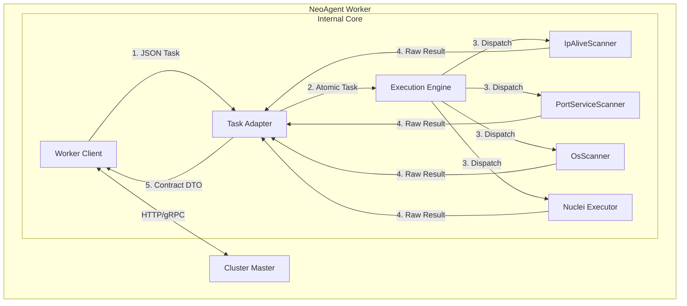

# Agent Server 重构与集群适配方案 (Phase 4.2)

## 1. 核心愿景

**"Don't call us, we'll call you."**

当前的 `cmd/agent/server.go` 是一个被动的 HTTP Server，这在 NAT 后或防火墙后的网络环境中是不可用的。
新的 Server 模式将重构为 **Active Worker (主动工作节点)**。它不再监听端口等待指令，而是主动向 Master 注册并拉取任务。

同时，我们必须纠正一个关键的架构误区：
*   **CLI 模式**: 使用 `Pipeline`。这是为了给人类用户提供"一键式"的自动化体验 (Alive -> Port -> Service)。
*   **Server 模式**: **不使用 Pipeline**。Server 是 Master 的机械臂。Master 负责编排（Orchestration），Worker 负责执行原子操作（Atomic Execution）。Worker 应该直接调用 `PortScanner`、`NucleiExecutor` 等原子能力，保持最大的灵活性。

---

## 2. 架构设计

### 2.1 整体架构图



### 2.2 核心组件职责

1.  **`worker.Client` (通信层)**
    *   负责与 Master 的网络交互：注册 (Register)、心跳 (Heartbeat)、拉取任务 (Fetch)、上报结果 (Report)。
    *   处理认证 (Token) 和加密。
    *   实现长轮询 (Long Polling) 或 WebSocket 以保证实时性。

2.  **`worker.Adapter` (防腐层/适配层)**
    *   **Inbound (Task)**: 将 Master 的 JSON 任务转换为 `internal/core/model.Task`。
    *   **Outbound (Result)**: 将内部的 `ScanResult` 转换为符合 `Master与Agent数据传递契约.md` 的强类型 DTO。
    *   **作用**: 隔离外部变化。Master 协议变了，只改 Adapter，不动 Core。

3.  **`worker.Engine` (执行引擎)**
    *   维护所有原子 Scanner 的实例 (单例模式)。
    *   不包含业务编排逻辑，只负责路由：`TaskType == "port_scan"` -> `PortServiceScanner.Run()`。

---

## 3. 数据契约实现方案

为了解决 "TaskResult 弱类型" 和 "契约丢失" 的问题，我们将严格遵循 **DTO (Data Transfer Object)** 模式。

### 3.1 目录结构

```text
internal/core/worker/
├── client/          # HTTP 通信
├── adapter/         # 转换逻辑
├── engine/          # 任务分发
└── payloads/        # DTO 定义 (严格对应 Master 契约)
    ├── common.go
    ├── alive.go     # IpAlive DTO
    ├── port.go      # PortScan DTO
    └── ...
```

### 3.2 Payloads DTO 定义示例

根据 `Master与Agent数据传递契约.md`，我们在 `payloads` 包中定义结构体。这相当于 Go 语言版本的契约文档。

```go
// internal/core/worker/payloads/port.go

// PortScanAttributes 对应 contract 中的 attributes
type PortScanAttributes struct {
    Ports   []PortInfo      `json:"ports"`
    Summary PortScanSummary `json:"summary"`
}

type PortInfo struct {
    IP          string `json:"ip"`
    Port        int    `json:"port"`
    Proto       string `json:"proto"`
    State       string `json:"state"`
    ServiceHint string `json:"service_hint,omitempty"`
    Banner      string `json:"banner,omitempty"`
}
```

### 3.3 Adapter 转换逻辑

Adapter 负责将内部丰富的数据结构 "降维" 或 "格式化" 为外部需要的 DTO。

```go
// internal/core/worker/adapter/result.go

func ToMasterResult(taskID string, internalRes *model.TaskResult) (*model.TaskResult, error) {
    // 1. 准备顶层结构
    masterRes := &model.TaskResult{
        TaskID: taskID,
        Status: "completed",
        Result: make(map[string]interface{}),
    }
    
    var attributes interface{}

    // 2. 根据类型进行转换
    switch internalRes.Type {
    case model.TaskTypePortScan:
        // 将 internalRes.Result (可能是一个复杂的 struct) 转换为 payloads.PortScanAttributes
        attr := payloads.PortScanAttributes{
            Ports: make([]payloads.PortInfo, 0),
        }
        
        // 假设 internalRes.Data 是 []model.PortResult
        if results, ok := internalRes.Data.([]model.PortResult); ok {
            for _, r := range results {
                attr.Ports = append(attr.Ports, payloads.PortInfo{
                    IP:    r.IP,
                    Port:  r.Port,
                    Proto: "tcp",
                    State: "open",
                    // ...
                })
            }
        }
        attributes = attr
        
    // ... 其他类型
    }

    // 3. 序列化为 Map (为了符合 map[string]interface{} 签名，或者直接修改 model 支持 interface{})
    // 推荐：将 model.TaskResult.Result 改为 interface{} 类型，或者在此处 Marshal 后再 Unmarshal
    // 为了性能，建议 Master 通信层直接接受 interface{}
    
    masterRes.Result["attributes"] = attributes
    masterRes.Result["evidence"] = map[string]interface{}{
        "raw_output": "...", // 可选
    }

    return masterRes, nil
}
```

---

## 4. Server 运行流程 (伪代码)

```go
// cmd/agent/server.go

func runServer() {
    // 1. 初始化核心组件
    // 注意：这里初始化的是原子 Scanner，而不是 AutoRunner
    portScanner := port_service.NewPortServiceScanner()
    aliveScanner := alive.NewIpAliveScanner()
    // ...
    
    engine := worker.NewEngine(portScanner, aliveScanner, ...)
    client := worker.NewClient(viper.GetString("master.address"), viper.GetString("auth.token"))
    
    // 2. 注册
    if err := client.Register(); err != nil {
        log.Fatal("Register failed")
    }
    
    // 3. 进入工作循环
    for {
        // 3.1 拉取任务 (阻塞或轮询)
        rawTask, err := client.FetchTask()
        if err != nil {
            time.Sleep(5 * time.Second)
            continue
        }
        
        // 3.2 适配任务
        coreTask, err := adapter.ToCoreTask(rawTask)
        if err != nil {
            client.ReportError(rawTask.ID, err)
            continue
        }
        
        // 3.3 执行任务 (原子能力)
        // Engine 根据 TaskType 路由到具体的 Scanner
        result, err := engine.Execute(coreTask)
        
        // 3.4 适配结果
        masterResult, err := adapter.ToMasterResult(rawTask.ID, result)
        
        // 3.5 上报
        client.Report(masterResult)
    }
}
```

---

## 5. 执行计划

### Step 1: 契约固化 (Payloads)
*   **动作**: 创建 `internal/core/worker/payloads`。
*   **内容**: 将 `Master与Agent数据传递契约.md` 中的所有 JSON Schema 翻译为 Go Struct。
*   **验收**: 所有的 JSON 字段都有对应的 Go 字段，且 tag 正确。

### Step 2: 适配层实现 (Adapter)
*   **动作**: 创建 `internal/core/worker/adapter`。
*   **内容**: 实现 `ToCoreTask` 和 `ToMasterResult`。
*   **注意**: 这里需要处理不同 Scanner 输出格式的差异，统一清洗数据。

### Step 3: 引擎与客户端 (Engine & Client)
*   **动作**: 创建 `internal/core/worker/client` 和 `internal/core/worker/engine`。
*   **内容**: 实现 HTTP 通信和 Scanner 路由逻辑。

### Step 4: 入口替换 (Server Cmd)
*   **动作**: 修改 `cmd/agent/server.go`。
*   **内容**: 废弃旧的 `agent.App`，替换为新的 Worker Loop。

---

## 6. 总结

*   **Pipeline** 是给**人**用的 (CLI)。
*   **Atomic Scanner** 是给**机器** (Master) 用的 (Server)。
*   **Adapter + DTO** 是连接两者的桥梁，确保我们 "Never Break the Contract"。
