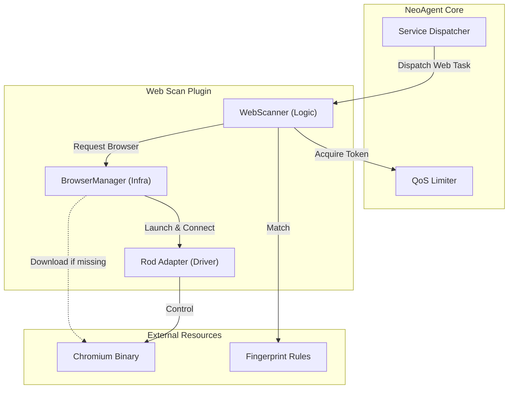

# NeoScan Web 扫描集成方案 (借鉴 SweetBabyScan)

## 1. 核心决策分析

### 1.1 为什么选择 Headless Browser (go-rod)?
传统的 HTTP Client (如 `net/http` 或 `resty`) 只能获取静态 HTML 源码。现代 Web 应用 (SPA/Vue/React) 高度依赖 JavaScript 动态渲染，导致传统扫描器存在以下盲区：
*   **指纹丢失**: 许多关键指纹（如 `window.app.version`）仅存在于 JS 堆栈或动态 DOM 中。
*   **截图失败**: 无法获取页面渲染后的视觉快照。
*   **交互限制**: 无法处理需要 JS 计算的跳转或验证。

**结论**: 引入 `go-rod` 是解决 "真问题" 的唯一途径，但必须作为**可选的重型插件**，而非强制依赖。

### 1.2 架构权衡 (Trade-off)
| 维度 | 传统 HTTP 扫描 | Headless Browser 扫描 | NeoScan 策略 |
| :--- | :--- | :--- | :--- |
| **体积** | < 10MB | > 100MB (含 Chromium) | **Lazy Load (按需下载)** |
| **内存** | ~10MB/并发 | ~100MB/并发 | **严格 QoS 流控 (低并发)** |
| **速度** | 毫秒级 | 秒级 | **分级扫描 (先 HTTP 后 Browser)** |

---

## 2. 架构设计 (Hexagonal Plugin Architecture)

我们采用 **"核心-插件"** 分离的架构，确保 NeoAgent 核心二进制保持轻量。



### 2.1 目录结构规划
```text
neoAgent/
├── internal/
│   ├── core/
│   │   ├── scanner/
│   │   │   ├── web/                # [新增] Web 扫描模块
│   │   │   │   ├── web_scanner.go  # 扫描器入口 (实现 Scanner 接口)
│   │   │   │   ├── fingerprint.go  # 指纹识别逻辑 (Wappalyzer 适配)
│   │   │   │   ├── screenshot.go   # 截图逻辑
│   │   │   │   └── types.go        # WebInfo, Screenshot 等数据结构
│   │   │   └── ...
│   │   └── lib/
│   │       ├── browser/            # [新增] 浏览器管理库 (Infrastructure)
│   │       │   ├── manager.go      # BrowserManager (下载、路径管理)
│   │       │   ├── launcher.go     # Chromium 启动参数配置 (Headless, Sandbox)
│   │       │   ├── rod_adapter.go  # go-rod 封装 (Page, Navigate, Eval)
│   │       │   └── process.go      # 进程组管理 (清理僵尸进程)
│   │       └── ...
│   └── pkg/
│       └── fingerprint/            # [新增] 通用指纹库 (可复用于非 Scanner 场景)
│           ├── rules/              # 内置 JSON 规则
│           └── matcher.go          # 规则匹配引擎
└── .neoagent/                      # [运行时]
    ├── bin/
    │   └── chromium/               # 自动下载的 Chromium 二进制
    └── rules/
        └── wappalyzer.json         # 外部规则文件
```

### 2.2 核心组件
1.  **BrowserManager (基础设施)**
    *   **职责**: 管理 Chromium 生命周期。
    *   **关键特性**:
        *   **Lazy Load**: 首次使用时自动检测环境，若缺失则从国内源/官方源下载。
        *   **Path Isolation**: 下载到 `.neoagent/bin/`，不污染系统路径。
        *   **Process Group**: 确保 Agent 退出时强制清理所有僵尸 Chrome 进程。

2.  **WebScanner (业务逻辑)**
    *   **职责**: 执行具体的扫描流程。
    *   **分级策略**:
        *   **L1 (Fast)**: 纯 HTTP 请求，获取 Header/Static HTML。
        *   **L2 (Deep)**: 启动 Browser，获取 DOM、执行 JS 提取变量、计算 Favicon Hash。
        *   **L3 (Visual)**: 全屏截图。

3.  **RodAdapter (驱动适配)**
    *   **职责**: 封装 `go-rod` 细节，提供统一接口 (`Navigate`, `Screenshot`, `Eval`)。

### 2.3 指纹规则标准 (Fingerprint Standard)

**决策**: 采用 **Wappalyzer** 标准作为 Agent 与 Master 交互的唯一指纹格式。

*   **Master 职责**: 规则中台。
    *   维护全量规则库。
    *   将第三方规则（如 Ehole/Goby/自定义正则）**吸纳并转化**为 Wappalyzer JSON 格式。
    *   通过 API 将清洗后的规则下发给 Agent。
*   **Agent 职责**: 执行引擎。
    *   不处理复杂的规则转换，只识别 Wappalyzer 格式。
    *   利用 `pkg/matcher` 实现通用的逻辑匹配。
    *   利用 `go-rod` 提取 DOM/JS/Meta 等多维度数据供匹配引擎使用。

---

## 3. 实施路线图 (Roadmap)

### Phase 1: 基础设施建设 (Infra)
*   [ ] 实现 `BrowserManager`，复用 `sbscan` 的下载逻辑但增强路径管理。
*   [ ] 实现 `Process Group` 信号处理，防止僵尸进程。
*   [ ] 验证 Linux 无 GUI 环境下的运行 (Xvfb/Headless)。

### Phase 2: 核心能力建设 (Capability)
*   [ ] 实现 `WebScanner` 基础框架。
*   [ ] 移植 Wappalyzer / FingerprintHub 规则库解析器。
*   [ ] 实现截图功能 (`CaptureScreenshot`)。

### Phase 3: 集成与优化 (Optimization)
*   [ ] 集成到 `ServiceDispatcher`，实现 `scan run` 流程自动触发。
*   [ ] 配置独立的 QoS 策略 (建议默认并发 <= 5)。

---

## 4. 关键差异点 (NeoScan vs SbScan)

| 特性 | SweetBabyScan (参考) | NeoScan (改进方案) |
| :--- | :--- | :--- |
| **浏览器获取** | 每次运行检查，依赖网络 | **Cache + Version Check**。首次下载后复用，支持离线包分发。 |
| **并发模型** | 协程池 (Goroutine Pool) | **QoS 动态流控 (AIMD)**。根据 CPU/内存负载动态调整并发，防止服务器卡死。 |
| **指纹库** | 硬编码/内置规则 | **规则引擎分离**。采用 Wappalyzer 标准，支持加载外部 JSON 规则库，便于更新。 |
| **进程管理** | 基础管理 | **进程组管理 (Process Group)**。更严格的资源回收机制。 |

## 5. 范围界定 (Scope)

*   **Web Scan (本方案)**:
    *   目标: "这是什么？" (指纹, 截图, 标题)
    *   性质: 无害, 信息收集
*   **Vuln Scan (未来规划)**:
    *   目标: "有什么漏洞？" (Nuclei, POC)
    *   性质: 有攻击性, 依赖 Web Scan 结果
