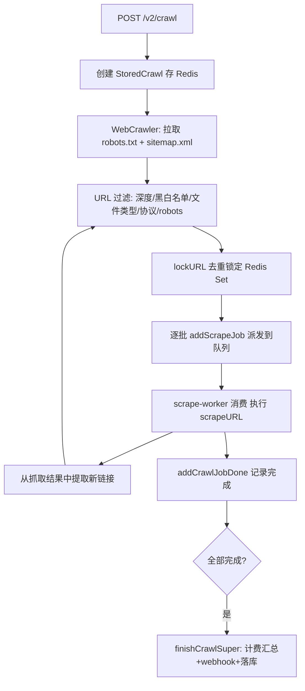

# Firecrawl 项目概览

> 分析基准：仓库当前主干代码（monorepo），重点聚焦 `apps/api`（核心爬虫/API/Worker 服务）。

## 1. 项目定位

Firecrawl 是一个 **"把整个 Web 变成 LLM 可用数据"** 的 API 化产品，对外提供：

- **Search**：搜索 + 结果全文抓取
- **Scrape**：单 URL 抓取，输出 Markdown / HTML / JSON / 截图 / 结构化数据
- **Crawl**：整站爬取（自动发现链接、去重、限速、断点续爬）
- **Map**：站点 URL 秒级发现（不抓正文，只拿链接图）
- **Batch Scrape**：批量并发抓取
- **Extract / Agent**：基于 LLM 的自然语言驱动信息抽取（"告诉我要什么数据"而不是"告诉我 CSS 选择器"）
- **Interact**：抓取后对页面进行 AI/代码驱动的二次交互（点击、搜索、截屏）
- **Deep Research**：多轮"搜索-抓取-总结-再搜索"的自动化调研 Agent

商业模式是 **"开源 + 云服务"**：核心引擎 AGPL-3.0 开源可自托管，云端版本（firecrawl.dev）叠加了反爬引擎 Fire-Engine、全网索引缓存、企业级鉴权与计费、威胁情报等闭源能力。这个"开源骨架 + 闭源引擎"的架构本身就是值得借鉴的商业设计。

## 2. Monorepo 结构

```
firecrawl/
├── apps/
│   ├── api/                # 核心：Express API + Worker + 爬虫引擎（TypeScript，含 Rust/NAPI 原生模块）
│   ├── playwright-service-ts/  # 独立的 Playwright 渲染微服务
│   ├── go-html-to-md-service/  # Go 实现的 HTML→Markdown 转换微服务
│   ├── nuq-postgres/        # 自研队列的 Postgres schema
│   ├── redis/                # Redis 部署配置
│   ├── ui/ingestion-ui/      # 管理后台前端
│   ├── test-suite/           # 端到端测试套件（"snips"）
│   ├── *-sdk/                 # 10 种语言的官方 SDK：JS/Python/Go/Java/Rust/Ruby/PHP/.NET/Elixir
│   └── siem/azure-sentinel/   # SIEM 集成模板
```

**技术栈要点**（`apps/api/package.json`）：

| 维度 | 选型 |
|---|---|
| 语言/运行时 | TypeScript（Node.js）+ Rust（NAPI 原生扩展 `@mendable/firecrawl-rs`） |
| Web 框架 | Express 5 |
| 队列/并发 | BullMQ（Redis）→ 正在自研迁移到 **NuQ**（基于 FoundationDB 的分布式队列） |
| 数据库 | Postgres（业务数据）+ FoundationDB（新队列） + ClickHouse（日志分析） |
| 缓存 | Redis / Dragonfly（多用途：去重、限流、索引缓存、分布式锁） |
| 渲染引擎 | Fire-Engine（闭源，Chrome CDP + TLS Client）、Playwright（自托管备选） |
| AI SDK | Vercel AI SDK（`ai` 包），多模型可插拔（OpenAI/Anthropic/Google/Groq/xAI/Ollama...） |
| 存储 | Google Cloud Storage（页面快照、索引文档） |
| 可观测性 | OpenTelemetry + Sentry + Prometheus + ClickHouse |
| 计费 | Autumn（信用计费 SaaS） |
| 对象序列化校验 | Zod 4 |

## 3. `apps/api/src` 目录职责速览

```
src/
├── controllers/       # HTTP 层：v0(遗留)/v1(遗留)/v2(当前)，每个版本独立维护，只做参数校验+委派
├── routes/            # 路由挂载
├── scraper/
│   ├── scrapeURL/      # 单URL抓取的核心管线：engines(多引擎) + transformers(后处理) + lib
│   ├── crawler / WebScraper/  # 整站爬取：链接发现、robots.txt、sitemap、去重过滤
├── services/
│   ├── worker/          # Worker 运行时：nuq(新队列)/nuq-fdb(FoundationDB实现)/team-semaphore(并发限流)
│   ├── billing/          # 信用计费
│   ├── indexing/         # 全网缓存索引写入
│   ├── monitoring/       # 页面变更监控（change tracking 产品线）
│   ├── webhook/          # Webhook 投递
│   └── siem-logging/     # 安全审计日志
├── lib/
│   ├── extract/          # LLM 结构化抽取（含历史版本 fire-0 兼容层）
│   ├── deep-research/    # 深度调研 Agent
│   ├── threat-protection/ # 恶意域名/威胁情报拦截（Google Web Risk、Zscaler）
│   ├── deterministicJson/ # 「确定性 JSON」抽取管线（不依赖 LLM 随机性）
│   └── generate-llmstxt/  # 生成 llms.txt 站点摘要
├── db/schema/           # Drizzle ORM schema
└── native/              # Rust 源码：HTML 解析、链接抽取、PDF/DOCX 文档解析、爬虫过滤规则
```

## 4. 核心数据流（一次 `scrape` 请求）

```mermaid
flowchart LR
    A[HTTP 请求 /v2/scrape] --> B[controllers/v2: 参数校验 Zod]
    B --> C{同步/异步}
    C -->|同步| D[直接入队 + 等待]
    C -->|异步/crawl成员| E[NuQ 队列 排队]
    D --> F[scrapeURL 主管线]
    E --> F
    F --> G[buildFallbackList 选择引擎优先级]
    G --> H[多引擎 竞速+瀑布 尝试]
    H --> I[质量判定 isLongEnough/isGoodStatusCode]
    I -->|失败| G
    I -->|成功| J[postprocessors 后处理]
    J --> K[transformers: markdown/llmExtract/diff/deterministicJson...]
    K --> L[写入索引缓存 GCS+Postgres]
    L --> M[计费 billTeam]
    M --> N[返回/Webhook/落库]
```



## 5. 核心数据流（一次 `crawl` 请求）



## 6. 面向自研爬虫的关键借鉴点（详见另外三份文档）

1. **多引擎瀑布 + 竞速调度**（`scrapeURL/engines/index.ts`）：不是简单的"重试"，而是按质量分数排序、并行竞速、超时接力的复合策略。
2. **全网索引缓存**：把"抓过的页面"当作可复用资产，三级缓存（内存/Dragonfly/Postgres+GCS）+ 负缓存，大幅降低重复抓取成本。
3. **URL 去重的工程细节**：排列组合归一化（www/协议/index.html等等价形式）、Redis Set 原子锁定、按团队维度限流。
4. **错误分类体系**：`TransportableError` 让"可序列化传输的业务错误"贯穿队列/进程边界，而不是丢失堆栈变成"unknown error"。
5. **自研队列演进**：从 BullMQ(Redis) 到 NuQ(FoundationDB)，为解决 Redis 队列在超大规模下的可靠性问题而做的架构演进，具有很强的参考价值。
6. **反爬对抗分层**：普通 fetch → TLS 指纹客户端 → 无头浏览器 CDP → 无头浏览器 stealth 代理，按"够用就好、不够再升级"的成本递增策略选择引擎。
7. **AI 抽取工程化**：schema 递归检测自动选模型、多页抽取结果的来源追踪与去重合并、"确定性 JSON"管线减少 LLM 依赖。

详见：
- `项目亮点.md` —— 独立成点的技术亮点清单
- `项目实现原理.md` —— 关键子系统的实现细节剖析
- `爬虫借鉴指南.md` —— 面向你自己爬虫项目的可落地改造建议
