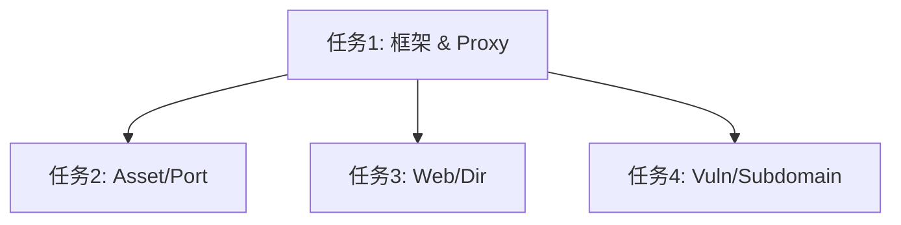

# 任务拆分文档 - [NeoAgent 核心指令集建设]

## 任务列表

### 任务1：基础 Options 框架与 Proxy 实现
#### 输入契约
- 依赖：`internal/core/model/task.go`
- 输入：`Agent指令集规范.md` 中的 Proxy 参数定义。

#### 输出契约
- 代码：`internal/core/options/types.go` (接口定义)
- 代码：`internal/core/options/proxy.go` (ProxyOptions 实现)
- 代码：`cmd/agent/proxy/root.go` (Cobra 命令)
- 验证：运行 `neoAgent proxy --help` 显示正确，且能打印生成的 Task JSON。

### 任务2：基础扫描指令实现 (Asset, Port)
#### 输入契约
- 依赖：任务1完成。
- 输入：`Agent指令集规范.md` 中的 Asset/Port 参数定义。

#### 输出契约
- 代码：`internal/core/options/scan_asset.go`
- 代码：`internal/core/options/scan_port.go`
- 代码：`cmd/agent/scan/asset.go`
- 代码：`cmd/agent/scan/port.go`

### 任务3：Web 与目录扫描指令实现
#### 输入契约
- 依赖：任务1完成。
- 输入：`Agent指令集规范.md` 中的 Web/Dir 参数定义。

#### 输出契约
- 代码：`internal/core/options/scan_web.go`
- 代码：`internal/core/options/scan_dir.go`
- 代码：`cmd/agent/scan/web.go`
- 代码：`cmd/agent/scan/dir.go`

### 任务4：高级扫描指令实现 (Vuln, Subdomain)
#### 输入契约
- 依赖：任务1完成。
- 输入：`Agent指令集规范.md` 中的 Vuln/Subdomain 参数定义。

#### 输出契约
- 代码：`internal/core/options/scan_vuln.go`
- 代码：`internal/core/options/scan_subdomain.go`
- 代码：`cmd/agent/scan/vuln.go`
- 代码：`cmd/agent/scan/subdomain.go`

## 依赖关系图

