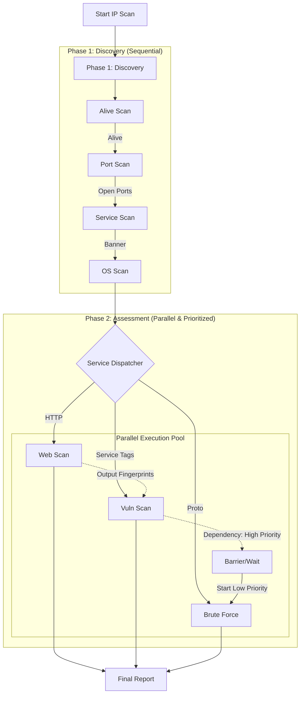

# 系统设计文档 - 全流程并行编排升级 (Phase 4.1)

## 1. 架构概览

### 1.1 整体流程图 (v2.0)



## 2. 核心组件设计

### 2.1 ServiceDispatcher (`internal/core/pipeline/dispatcher.go`)

**接口定义**:
```go
type Dispatcher interface {
    // Dispatch 分析上下文，生成并执行后续任务
    Dispatch(ctx context.Context, pCtx *PipelineContext)
}
```

**实现逻辑**:
1.  遍历 `pCtx.Services`。
2.  根据 Service Name (e.g., "http", "ssh") 匹配策略。
3.  生成 Task List: `webTasks`, `vulnTasks`, `bruteTasks`。
4.  执行调度逻辑 (Phase 2.1 -> Phase 2.2)。

### 2.2 PipelineContext 增强 (`internal/core/pipeline/context.go`)

需要扩展 Context 以支持存储并行任务的结果：

```go
type PipelineContext struct {
    // ... existing fields ...
    
    // Phase 2 Results (Thread-Safe)
    WebResults   []*model.TaskResult
    VulnResults  []*model.TaskResult
    BruteResults []*model.TaskResult
    
    mu sync.Mutex // 保护写入
}
```

### 2.3 AutoRunner 改造 (`internal/core/pipeline/auto_runner.go`)

**主要改动**:
- 引入 `ServiceDispatcher` 接口。
- 在 `executePipeline` 中调用 `dispatcher.Dispatch()`。
- 移除原有的硬编码 Brute 调用逻辑。

## 3. 接口契约

### 3.1 任务分发规则
| Service | Action | Priority |
| :--- | :--- | :--- |
| http/https | WebScan, VulnScan | High |
| ssh/rdp/ftp... | BruteScan | Low |
| * (All) | VulnScan (General) | High |

### 3.2 错误处理
- **Task Failure**: 单个任务失败（如 WebScan 超时）不应中断整个流程。
- **Logging**: 必须记录每个子任务的 Start/End 时间，以便验证并行性。

## 4. 目录结构变更

```
internal/core/pipeline/
├── dispatcher.go       # [New] 分发器实现
├── context.go          # [Modify] 增加结果字段
└── auto_runner.go      # [Modify] 集成 Dispatcher
```
