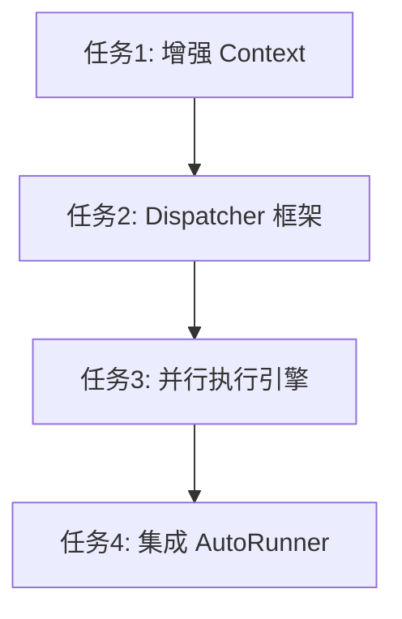

# 任务拆分文档 - 全流程并行编排升级 (Phase 4.1)

## 任务列表

### 任务1：增强 PipelineContext
#### 输入契约
- 现有 `PipelineContext` 结构体。
#### 输出契约
- 增加 `WebResults`, `VulnResults` 字段。
- 增加线程安全的 `AddWebResult`, `AddVulnResult` 方法。
#### 实现约束
- 使用 `sync.Mutex` 保护并发写入。

### 任务2：实现 ServiceDispatcher 基础框架
#### 输入契约
- `PipelineContext` (包含 Open Ports 和 Services)。
- `RunnerManager` (用于获取 Scanner)。
#### 输出契约
- `ServiceDispatcher` 结构体和 `Dispatch` 方法框架。
- 能够解析 Service Map 并打印 "拟分发任务" 的日志。
#### 实现约束
- 此时不执行真实扫描，仅做逻辑分发验证。

### 任务3：实现并行执行引擎 (Phase 2 Logic)
#### 输入契约
- 任务列表 (`webTasks`, `vulnTasks`, `bruteTasks`)。
#### 输出契约
- 使用 `sync.WaitGroup` 并行执行 Web/Vuln 任务。
- `Wait()` 后执行 Brute 任务。
- 结果回写到 `PipelineContext`。
#### 实现约束
- 必须验证 Web/Vuln 是并行执行的（通过日志时间戳）。

### 任务4：集成 AutoRunner
#### 输入契约
- `AutoRunner` 结构体。
- `ServiceDispatcher` 实例。
#### 输出契约
- `AutoRunner` 初始化时创建 `Dispatcher`。
- `executePipeline` 调用 `Dispatcher.Dispatch`。
- 移除旧的 Brute 调用代码。

## 依赖关系图

