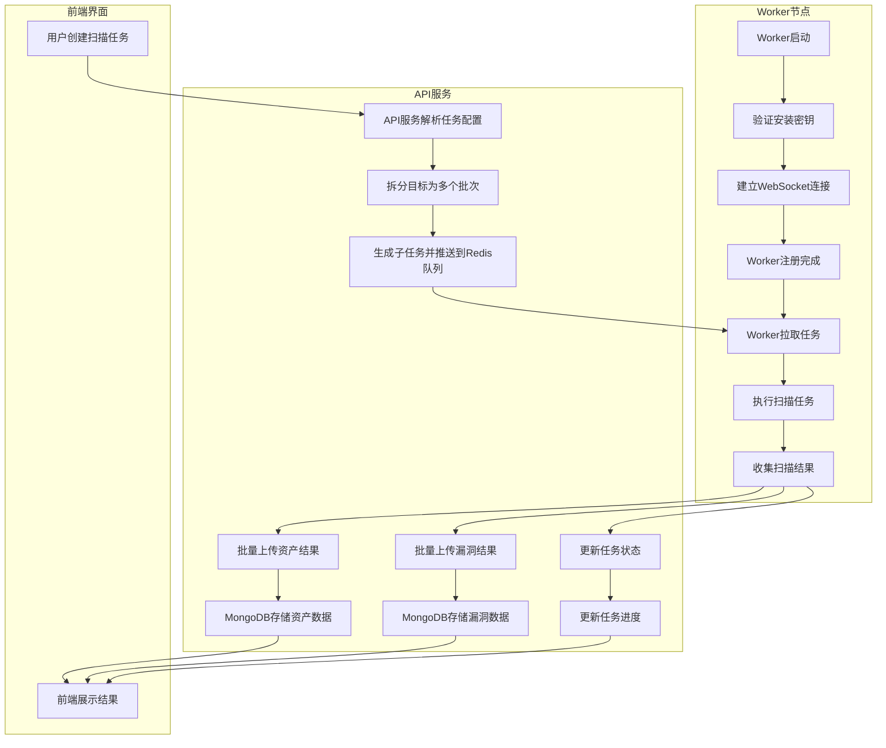

# CScan 任务流程分析

## 一、扫描任务分发机制

### 1.1 任务创建与拆分

当用户在前端界面创建扫描任务后，系统会执行以下步骤：

1. **任务解析**：API服务解析用户提交的扫描配置，包括扫描目标、启用的模块等
2. **目标拆分**：将大的扫描任务拆分成多个批次（batch），每批处理一定数量的目标
3. **子任务生成**：为每个批次生成对应的子任务，每个子任务包含完整的配置信息
4. **任务入队**：将子任务推送到Redis的任务队列中

关键代码位置：
- [api/internal/logic/tasklogic.go](cscan/api/internal/logic/tasklogic.go) 中的 `MainTaskStart` 方法
- [scheduler/scheduler.go](cscan/scheduler/scheduler.go) 中的 `PushTask` 和 `PushTaskBatch` 方法

### 1.2 任务分发策略

任务分发使用负载均衡机制，主要考虑以下因素：

1. **Worker负载**：根据Worker的CPU、内存使用情况选择合适的Worker
2. **任务优先级**：高优先级任务会被优先处理
3. **Worker专属队列**：如果任务指定了特定Worker，会推送到该Worker的专属队列
4. **公共队列**：未指定Worker的任务会被放入公共队列

关键代码位置：
- [scheduler/load_balancer.go](cscan/scheduler/load_balancer.go) 中的 `DistributeTask` 方法

## 二、Worker注册机制

### 2.1 Worker启动与验证

Worker启动时需要执行以下步骤：

1. **参数解析**：解析命令行参数，包括API服务地址、安装密钥、Worker名称等
2. **安装密钥验证**：Worker向API服务发送验证请求，携带安装密钥、Worker名称、IP、操作系统等信息
3. **连接建立**：验证通过后，Worker与API服务建立WebSocket连接
4. **认证协商**：通过WebSocket发送认证消息，包括Worker名称和安装密钥

关键代码位置：
- [cmd/worker/main.go](cscan/cmd/worker/main.go) 中的 `validateInstallKey` 函数
- [worker/wsclient.go](cscan/worker/wsclient.go) 中的 `authenticate` 方法
- [api/internal/handler/worker/wshandler.go](cscan/api/internal/handler/worker/wshandler.go) 中的 `validateInstallKey` 函数

### 2.2 安装密钥管理

1. **密钥生成**：系统首次运行时生成唯一的安装密钥
2. **密钥存储**：安装密钥存储在Redis中，键名为 `cscan:worker:install_key`
3. **密钥验证**：Worker连接时需要提供相同的安装密钥才能通过验证
4. **密钥更新**：管理员可以在后台刷新安装密钥

关键代码位置：
- [api/internal/logic/workerinstalllogic.go](cscan/api/internal/logic/workerinstalllogic.go) 中的 `GetInstallCommand` 和 `ValidateInstallKey` 方法

## 三、任务执行结果回传机制

### 3.1 结果回传格式

Worker执行任务后，将结果以特定格式回传给系统，主要包括：

1. **资产结果**：扫描发现的资产信息，包括主机、端口、服务、标题等
2. **漏洞结果**：发现的漏洞信息，包括POC文件、严重程度、URL、详情等
3. **目录扫描结果**：目录扫描发现的路径信息
4. **任务状态更新**：任务执行进度、当前阶段、执行结果等

关键代码位置：
- [api/internal/handler/worker/resulthandler.go](cscan/api/internal/handler/worker/resulthandler.go) 中的各种结果处理方法
- [worker/worker.go](cscan/worker/worker.go) 中的 `saveAssetResult` 和 `saveVulResult` 方法

### 3.2 结果回传流程

1. **结果收集**：Worker在执行扫描过程中收集各类结果
2. **批量上传**：将结果分批上传到API服务，避免单次传输大量数据
3. **数据转换**：将Worker内部数据结构转换为API服务所需的格式
4. **数据库存储**：API服务接收结果后，将其存储到MongoDB数据库
5. **状态更新**：更新任务状态和进度信息

关键代码位置：
- [worker/httpclient.go](cscan/worker/httpclient.go) 中的 `SaveTaskResult`、`SaveVulResult` 等方法
- [api/internal/handler/worker/resulthandler.go](cscan/api/internal/handler/worker/resulthandler.go) 中的 `WorkerTaskResultHandler` 和 `WorkerVulResultHandler` 方法

## 四、任务流程图



## 五、关键数据结构

### 5.1 任务信息结构
```go
type TaskInfo struct {
    TaskId      string                 // 任务ID
    MainTaskId  string                 // 主任务ID
    WorkspaceId string                 // 工作空间ID
    TaskName    string                 // 任务名称
    Config      string                 // 任务配置JSON
    Priority    int                    // 优先级
    Workers     []string               // 指定的Worker列表
    CreateTime  string                 // 创建时间
}
```

### 5.2 Worker状态结构
```go
type WorkerStatus struct {
    WorkerName           string  // Worker名称
    IP                   string  // IP地址
    CPULoad              float64 // CPU负载
    MemUsed              float64 // 内存使用率
    TaskStartedNumber    int32   // 已开始任务数
    TaskExecutedNumber   int32   // 已执行任务数
    Concurrency          int     // 并发数
    IsDaemon             bool    // 是否为守护进程
    EffectiveConcurrency int     // 实际生效的并发数
    IsThrottled          bool    // 是否被限流
    UpdateTime           string  // 更新时间
}
```

### 5.3 资产结果结构
```go
type AssetDocument struct {
    Authority  string     // 权威标识 (host:port)
    Host       string     // 主机地址
    Port       int32      // 端口号
    Category   string     // 分类
    Service    string     // 服务类型
    Title      string     // 页面标题
    App        []string   // 应用技术栈
    HttpStatus string     // HTTP状态码
    Screenshot string     // 截图路径
    IsHttp     bool       // 是否为HTTP服务
    Ipv4       []IPV4Info // IPv4信息
    Ipv6       []IPV6Info // IPv6信息
}
```

这套机制保证了任务的高效分发、Worker的安全注册和结果的可靠回传，形成了一个完整的分布式扫描系统闭环。