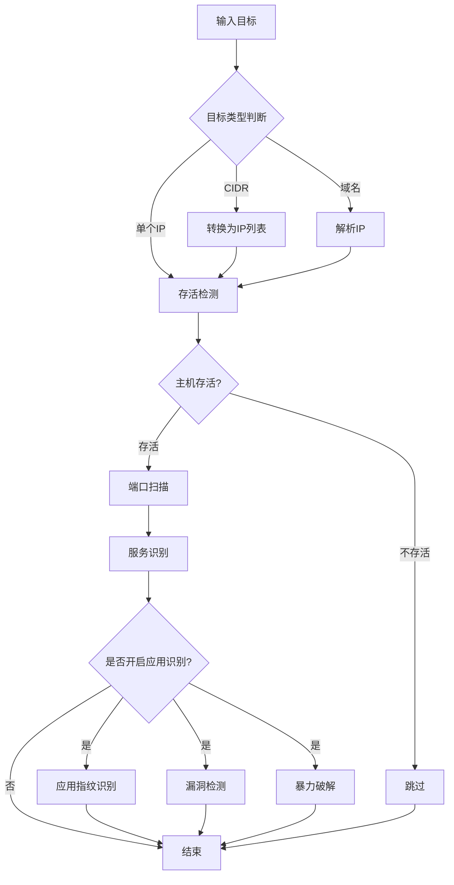

# qscan 项目分析报告

## 1. 项目概述

qscan 是一款基于 Go 语言开发的网络扫描工具，它整合了多种扫描功能，包括主机发现、端口扫描、服务识别、漏洞检测和暴力破解等。该项目模仿了 nmap 的服务探测功能，并在此基础上增加了更多实用的扫描功能。

## 2. 项目扫描思路

### 2.1 整体扫描流程



### 2.2 扫描策略

1. **多层扫描策略**：
   - 第一层：主机存活检测（ICMP Ping + TCP 端口检测）
   - 第二层：端口扫描（使用自定义探针）
   - 第三层：服务识别（基于 nmap 探针库）
   - 第四层：应用指纹识别
   - 第五层：漏洞检测和暴力破解

2. **并发扫描机制**：
   - 使用自定义任务池实现高并发
   - 支持用户自定义线程数（最大 2048）
   - 不同类型扫描器有不同的并发级别

3. **智能化扫描**：
   - 自动跳过不存活主机
   - 根据端口数量决定是否关闭主机发现
   - 支持跳过指定端口和IP

## 3. 目录结构说明

```
qscan/
├── app/                    # 应用配置层
│   ├── type-args.go       # 命令行参数定义
│   ├── type-config.go     # 应用配置
│   ├── type-csvwriter.go  # CSV输出格式
│   └── type-jsonwriter.go # JSON输出格式
├── core/                   # 核心功能模块
│   ├── appfinger/         # 应用指纹识别
│   ├── gonmap/           # 仿nmap服务识别
│   ├── hydra/            # 暴力破解模块
│   ├── pocScan/          # 漏洞扫描模块
│   ├── scanner/          # 扫描器核心
│   ├── slog/             # 日志系统
│   ├── spy/              # 网段探测
│   └── stdio/            # 输入输出处理
├── lib/                    # 基础库
│   ├── color/            # 颜色输出
│   ├── dns/              # DNS解析
│   ├── gosmb/            # SMB协议
│   ├── gotelnet/         # Telnet协议
│   ├── grdp/             # RDP协议
│   ├── misc/             # 通用工具
│   ├── osping/           # ICMP Ping
│   ├── pool/             # 并发任务池
│   ├── sflag/            # 参数解析
│   ├── simplehttp/       # HTTP客户端
│   ├── tcpping/          # TCP连接检测
│   └── uri/              # URI处理
├── run/                    # 扫描调度
│   └── run.go            # 主调度逻辑
├── SHB-qscan/            # 说明文档
├── README.md             # 项目说明
└── qscan.go              # 主入口
```

### 3.1 核心模块说明

#### 3.1.1 app 模块
- **作用**：处理应用程序配置和命令行参数
- **主要文件**：
  - [type-args.go](qscan/app/type-args.go)：定义所有命令行参数
  - [type-config.go](qscan/app/type-config.go)：应用程序配置管理

#### 3.1.2 core/gonmap 模块
- **作用**：仿照 nmap 实现的服务识别功能
- **特点**：复用了 nmap 的探针数据，在 Go 中重新实现执行逻辑
- **主要文件**：
  - [gonmap.go](qscan/core/gonmap/gonmap.go)：主初始化和配置
  - [type-nmap.go](qscan/core/gonmap/type-nmap.go)：扫描逻辑
  - [type-probe.go](qscan/core/gonmap/type-probe.go)：探针处理
  - [type-match.go](qscan/core/gonmap/type-match.go)：匹配规则

#### 3.1.3 core/scanner 模块
- **作用**：各种扫描器的实现
- **主要文件**：
  - [type-client-ip.go](qscan/core/scanner/type-client-ip.go)：IP存活扫描器
  - [type-client-port.go](qscan/core/scanner/type-client-port.go)：端口扫描器
  - [type-client-url.go](qscan/core/scanner/type-clinet-url.go)：URL扫描器

#### 3.1.4 core/pocScan 模块
- **作用**：漏洞扫描功能
- **特点**：支持 YAML 格式的 POC 规则
- **主要文件**：
  - [pocs/](qscan/core/pocScan/pocs)：存储各种漏洞检测规则
  - [POC.go](qscan/core/pocScan/POC.go)：POC执行引擎

#### 3.1.5 core/hydra 模块
- **作用**：暴力破解功能
- **支持协议**：SSH、RDP、FTP、SMB、MySQL、Oracle 等

### 3.2 基础库模块说明

#### 3.2.1 lib/pool
- **作用**：并发任务池，实现高并发扫描
- **特点**：基于 Go channel 和 goroutine 的任务队列

#### 3.2.2 lib/tcpping
- **作用**：TCP 全连接探测，用于主机存活检测
- **特点**：使用常见的端口（22, 23, 80, 139, 443, 445, 3389）进行连通性测试

#### 3.2.3 lib/osping
- **作用**：ICMP Ping 探测，用于主机存活检测

## 4. 扫描流程详细说明

### 4.1 目标处理
1. 解析输入目标（支持单个IP、CIDR网段、域名等）
2. CIDR网段通过 [uri.CIDRToIP()](qscan/lib/uri/uri.go#L226-L231) 转换为IP列表
3. 排除指定的IP地址

### 4.2 主机存活检测
1. 优先使用ICMP Ping检测
2. ICMP失败时使用TCP端口检测（常见端口）
3. 根据端口数量决定是否跳过存活检测

### 4.3 端口扫描
1. 使用自定义探针进行端口扫描
2. 仿照 nmap 的探针机制
3. 支持TCP和UDP探针

### 4.4 服务识别
1. 对开放端口发送特定探测包
2. 分析响应并匹配服务指纹
3. 识别服务类型、版本等信息

### 4.5 应用识别和漏洞检测
1. 对特定服务进行应用指纹识别
2. 执行相应的漏洞检测
3. 如开启暴力破解，则进行密码猜测

## 5. 项目特色

1. **模块化设计**：各功能模块分离，便于维护和扩展
2. **高并发**：基于 Go 的并发特性，支持大量并发任务
3. **兼容性强**：支持多种目标格式和输出格式
4. **扩展性好**：支持自定义 POC 规则和暴力破解字典
5. **智能化**：根据扫描结果动态调整后续扫描策略

这个项目充分体现了现代网络扫描工具的特点，结合了多种扫描技术和策略，为用户提供了一个功能全面的网络探测工具。