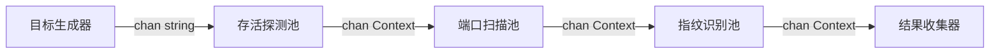

# 并发扫描优化方案：分层解耦流水线 (Stage-Decoupled Pipeline)

Sun：先搞一个线性的，等后面把各个scanner的能力补齐，都加到线性流水线中，之后再考虑并发实现

## 1. 现状与瓶颈分析

### 1.1 当前模型：垂直流水线 (Vertical Pipeline)
目前的 `AutoRunner` 采用的是"每个IP一条全流程流水线"的模式。
- **机制**：如果设置并发数 `-c 20`，系统会启动 20 个 Worker。每个 Worker 负责一个 IP 的完整生命周期（Alive -> Port -> Service -> OS）。
- **问题**：**流水线阻塞 (Head-of-Line Blocking)**。
  - 场景：扫描大网段（如 `/16`），其中大部分 IP 不存活，少数 IP 存活且开放端口。
  - 现象：
    1. Worker A 遇到存活 IP，进入耗时的端口扫描和服务识别阶段（可能耗时 10s+）。
    2. Worker A 在这 10s 内被完全占用，无法释放资源去探测其他 IP。
    3. 如果 20 个 Worker 都遇到了存活 IP，整个扫描器的发现速度就会降为 0，直到这些 Worker 完成深度扫描。
  - **后果**：对于大网段扫描，整体吞吐量极低，受限于最慢的那个阶段。

### 1.2 目标
- **最大化发现速度**：Alive 探测不应受制于 Port 扫描的阻塞。
- **资源精细化控制**：允许为不同开销的阶段分配不同的并发度（例如 Ping 可以几百并发，但全端口扫描只能几十并发）。

---

## 2. 优化方案：分层解耦 (Decoupling)

我们将"垂直切分"改为"水平切分"，构建真正的工厂流水线。

### 2.1 架构设计



### 2.2 核心组件

1.  **Stage 1: Alive Scan Workers (存活探测)**
    - **职责**：仅负责 Ping/ARP/ICMP 探测。
    - **并发度**：**高** (e.g., 100-500)。
    - **特性**：非阻塞。即使后续队列满了，也可以丢弃或者阻塞等待，但不会占用端口扫描的资源。
    - **输出**：仅当 Target 存活时，将其 Context 传递给下一级。

2.  **Stage 2: Port Scan Workers (端口扫描)**
    - **职责**：对存活 IP 进行端口发现。
    - **并发度**：**中** (e.g., 20-50)。
    - **特性**：连接密集型。需要控制并发以避免触发防火墙阈值或耗尽文件描述符。
    - **输出**：仅当发现开放端口时，传递给下一级。

3.  **Stage 3: Service/OS Workers (服务与OS识别)**
    - **职责**：版本探测、指纹识别、脚本扫描。
    - **并发度**：**低** (e.g., 10-20)。
    - **特性**：交互密集型且耗时最长。这是整个系统的瓶颈，独立出来可以防止它拖慢发现速度。

4.  **Collector (收集器)**
    - **职责**：汇总最终结果，处理输出（CLI/File）。

### 2.3 数据流向
- `chan string` (Targets) -> **Stage 1**
- `chan *PipelineContext` (Alive Hosts) -> **Stage 2**
- `chan *PipelineContext` (Hosts with Open Ports) -> **Stage 3**
- `chan *PipelineContext` (Final Results) -> **Collector**

---

## 3. 参数配置策略

为了支持这种分层架构，配置结构需要调整：

```go
type ConcurrencyConfig struct {
    Alive   int // 默认 100
    Port    int // 默认 20
    Service int // 默认 10
}
```

CLI 参数可以保持 `-c` 作为基准，或者引入高级参数 `--c-alive`, `--c-port` 等。
建议策略：
- `-c 20` (默认)：自动按比例分配。
  - Alive = 20 * 5 = 100
  - Port = 20
  - Service = 20 / 2 = 10

---

## 4. 实施计划

1.  **重构 AutoRunner**：废弃 `sync.WaitGroup` 直接管理所有 Worker 的模式，改为管理三个独立的 Worker Pool。
2.  **通道管理**：引入带有缓冲的 Channel，防止上一级 Worker 因下一级处理不过来而完全阻塞（虽然最终还是会阻塞，但缓冲可以吸收突发流量）。
3.  **优雅退出**：实现级联关闭（Cascade Shutdown）。Target 关闭 -> Alive 完成 -> 关闭 Alive Chan -> Port 完成 -> 关闭 Port Chan ...

---

## 5. 优势总结

| 特性 | 旧方案 (垂直) | 新方案 (分层) |
| :--- | :--- | :--- |
| **大网段扫描** | 容易被存活主机卡死 | 存活探测全速进行，不受后续影响 |
| **资源利用率** | 存活探测阶段 CPU/Net 闲置 | 各阶段满负荷运行 |
| **并发控制** | 粗粒度 (仅总并发) | 细粒度 (针对协议特性优化) |
| **代码结构** | 耦合度高 | 模块化，易于扩展新阶段 |
