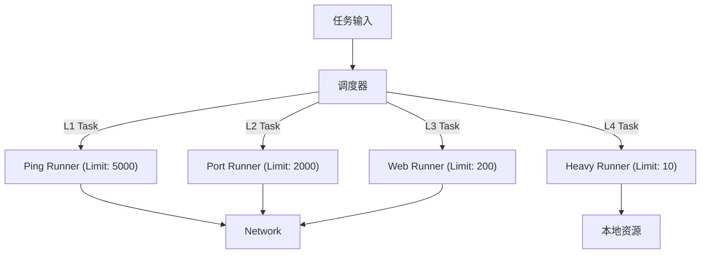

# NeoAgent 并发模型设计说明 v1.0

## 1. 核心理念

**"Simple is Better than Complex"**

在 Go 语言中，Goroutine 的创建成本极低。因此，我们拒绝使用传统的、重量级的 "Worker Pool"（预创建固定数量的工作线程）模式。
相反，我们采用 **"Semaphore (信号量)"** 模式：
- 按需创建 Goroutine。
- 使用 Channel 作为信号量限制最大并发数。
- 使用 WaitGroup 等待任务完成。

这种模式具有**代码极简**、**资源利用率高**（无空转）、**天然背压**（Backpressure）的优点。

---

## 2. 基础并发原语 (The Primitive)

核心并发控制器 `Runner` 的设计极其精简：

```go
type Runner struct {
    limit chan struct{}  // 信号量，控制并发数
    wg    sync.WaitGroup // 等待组
}

func NewRunner(concurrency int) *Runner {
    return &Runner{
        limit: make(chan struct{}, concurrency), // 带缓冲 Channel
    }
}

func (r *Runner) Run(task func()) {
    r.limit <- struct{}{} // 1. 获取令牌 (若满则阻塞)
    r.wg.Add(1)
    
    go func() {
        defer func() {
            <-r.limit     // 3. 归还令牌
            r.wg.Done()
        }()
        task()            // 2. 执行任务
    }()
}

func (r *Runner) Wait() {
    r.wg.Wait()
}
```

---

## 3. 分层并发策略 (Hierarchical Concurrency)

扫描任务不是平面的，不同类型的任务对资源的消耗完全不同。因此，不能使用全局统一的并发限制，必须分层控制。

### 3.1 层次定义

| 层级 | 任务类型 | 资源特征 | 建议并发数 | 限制瓶颈 |
| :--- | :--- | :--- | :--- | :--- |
| **L1** | **Host Discovery** (ICMP/Ping) | 极低 CPU/MEM，高网络包量 | 5000+ | 网络带宽/PPS |
| **L2** | **Port Scan** (TCP SYN/Connect) | 低 CPU/MEM，高 FD 消耗 | 1000-3000 | ulimit (FD) |
| **L3** | **Service/Web Scan** (HTTP/Banner) | 中等 CPU/MEM，中等延迟 | 100-500 | 目标服务器负载 |
| **L4** | **Heavy Scan** (Nuclei/Browser) | 高 CPU/MEM，高耗时 | 5-20 | 本地 CPU/内存 |

### 3.2 动态调整 (Adaptive Limiting)

Agent 应支持根据当前环境动态调整并发数：
- **FD 耗尽检测**: 如果检测到 `too many open files` 错误，自动降低 L2/L3 并发数。
- **CPU 过载保护**: 如果本地 CPU 使用率持续 > 90%，暂停 L4 任务调度。

---

## 4. 任务调度流 (Scheduling Flow)



## 5. 与 Worker Pool 的对比

| 特性 | Semaphore (本方案) | Worker Pool (Qscan) |
| :--- | :--- | :--- |
| **Goroutine 管理** | 动态创建，用完即销毁 | 静态维护，长期存活 |
| **资源占用** | 闲置时为 0 | 闲置时占用 Stack 内存 |
| **代码复杂度** | 低 (~20行) | 高 (~200行，需管理队列/生命周期) |
| **任务提交** | 阻塞式 (Backpressure) | 阻塞或非阻塞 (取决于队列实现) |
| **适用场景** | **IO 密集型 (网络扫描)** | CPU 密集型 (计算任务) |

## 6. 结论

NeoAgent 将采用 **基于 Channel 信号量的分层并发模型**。这是 Go 语言处理高并发网络任务的最佳实践 (Best Practice)。
