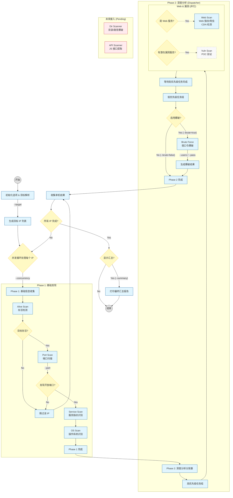

# scan run 全流程处理逻辑

> **版本**: v1.1
> **更新日期**: 2026-08-14
> **状态**: 核心流程已落地，部分细节过期（已标注）

---

## 修改记录

| 日期 | 版本 | 变更说明 |
|------|------|---------|
| 2026-08-14 | v1.1 | 标注过期内容，Web Scan 已实现，补充 Vuln/Dir/API Scanner 状态 |

---

本文档描述了 `scan run` 命令的完整执行流程，包括当前已实现的模块和未来规划的功能。

## 流程图

> **变更说明**:
> - Web Scan 已从 `planned` 更新为 `implemented`（2026-08 已实现）
> - ~~Vuln Scan 仍为 `planned`~~（实际未实现，Phase 5.2 规划中）
> - Dir Scanner 和 API Scanner **未接入** Pipeline（见 `internal/core/pipeline/README.md`）

## 关键流程说明

### Phase 1: 基础发现 (已完全实现)
- **Alive Scan**: 使用 ICMP/ARP/TCP Ping 检测主机存活。不存活的主机直接跳过。
- **Port Scan**: 扫描开放端口，受 `--port` 参数控制范围。
- **Service Scan**: 基于 nmap-service-probes 指纹库识别服务版本。
- **OS Scan**: 基于 TTL 和指纹推断操作系统。

### Phase 2: 深度分析 (部分实现)
- **Dispatcher**: 负责根据服务类型分发后续任务。
- **Web Scan (已实现)**: 
  - 针对 Web 服务进行指纹识别、爬虫、CDN 边缘节点检测。
  - **状态**: ✅ 已完全实现（2026-08）
- **Vuln Scan (~~规划中~~ 未实现)**: ~~针对 Web 服务进行 POC 漏洞验证~~
  - **状态**: ❌ **未实现**（Phase 5.2 规划中，代码中标记 `// TODO`）
- **Brute Force (已实现)**: 
  - 受 `--brute` 参数控制开启。
  - 针对 SSH, FTP, Telnet, MySQL, Postgres, Redis 等服务进行弱口令检测。
  - 支持 `--users` 和 `--pass` 自定义字典。
  - **状态**: ✅ 已实现
- **Dir Scanner (~~规划中~~ 未接入)**: ~~目录/路径扫描~~
  - **状态**: 📝 **未接入 Pipeline**（仅 CLI 独立命令 `scan dir`，详见 `docs/目录扫描/`）
- **API Scanner (~~规划中~~ 未接入)**: ~~JS 接口提取~~
  - **状态**: 📝 **未接入 Pipeline**（仅 CLI 独立命令 `scan api`，详见 `docs/API 扫描-js提取/`）

## 参数影响总结

| 参数 | 影响阶段 | 说明 | 状态 |
| :--- | :--- | :--- | :---: |
| `--target` | 初始化 | 决定扫描目标的数量和范围 | ✅ |
| `--concurrency` | 循环控制 | 决定同时进行 Phase 1 的 IP 数量 | ✅ |
| `--port` | Phase 1 | 决定端口扫描的覆盖范围 | ✅ |
| ~~`--vuln`~~ | Phase 2 | ~~决定是否开启漏洞扫描~~ | ❌ **未实现** |
| `--brute` | Phase 2 | **关键开关**，决定是否进行弱口令爆破 | ✅ |
| `--users/--pass` | Phase 2 | 仅在爆破开启时生效，覆盖默认字典 | ✅ |
| `--web` | Phase 2a | 开启 Web 指纹识别/爬虫/CDN 检测 | ✅ |
| ~~`--dir`~~ | Phase 2a | ~~开启目录/路径扫描~~ | 📝 **未接入 Pipeline** |
| ~~`--api`~~ | Phase 2b | ~~开启 API 接口提取~~ | 📝 **未接入 Pipeline** |
| `--summary` | 结束阶段 | 决定是否输出统计报告 | ✅ |
