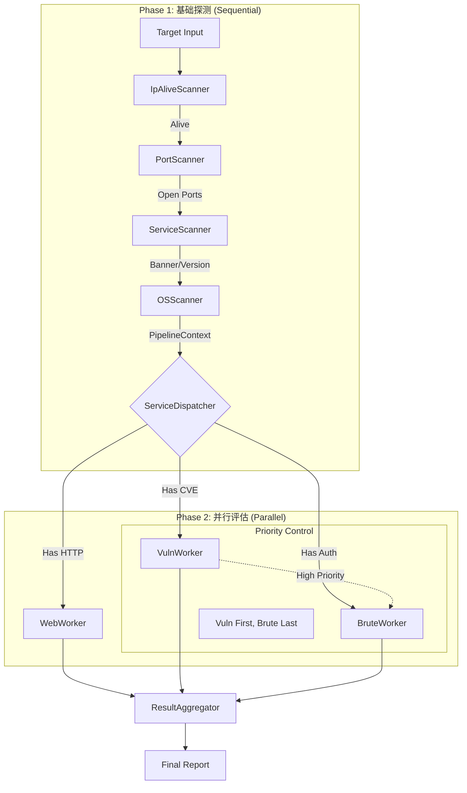

# Phase 4.1 全流程编排融合设计方案 (Fusion Design)

> **版本**: v1.1
> **更新日期**: 2026-08-14
> **状态**: 核心架构已落地，细节部分过期（已标注）

---

## 修改记录

| 日期 | 版本 | 变更说明 |
|------|------|---------|
| 2026-08-14 | v1.1 | 标注过期内容，补充实际代码状态和新扫描器（DirScanner/API Scanner）接入信息 |

---

## 1. 设计背景

本方案旨在融合 **"Pipeline 后期升级规划 (Old Plan)"** 的数据模型优势与 **"Parallel Dispatch (New Plan)"** 的架构优势。
我们在保留 `PipelineContext` 这一核心数据载体的同时，摒弃复杂的 YAML 模板配置，采用硬编码的策略模式来实现灵活高效的并行扫描编排。

> **当前状态**: ✅ 核心架构已落地，详见 `internal/core/pipeline/` 目录下的实际代码。

---

## 2. 核心架构：Phase-based Orchestration

整体流程分为两个阶段：**串行探测 (Phase 1)** 和 **并行评估 (Phase 2)**。



> **当前状态**: ✅ 已落地。实际代码在 `internal/core/pipeline/auto_runner.go` 和 `dispatcher.go`。

---

## 3. 数据模型：PipelineContext (Evolution)

`PipelineContext` 是贯穿全流程的血液。它在 Phase 1 被逐步填充，在 Phase 2 被分发和读取。

### 3.1 设计稿中的简化模型

```go
type PipelineContext struct {
    IP string
    
    // Phase 1 Results
    Alive      bool
    Hostname   string
    OSInfo     *model.OsInfo
    OpenPorts  []int
    Services   map[int]*model.PortServiceResult // Port -> Service Info
    
    // Phase 2 Results (New)
    WebResults   []*model.WebResult
    VulnResults  []*model.VulnResult
    BruteResults []*model.BruteResult
    
    // Sync Control
    mu sync.RWMutex
}
```

### 3.2 实际代码中的完整模型

```go
type PipelineContext struct {
    IP string
    
    // 阶段 1: 存活信息
    Alive    bool
    Hostname string
    OSGuess  string // 基于 TTL 的 OS 猜测
    
    // 阶段 2: 端口开放信息
    // 仅存储 Open 端口
    OpenPorts []int
    
    // 阶段 3: 服务识别信息
    // Port -> Result 映射
    Services map[int]*model.PortServiceResult
    
    // 阶段 4: 操作系统精确识别
    OSInfo *model.OsInfo
    
    // 阶段 5 (Phase 2): 攻击面评估结果
    WebResults   []*model.WebResult
    VulnResults  []*model.VulnResult
    BruteResults []*model.BruteResult
    
    // ~~新增~~ DirResults / ApiResults （待接入时添加）
    
    mu sync.RWMutex
}
```

> **差异**: 实际代码新增了 `OSGuess`（阶段 1 TTL 来源）、`GetAllServices()` 辅助方法。设计稿中的简化版本与实际代码基本一致。

---

## 4. 核心组件：ServiceDispatcher

`ServiceDispatcher` 是 Phase 1 和 Phase 2 的连接点。它取代了原计划中的 YAML 模板引擎，通过**代码逻辑**来决定后续任务。

### 4.1 分发逻辑 (Hardcoded Intelligence)

> **状态**: ✅ 已落地，与设计方案基本一致。

```go
func (d *ServiceDispatcher) Dispatch(ctx context.Context, pCtx *PipelineContext) {
    // Phase 2a: High Priority (Web & Vuln)
    // "Vuln First"
    d.dispatchHighPriority(ctx, pCtx)

    // Phase 2b: Low Priority (Brute Force)
    // "Brute Last"
    d.dispatchLowPriority(ctx, pCtx)
}
```

**Phase 2a (dispatchHighPriority)**:
- **Web Scan**: `shouldScanWeb()` 检查是否有 HTTP/HTTPS 服务 → 触发 WebScanner
- **Vuln Scan**: ~~Placeholder~~ 代码中标记 `// TODO: 调用真实的 Vuln Scanner`（未实现）

**Phase 2b (dispatchLowPriority)**:
- **Brute Force**: 检查 `EnableBrute` 开关 → 遍历支持协议列表 → 触发 BruteScanner
- **协议列表**: `"ssh", "rdp", "mysql", "redis", "postgres", "mssql", "ftp", "telnet", "smb", "oracle", "elasticsearch", "mongodb"`

> **新增（待接入）**:
> - **Phase 2a**: DirScanner（和 Web Scanner 并行）
> - **Phase 2b**: API Scanner（依赖 Web Scanner 产出）

### 4.2 分发策略 (Presets)

> **状态**: ⚠️ **部分过期**。设计稿中定义了 4 种策略，实际代码只有 2 种。

```go
type DispatchStrategy int

const (
    StrategyDefault DispatchStrategy = iota
    StrategyQuick                    // 快速模式：跳过深度扫描和耗时爆破
    StrategyFull                     // 全量模式：执行所有可能的扫描
    // ~~StrategySafe~~ 未实现，与 StrategyQuick 重叠
)

type ServiceDispatcher struct {
    strategy DispatchStrategy
    bruteScanner *brute.BruteScanner
    webScanner   *web.WebScanner
    opts         *options.ScanRunOptions
}
```

---

## 5. 优先级控制 (Vuln First, Brute Last)

为了避免爆破的高噪音导致 IP 被封禁，从而影响漏洞扫描，我们需要实现简单的依赖控制。

**实际实现方案** (已落地):

`ServiceDispatcher.Dispatch()` 分为 **Phase 2a (Web/Vuln)** 和 **Phase 2b (Brute)**：
- 先启动 Web/Vuln 任务（高优先级），使用 `WaitGroup` 等待完成
- 再启动 Brute 任务（低优先级）

**实现**: 方案 A (简单) - Parallel Web/Vuln → Wait → Parallel Brute

```go
// dispatchHighPriority 中：
wg.Wait()  // 等待 Web/Vuln 完成
// dispatchLowPriority 中：
// 启动 Brute 任务
```

---

## 6. 实施路线图

### 6.1 已完成阶段

| 阶段 | 项目 | 状态 | 对应文件 |
|------|------|:---:|---------|
| 1 | **Refactor PipelineContext**: 扩展 Phase 2 结果字段 | ✅ | `pipeline/pipeline.go` |
| 2 | **Implement ServiceDispatcher**: 分发逻辑 + 策略控制 | ✅ | `pipeline/dispatcher.go` |
| 3 | **Upgrade AutoRunner**: 接入 Dispatcher + Phase 2a/b 执行流 | ✅ | `pipeline/auto_runner.go` |
| 4 | **CLI Integration**: `scan run` 参数映射到 DispatchStrategy | ✅ | `cmd/agent/scan/run.go` |
| 5 | **RunnerManager / Global Factory**: 统一扫描器注册 | ✅ | `factory/` 目录 |

### 6.2 待实施阶段

| 阶段 | 项目 | 状态 | 预计阶段 |
|------|------|:---:|---------|
| 6 | **DirScanner 接入 Pipeline**: Phase 2a 并行分发 | ❌ | 规划中 |
| 7 | **API Scanner 接入 Pipeline**: Phase 2b 依赖 Web 产出 | ❌ | 规划中 |
| 8 | **Vuln Scanner 实现 + 接入**: Phase 2a 高优先级 | ❌ | 规划中 |
| 9 | **PipelineContext 扩展**: 新增 `DirResults` / `ApiResults` | ❌ | 待 #6/#7 |

---

## 7. Pipeline 演进文档

当前 Pipeline 的详细架构文档（含完整的改造计划、需修改的文件清单）已迁移至：

> [`internal/core/pipeline/README.md`](../../../internal/core/pipeline/README.md) - **v1.1** (2026-08-14)

该文档包含：
- 完整的 Pipeline 流程（Stage 1-4 + Phase 2a/2b/2c）
- DirScanner / API Scanner 接入决策
- 建议的 Pipeline 重构图
- 需改造的代码文件清单
- 核心设计原则

---

## 8. 此方案的核心价值回顾

> 此方案融合了原计划的清晰数据流和新计划的高效执行流，完全符合 Linus 的 **"Good Taste"**（消除 YAML 配置，硬编码即真理）和 **"Pragmatism"**（用简单 WaitGroup 替代复杂 DAG）原则。
