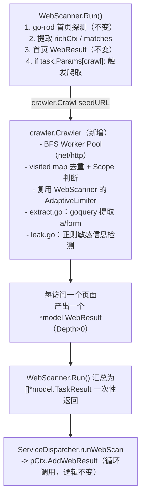
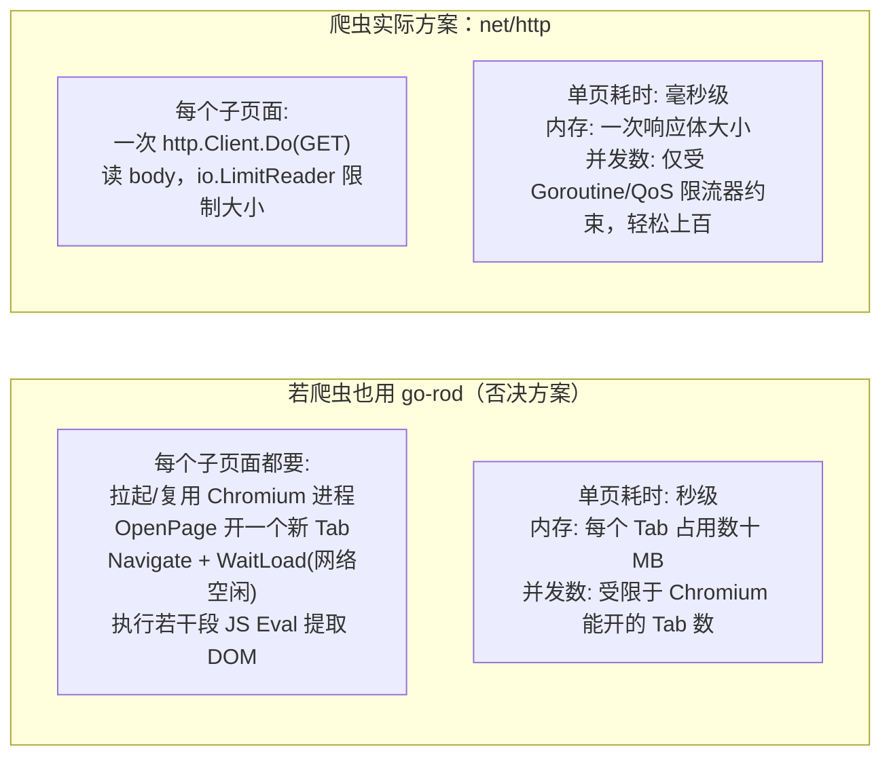
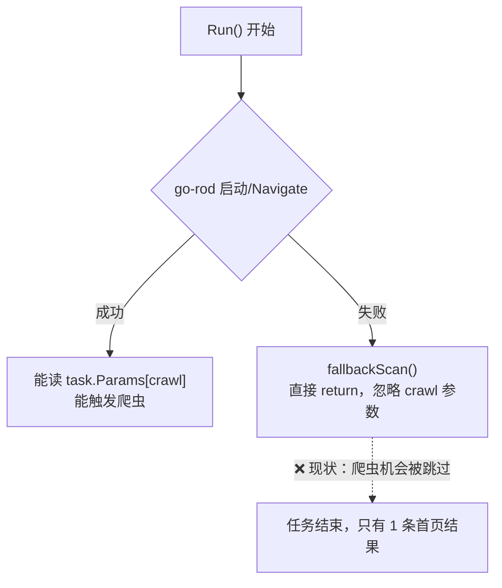
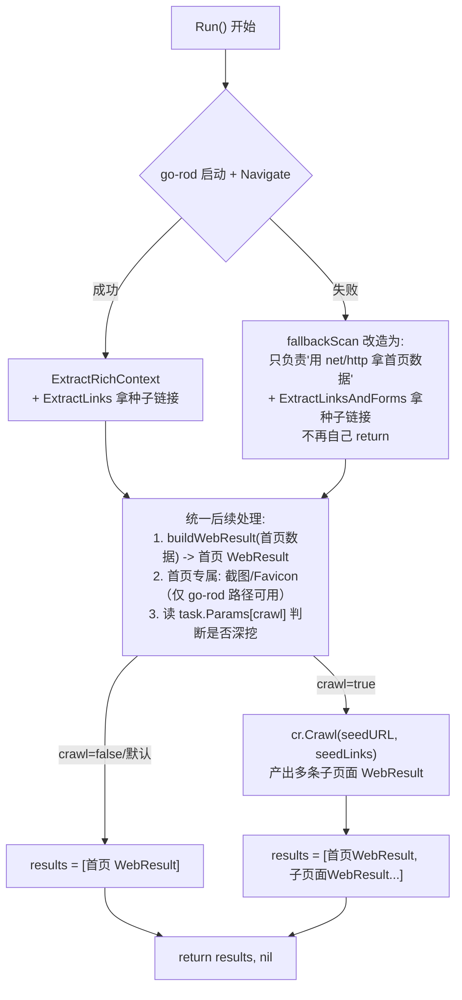

# NeoScan Web 爬虫与被动分析器架构方案 v2.0

> 本文档独立于 `Web爬虫与被动分析器设计方案-gemini3-v1.0.md` 给出，基于对 `BrowsertrixCrawler`、`Firecrawl` 源码的实际研读，
> 结合 NeoScan 现有代码（`internal/core/scanner/web`、`internal/core/pipeline`、`internal/core/factory`、`internal/pkg/fingerprint`）
> 给出的重新思考版本。核心目标只有一个：**用最少的新概念，把 Phase 5.1 的活干完，并且不破坏现有任何东西。**

---

## 一、先给结论

【核心判断】
✅ 值得做，但**不是**照搬 Browsertrix/Firecrawl 的架构。

这两个项目的抓取内核（Redis ZSET 分布式队列 + Lua 原子脚本、Engine quality/feature-flag 十几种引擎瀑布降级）都是为了解决它们自己的问题：
- Browsertrix 要解决的是**多容器分布式、可暂停可恢复的网页存档**（要保证 crawl 状态可以在 Pod 重启后 replay）。
- Firecrawl 要解决的是 **SaaS 化的"给我一个 URL，尽最大可能返回可用内容"**（要应对反爬、PDF、Twitter、Wikipedia 等各种奇葩站点）。

> **术语澄清**：这里说的"单进程"特指**单个 Agent 处理一次 Web 爬虫任务这个粒度**，不是说 NeoScan 整体架构是单机的——NeoScan 本身是 Master + 多 Agent 的分布式集群，这一点不冲突。Browsertrix 引入 Redis 分布式队列，是因为它的**单次 crawl 任务**会被多个浏览器容器联合分布式完成，且要支持暂停后从另一台机器 Resume；而 NeoScan 的"一次 Web 扫描任务"是分配给单个 Agent 独立完成的原子 Task（爬一个站点产出几十到几百个 URL），不存在"一个 Task 需要多台 Agent 联合爬"的场景。集群层面的并行（多机器分摊多个扫描目标）NeoScan 早已具备，这里讨论的是**单个 Task 内部**要不要照搬 Browsertrix 的跨进程状态机，答案是不需要。

NeoScan 单个 Agent 处理一次爬虫任务时，**跑一次扫描，目的是发现攻击面**，不需要断点续爬、不需要跨引擎瀑布重试、不需要分布式状态机。如果照搬这套东西，就是"用航母的锅炉去烧开水"——这是典型的 **过度设计**，是要不得的。

真正的问题是：**现有 `WebScanner` 只探测了首页，攻击面收集停留在"单点快照"，没有"顺藤摸瓜"的能力**。要解决的就是这一个问题，别的都不要碰。

---

## 二、第一层：数据结构分析

> "Bad programmers worry about the code. Good programmers worry about data structures."

先看现状。NeoScan 当前的核心数据流是：

```
model.Task ──(Scanner.Run)──> []model.TaskResult{ Result: *model.WebResult }
```

`WebResult` 目前长这样（`internal/core/model/result_types.go`）：

```12:20:c:/mytools/code/go/NeoScan/neoAgent/internal/core/model/result_types.go
// WebResult Web扫描结果
type WebResult struct {
	URL             string            `json:"url"`
	IP              string            `json:"ip"`
	...
}
```

它是一个**单 URL 的快照结构**。而爬虫要产出的东西，本质上是"以 IP:Port 为根的一棵 URL 树，附带每个节点的攻击面标注"。这就带来第一个关键决策：

### 决策 1：爬虫的产出不是新的 TaskType，而是 WebResult 的“复数化”

v1.0 方案里，隐含的假设是"爬虫是 WebScanner 内部的一个子模块，爬完之后塞回 WebResult"。这个方向是对的，但 v1.0 没有回答一个根本问题：**爬到的 100 个页面，每个页面的指纹、状态码、表单信息，要不要都单独构成一条 `WebResult`？**

答案必须是 **Yes**。理由：
1. Pipeline 的下游（Vuln Scanner、Dir Scanner）消费的是 `[]*model.WebResult`，它们要拿到的是"每一个具体 URL 的攻击面"，而不是一个塞满子 URL 的大对象。
2. 现有 `pCtx.AddWebResult(res *model.WebResult)` 已经是"多次调用，逐条累加"的模式（参见 `pipeline/pipeline.go` 第 75-79 行）。爬虫只需要复用这个入口，对 Pipeline 和 Dispatcher **零改动**。
3. 如果搞一个 `WebResult.Children []WebResult` 或者单独一个 `CrawlResult` 大对象，就是在制造特殊情况——下游代码要么要多写一个分支处理"聚合结果"，要么要多写一次展开逻辑。**消除特殊情况的方法就是：爬虫内部产出多少个 URL，就向 Pipeline 报多少条 `WebResult`。**

所以数据结构上只需要做一件事：给 `WebResult` 增加"攻击面"相关的可选字段（不影响现有字段和现有调用方）：

```go
// WebResult 新增字段（其余字段不变）
type WebResult struct {
    // ... 现有字段不变 ...

    Depth       int               `json:"depth,omitempty"`        // 爬取深度，0=首页
    Forms       []FormInfo        `json:"forms,omitempty"`        // 表单/输入点
    Params      []string          `json:"params,omitempty"`       // URL Query 参数名集合
    Leaks       []LeakInfo        `json:"leaks,omitempty"`        // 被动泄露检测结果
}

type FormInfo struct {
    Action string   `json:"action"`
    Method string   `json:"method"`
    Fields []string `json:"fields"`
}

type LeakInfo struct {
    Type    string `json:"type"`    // aksk / jwt / internal_ip / ...
    Match   string `json:"match"`   // 脱敏后的命中内容
    Context string `json:"context,omitempty"`
}
```

这是**加字段，不是加类型**。老代码（CLI 表格输出、CSV/JSON Reporter）完全不受影响，`Headers()/Rows()` 不需要改，因为这些新字段只在需要时才展示（比如新增一列 `Leaks` 计数，属于锦上添花，不是本次范围）。

### 决策 2：去重表用什么结构？—— 一个 `map[string]struct{}` 就够了，别整 Redis/Heap

v1.0 提出用 `container/heap` 实现优先级队列、用哈希存储归一化 URL。Browsertrix 用 Redis ZSET + 5 个 Lua 脚本实现同样的事情。

问一个实用主义的问题：**NeoScan 单次爬取的 URL 量级是多少？** 一个安全扫描场景下的中小型 Web 应用，深度 2-3 层，一般是几十到几百个 URL，最多上千。这种量级：

- 排序用不着堆，`slice` 或者一个 `chan` 都能顶。
- 去重用不着 Redis，一个加锁的 `map[string]struct{}` 完全够用，Agent 是单机单进程。

**好品味的做法是：数据结构的复杂度要匹配数据的真实规模。** 引入 heap 不是错，但如果一个 `sync.Map` + 简单 FIFO 就能解决问题，堆就是过度设计——它带来的收益（严格的优先级排序）在这个规模下约等于 0，但带来的心智负担和 bug 面是实打实的。

**结论**：用最笨但最清晰的方式——一个受 `sync.Mutex` 保护的 `visited map[string]struct{}` 做去重，一个 **带缓冲的 channel 当队列**（`chan *crawlItem`）做广度优先遍历。深度限制通过 `crawlItem.Depth` 字段判断，超过 `MaxDepth` 就不入队，没有分支，没有堆，没有打分公式。

---

## 三、第二层：特殊情况识别

把 v1.0 和两个参考项目里的"特殊情况"摘出来看看，哪些是真需求，哪些是可以设计掉的：

| 特殊情况 | v1.0 / 参考项目的处理方式 | Linus 式处理 |
|---|---|---|
| URL 带 Hash / 排序参数不一致导致误判为不同 URL | 归一化引擎 + 相似度计算 + 参数模式聚合（Pattern Aggregation） | **只做最基本的归一化**（去 Fragment、Query 排序），不做"相似度聚合"——这是在猜测用户意图，真遇到 `/article/1..1000` 的翻页，靠 `MaxURLsPerPattern`（对同一路径模板计数，超过 N 次直接跳过）这种一行代码就能解决的方式，不需要引入相似度算法 |
| 大文件/非 HTML 资源拖爆内存 | Fast Abort + Content-Type 探测 | 保留，这是真实问题（HTTP 层面 `io.LimitReader` 已经在 `fallbackScan` 里用过，直接复用这个模式） |
</br>
| 403/429 限流 | 自适应限流 | **不新建限流器**，直接复用现有 `qos.AdaptiveLimiter`（`WebScanner` 已经持有一个实例），爬虫和首页扫描共享同一个限流器实例，因为它们打的是同一个目标 |
| 爬虫和 Headless 浏览器混合调度 | "智能降级策略"：首页用 go-rod，深层用 net/http | 保留这个大方向（对，这一点 v1.0 判断准确），但不需要"降级"这个词——本来就该是两种不同职责：**go-rod 只负责首页探测拿到 JS 渲染后的真实 DOM**，**爬虫全程只用 `net/http`**。这不是失败后的降级，是从一开始就该如此的正常路径 |
| 分布式状态持久化/断点续爬 | Redis ZSET + Lua 脚本 | **完全不需要**。Agent 单次任务运行几秒到几十秒，中断了重新发一次 Task 即可，Master-Agent 协议本身就有重试语义。引入 Redis 会强迫 Agent 依赖外部组件，直接违反《Agent重构开发总纲》里"独立、自包含"的第一条原则 |
| 多引擎（PDF/Wikipedia/Twitter/TLS-Client 等）瀑布降级 | Engine quality 矩阵 + feature flag 打分 | **完全不需要**。安全扫描不关心把 PDF 转成完美的 Markdown，只需要识别出"这是个文件资源"就记为资产，不解析 | 

**一句话说清爬虫的本质**：*从一个种子 URL 出发，用 BFS 在同源范围内走 N 层，走过的每一页都过一遍"提取链接 + 提取表单 + 正则找泄露"，输出一批 `WebResult`。*

这句话不需要"打分公式""相似度聚合""Engine 矩阵"任何一个高级词汇就能完整描述。**如果一句话说不清楚，说明方案设计者在解决自己臆想出来的问题。**

---

## 四、第三层：复杂度审查——目录结构怎么摆

v1.0 的目录设计：

```
internal/core/scanner/web/
├── crawler/
│   ├── crawler.go
│   ├── queue.go       # heap + 归一化
│   ├── extractor.go   # goquery 提取
│   ├── analyzer.go    # 正则泄露检测
│   └── filter.go      # Scope + DenialReason
├── web_scanner.go
└── context.go
```

这个划分本身没有大错，问题在于**颗粒度过细**（5 个文件对应一个几百行就能写完的功能），以及 `filter.go` 里的 `DenialReason` 这种"日志美化"需求被拔高成了一个独立模块。审计需求是真实的（"为什么没扫到"确实是排查刚需），但不需要为此设计一个类型系统，一行 `logger.Debugf` 加个原因字符串参数就够了。

**Linus 式精简方案**：3 个文件，每个文件职责单一，没有一个文件是"因为要凑对称性"而存在的。

```
internal/core/scanner/web/
├── web_scanner.go         # 现有文件，改动点：Run() 末尾加一段"是否需要深度爬取"的调用
├── context.go             # 现有文件，不变
└── crawler/                              # 新增
    ├── crawler.go         # BFS 主循环 + 去重 + Scope 判断（这三者是一个功能，不拆）
    ├── extract.go         # 用 goquery 从 HTML 提取 <a>/<form>/参数
    └── leak.go            # 正则泄露检测规则与匹配
```

为什么把"BFS + 去重 + Scope"揉进一个文件？因为它们是**同一个循环体里的顺序步骤**，人为拆到 3 个文件只会增加跳转成本，不会增加内聚性。这才是"消除不必要的抽象层"。

### 3 层缩进检验

`crawler.go` 的主循环伪代码验证是否超过 3 层缩进：

```go
func (c *Crawler) run(ctx context.Context, seedURL string) {
    queue := make(chan *item, 256)
    queue <- &item{URL: seedURL, Depth: 0}

    var wg sync.WaitGroup
    for i := 0; i < c.concurrency; i++ {
        wg.Add(1)
        go c.worker(ctx, queue, &wg)   // 1层：worker 内部再展开
    }
    wg.Wait()
}

func (c *Crawler) worker(ctx context.Context, queue chan *item, wg *sync.WaitGroup) {
    defer wg.Done()
    for it := range queue {                      // 1层
        if !c.shouldVisit(it) {                   // 2层
            continue
        }
        body, links := c.fetchAndExtract(ctx, it) // 2层
        c.reportLeak(it.URL, body)                // 2层
        for _, link := range links {              // 2层
            c.enqueue(queue, link, it.Depth+1)     // 3层
        }
    }
}
```

3 层封顶，`shouldVisit`（去重+Scope+深度）、`fetchAndExtract`（HTTP+goquery）、`reportLeak`（正则）全部下沉成独立函数，主循环只做编排。这是可以正常读下来的代码，不需要注释解释"这里为什么要这样"。

---

## 五、并发模型专项说明：为什么用 Goroutine，不用多进程

这是一个在方案评审中被明确提出的问题：**NeoScan 整体是 Master + 多 Agent 的分布式系统，为什么爬虫内部提速不用"多开几个 Agent 子进程"的方式，而是用 Goroutine？** 这个问题问得对，值得单独展开说清楚，避免和上一节的"单进程"表述混淆。

### 5.1 先分清楚两个不同层级的"并发"

| 层级 | NeoScan 现状 | 是否需要变更 |
|---|---|---|
| 集群层：多机器分摊多个扫描目标 | ✅ 已有，Master 分发 Task，多个 Agent 并行拉取执行 | 不涉及本次讨论范围 |
| 单机层：单个 Agent 内多个 IP 目标并行跑 Pipeline | ✅ 已有，见 `pipeline/auto_runner.go` 的 `sem := make(chan struct{}, r.concurrency)` + `go func(){...}()` | 不涉及本次讨论范围 |
| 单任务层：一次 Web 爬虫任务内部，多个 URL 怎么并行抓取 | ❌ 待实现，本方案 `crawler.Options.Concurrency` 要解决的就是这一层 | **本节讨论的就是这一层该用 Goroutine 还是子进程** |

三层需求是叠加关系，不是互斥关系。本方案不改变前两层（它们已经工作得很好），只在第三层引入并发能力。

### 5.2 数据结构/资源模型分析：爬虫任务的本质是 IO 密集型

一次 HTTP 请求的耗时构成：

```
DNS 解析(ms) + TCP 握手(ms) + TLS 握手(ms) + 服务器处理(ms) + 数据传输(ms)
                                  ↑
                     这段时间 CPU 基本在"睡觉"（等待网络 IO 返回）
```

Go 的 Goroutine 从设计第一天起就是为了解决这类问题：一个 Goroutine 发起 HTTP 请求后进入 `netpoller` 挂起等待，调度器立刻把 CPU 让给另一个 Goroutine 干活。1 个 OS 线程能同时"照看"成千上万个等待中的 Goroutine——这是 Go runtime 内置的能力，不需要开发者手动管理线程池。

而"多进程"要解决的是另一类问题：CPU 密集型任务的并行计算，或者语言运行时本身存在全局锁（如 Python 的 GIL，必须用多进程绕开）。Go 没有 GIL，`runtime.GOMAXPROCS` 默认等于 CPU 核心数，单个 Go 进程内部本身就能吃满所有 CPU 核心。**开多个 Agent 子进程不会让程序多用一个 CPU 核心，因为单进程早就能用满了；对于本来就不怎么用 CPU 的 IO 密集型爬虫任务，多开进程唯一的效果是多消耗几份内存。**

### 5.3 特殊情况识别：子进程方案会引入哪些真实成本

| 维度 | Goroutine（进程内并发） | 子进程（fork 多个 Agent 实例） |
|---|---|---|
| 创建开销 | 约 2KB 初始栈，微秒级创建 | 完整 OS 进程，MB 级内存，毫秒级 fork+exec |
| 通信成本 | 内存直接共享（`chan` / 指针传递），零拷贝 | 必须走 IPC（管道/socket/临时文件），需要额外的序列化/反序列化代码 |
| 结果聚合 | 直接写回同一个 `PipelineContext`（复用现有 `pCtx.AddWebResult`） | 子进程结果需要序列化成 JSON/Proto，父进程再反序列化聚合，多一层转换和错误处理代码 |
| QoS 限流 | 一个 `qos.AdaptiveLimiter` 实例天然对所有 Goroutine 生效 | 每个子进程是独立内存空间，限流状态要么各自为政（多进程叠加并发可能打爆目标站点），要么需要额外的跨进程共享存储来同步限流状态 |
| 崩溃隔离 | 一个 Goroutine panic 默认会拖垮整个进程，**但** `WebScanner.Run()` 已经用 `defer recover()` 兜底（见 `web_scanner.go` 第 67-78 行），这个问题已被现有架构解决 | 子进程崩溃确实不影响父进程，但这个优势在本场景没有对应的真实痛点——访问一个恶意页面不会让整个 Chromium 段错误，遇到的异常本来就该在 Goroutine 内被 `recover` 兜住 |
| 与现有架构的关系 | 与 `AutoRunner.Run()` 已有的模型完全一致，直接复用同一套 Semaphore + WaitGroup 范式 | 需要在 Master-Agent 协议之外，再造一整套"Agent 内部子 Agent"的调度、心跳、结果回收机制——等于在一个分布式系统里再套一层小分布式系统 |

**一句话说清楚**：子进程方案是在解决一个不存在的问题（"Go 单进程并发能力不够用"），代价是引入一整套全新的 IPC、状态同步、限流协调基础设施。这正是需要被砍掉的过度设计。

### 5.4 真正该是"子进程"的东西，其实已经是子进程了

现有代码里，Chromium 浏览器本身就是一个独立 OS 子进程（`internal/core/lib/browser/browser_manager.go` 中 `launcher.Get()` 拉起的是真实的 `chrome`/`chrome.exe` 二进制），Agent 进程通过 CDP 协议远程控制它，而不是把浏览器内嵌进 Agent 进程里跑。这是唯一"应该独立于 Agent 主进程"的重型组件，而它已经是子进程了，不需要为此再做任何调整。

需要子进程隔离的判断标准很简单：**这个组件是否有独立的、与 Go runtime 不兼容的运行时（如 Chromium 的 V8 + Blink）？** 如果是，用子进程 + 协议通信（CDP/gRPC）隔离，这是对的，NeoScan 已经这么做了。如果只是"多个 HTTP 请求要并发跑"，那和进程隔离半点关系都没有，纯粹是 Goroutine 该干的事。

### 5.5 结论：本方案的并发落地方式

1. **单站点内的多 URL 并行抓取**：Goroutine Worker Pool，即第八节 `crawler.go` 里 `for i := 0; i < c.concurrency; i++ { go c.worker(...) }` 的设计，默认并发数 5，可通过 `crawler.Options.Concurrency` 调整。
2. **多个 IP 目标之间的并行**：复用现有 `AutoRunner.Run()` 的 Semaphore 模型，不做任何改动。
3. **跨 Agent 的并行**：由 Master 的任务分发机制负责，不属于本方案（爬虫 Scanner）的职责范围。
4. **不引入任何形式的 Agent 内部子进程/多开 Agent 实例方案**。如果未来遇到真正 CPU 密集型的瓶颈（比如超大规模正则匹配、密码爆破哈希计算），应当先用 `pprof` 实测确认瓶颈所在，再决定是否需要更重的并行方案——**先测量，再优化，不要没测量就上重型架构**。

---

## 六、第四层：破坏性分析——会破坏什么？

逐条过一遍现有链路，确认零破坏：

1. **`WebScanner.Run()` 签名不变**，仍然是 `(ctx, task) -> ([]*model.TaskResult, error)`。爬虫是 `Run()` 内部在拿到首页 `richCtx` 之后追加的一段逻辑，通过 `task.Params["crawl"]`（bool）和 `task.Params["crawl_depth"]`（int）控制是否触发、触发多深，**默认关闭**，不传这个参数的老调用方（`ServiceDispatcher.runWebScan`、CLI `scan web`）行为完全不变。
2. **`model.WebResult` 只做字段新增，不删不改**已有字段，JSON 序列化向后兼容，CSV/表格 Reporter 不需要改。
3. **`PipelineContext.AddWebResult` 接口不变**，爬虫产出的每个子页面结果，就是再调用 N 次这个方法，Dispatcher 完全无感知。
4. **不引入新的外部依赖组件**（不需要 Redis，不需要 Rust 扩展），只需要引入 `github.com/PuerkitoBio/goquery`（纯 Go，MIT 协议，`go.mod` 加一行）。
5. **`qos.AdaptiveLimiter` 复用现有实例**，不新建令牌桶，爬虫产生的并发请求和首页扫描共享同一份限流状态，语义更准确（同一个目标站点，不管是首页扫描还是深度爬取，都应该被同一个限流策略约束）。

**唯一需要新增的公共契约**是 `Task.Params` 里两个新 key（`crawl`, `crawl_depth`），这是纯新增，不影响任何现有 Key 的读取逻辑。

---

## 七、第五层：实用性验证

- 这个问题在生产环境真实存在吗？**是**——"进度文档"里 Phase 5.1 明确写着当前是"单点首页探测"，下游 Vuln Scanner（Phase 5.2）需要更多攻击面输入点才有意义，这不是臆想出来的需求。
- 方案的复杂度是否匹配问题的严重性？**匹配**——三个新文件，一个新依赖库，一次 `WebResult` 字段扩展，一个 Task 参数扩展。这是能在 1-2 个迭代内交付、能被单元测试完整覆盖的规模。
- 有没有必要把 v1.0 里的"打分公式""相似度聚合""DenialReason 类型系统"都做出来？**没有**——这些是"可能未来用得上"的功能，属于典型的"解决假想问题"。等真的遇到"深分页地狱"再加"同路径模板计数上限"这一行代码也来得及，不需要提前设计。

---

## 八、最终架构设计

### 8.1 模块与数据流



关键设计点：**爬虫不是一个独立的 Scanner/TaskType，而是 `WebScanner` 内部按需触发的一个"深度补充阶段"**。这是与 v1.0 的第二个重大分歧——v1.0 倾向于把 crawler 做成 web 包下平行的子系统，本方案认为它应该是 WebScanner 生命周期里的一环，因为：

1. 只有 WebScanner 拿到首页之后，才知道该不该继续深挖（比如首页 404，直接不用爬）。
2. 复用同一个限流器实例，语义更自洽，不用在 Dispatcher 层协调两个独立 Scanner 的并发关系。
3. 保持 `model.TaskTypeWebScan` 单一职责："给我一个 IP:Port，把这个 Web 服务的攻击面摸清楚"——不管摸清楚的手段是首页快照还是深挖 3 层，对外都是同一个任务类型，Dispatcher 不需要为"web_scan" 和 "web_crawl" 两种任务类型分别写分发规则。

### 8.2 核心类型（放在 `internal/core/scanner/web/crawler/crawler.go`）

```go
package crawler

type Options struct {
    MaxDepth    int           // 默认 2
    MaxPages    int           // 硬上限，默认 200，防止爬虫失控
    Concurrency int           // 默认 5，与 WebScanner 的 QoS 挂钩
    Timeout     time.Duration // 单页超时，默认 10s
    SameHostOnly bool         // 默认 true，只在同一 Host 内爬
}

type Page struct {
    URL        string
    Depth      int
    StatusCode int
    Title      string
    Body       string
    Headers    map[string]string
    Forms      []model.FormInfo
    Params     []string
    Leaks      []model.LeakInfo
    // 注意：这里不放 TechStack。crawler 包只负责产出原始响应数据，
    // 指纹识别是否要做、怎么做，是调用方 WebScanner 的职责，见 8.6 节。
}

type Crawler struct {
    opts    Options
    limiter *qos.AdaptiveLimiter // 复用 WebScanner 传入的实例，不新建
    client  *http.Client
    seedHost string

    mu      sync.Mutex
    visited map[string]struct{}
}

func New(opts Options, limiter *qos.AdaptiveLimiter) *Crawler
func (c *Crawler) Crawl(ctx context.Context, seedURL string, seedLinks []string) []*Page
```

`Crawl` 的第三个参数 `seedLinks`——这是刻意设计：首页在 go-rod 阶段已经拿到了 JS 渲染后的真实链接（`ExtractRichContext` 目前没提取 `<a>`，需要补一个小函数 `ExtractLinks(page)`，10 行代码），把这批链接作为 BFS 的第一层种子，避免爬虫重新用 `net/http` 打一次首页（首页可能是 SPA，`net/http` 拿到的是空壳）。这正是 v1.0 中"智能降级策略"的合理内核，本方案把它保留并做得更精确：**不是"首页用浏览器、其余用 HTTP"这种简单的深度切分，而是"浏览器只用于拿到 JS 渲染后的种子链接，一旦拿到链接，后续遍历全部走 HTTP"**。

#### 8.2.1 爬虫会调用浏览器吗？—— 不会，`Crawler` 结构体里没有、也不应该有 go-rod 的任何东西

这是一个必须明确写清楚的边界，因为直觉上"爬虫要爬 JS 渲染的 SPA 页面，是不是也得用浏览器"是个合理的疑问。答案是否定的，原因不是"图省事"，而是**成本账算下来根本不划算**：



| 维度 | go-rod（浏览器） | net/http（爬虫实际选择） |
|---|---|---|
| 单页耗时 | 通常 1-3 秒（要等 Navigate + WaitLoad + JS 执行） | 通常几十到几百毫秒 |
| 资源占用 | 每个 Tab 数十 MB 内存，且 `BrowserManager`（见 `internal/core/lib/browser/browser_manager.go`）管理的是**一个独立的 Chromium 子进程**，不是 Go 内部对象 | 一次 HTTP 响应体的内存，用完即释放 |
| 并发扩展性 | 受 Chromium 本身能同时开多少 Tab 限制，开太多 Tab 反而会让浏览器自己变卡甚至崩溃 | 受 `qos.AdaptiveLimiter` 和 Goroutine 数量控制，轻松支持几十上百并发 |
| 爬 100 个 URL 的总耗时 | 100 × 1~3s ≈ 1.5~5 分钟（还没算并发抢占 Tab 的排队） | 100 个 URL 并发 5 跑，几秒到十几秒量级 |
| 是否需要 | 只有"必须执行 JS 才能拿到真实内容"的场景才需要（即 SPA 首屏渲染） | 绝大多数子页面是服务端渲染的 HTML、API 响应、静态资源，`net/http` 直接能拿到完整内容 |

**结论**：浏览器是为了解决"首页可能是 SPA 空壳，必须跑一遍 JS 才能看到真实 DOM 和链接"这一个具体问题而存在的，这个问题**只在首页第一次探测时存在一次**——一旦通过 go-rod 拿到了 JS 渲染后的真实链接列表（`seedLinks`），后续每一层 BFS 遍历，目标 URL 是链接里已经写死的具体地址（`/admin`、`/api/v1/users` 这种），不再需要"执行 JS 才能发现"，`net/http` 直接请求就能拿到完整响应。**用浏览器爬完整个站点，是用"渲染一次页面"的解法去解决"发起一百次请求"的问题，这是原本就该避免的过度设计。**

如果坚持要用浏览器爬每一层，`Crawler` 就得持有 `*browser.BrowserLauncher`，`crawler` 包就得 import `lib/browser`，还得处理"并发爬取时多个 Goroutine 抢 Tab"的资源竞争问题——这一整套复杂度，只是为了应付"极少数子页面本身也是 SPA"这种边缘情况。真遇到这种页面，代价是**这一个 URL 的指纹识别精度打折扣**（见 8.6.4 节），而不是整个爬虫都要背上浏览器的重量级成本。这是成本和收益不对等的典型案例，答案很明确：不做。

### 8.3 URL 归一化与去重（`crawler.go` 内部函数，不单独成文件）

```go
func normalizeKey(raw string) string {
    u, err := url.Parse(raw)
    if err != nil {
        return raw
    }
    u.Fragment = ""              // 去 Hash
    q := u.Query()
    // 排序 query key，保证 ?a=1&b=2 与 ?b=2&a=1 视为同一 URL
    keys := make([]string, 0, len(q))
    for k := range q {
        keys = append(keys, k)
    }
    sort.Strings(keys)
    sorted := url.Values{}
    for _, k := range keys {
        sorted[k] = q[k]
    }
    u.RawQuery = sorted.Encode()
    return u.String()
}
```

不做参数值归一化（比如把 `?id=1` 和 `?id=2` 视为相同），因为那是"猜测"，不同的 `id` 值完全可能对应不同的业务对象（IDOR 漏洞检测还就指望这个差异）。**唯一需要防的是"同一个资源被不同顺序/大小写的 URL 重复访问"，不是"业务上相似的 URL"。** 如果真遇到 1000 个自增 ID 的爬取地狱，用 `MaxPages` 硬上限兜底即可，这是实用主义，不是理论洁癖。

### 8.4 攻击面提取（`extract.go`）

```go
func ExtractLinksAndForms(baseURL string, body string) (links []string, forms []model.FormInfo, params []string) {
    doc, err := goquery.NewDocumentFromReader(strings.NewReader(body))
    if err != nil {
        return nil, nil, nil
    }
    base, _ := url.Parse(baseURL)

    doc.Find("a[href]").Each(func(_ int, s *goquery.Selection) {
        href, _ := s.Attr("href")
        if abs := resolve(base, href); abs != "" {
            links = append(links, abs)
        }
    })

    doc.Find("form").Each(func(_ int, s *goquery.Selection) {
        action, _ := s.Attr("action")
        method, _ := s.Attr("method")
        if method == "" {
            method = "GET"
        }
        var fields []string
        s.Find("input[name],select[name],textarea[name]").Each(func(_ int, f *goquery.Selection) {
            if name, ok := f.Attr("name"); ok {
                fields = append(fields, name)
            }
        })
        forms = append(forms, model.FormInfo{Action: resolve(base, action), Method: strings.ToUpper(method), Fields: fields})
    })

    if base.RawQuery != "" {
        for k := range base.Query() {
            params = append(params, k)
        }
    }
    return
}
```

引入 `goquery` 是本方案唯一的新依赖，理由：它是 Go 生态里最成熟的 HTML 解析库（对标 jQuery API），比手写正则解析 HTML 靠谱得多——**这不是过度设计，是用对的工具做对的事**。v1.0 也建议了同样的库，这一点结论一致。

### 8.5 被动泄露检测（`leak.go`）

```go
type leakRule struct {
    Name    string
    Pattern *regexp.Regexp
}

var defaultLeakRules = []leakRule{
    {"aws_ak", regexp.MustCompile(`AKIA[0-9A-Z]{16}`)},
    {"aliyun_ak", regexp.MustCompile(`LTAI[0-9A-Za-z]{12,20}`)},
    {"jwt", regexp.MustCompile(`eyJ[A-Za-z0-9_-]+\.[A-Za-z0-9_-]+\.[A-Za-z0-9_-]+`)},
    {"internal_ip", regexp.MustCompile(`\b(?:10|172\.(?:1[6-9]|2\d|3[0-1])|192\.168)\.\d{1,3}\.\d{1,3}\b`)},
}

func DetectLeaks(body string) []model.LeakInfo {
    var out []model.LeakInfo
    for _, r := range defaultLeakRules {
        for _, m := range r.Pattern.FindAllString(body, -1) {
            out = append(out, model.LeakInfo{Type: r.Name, Match: mask(m)})
        }
    }
    return out
}
```

规则先内置 4-5 条最高频的（AK/SK、JWT、内网 IP），**不要一上来就搞规则文件加载/热更新体系**——`rules/fingerprint/web/` 目录现有的 JSON 规则加载机制是给指纹用的，泄露检测的正则如果以后条数多了，参照同样的模式加一个 `rules/leak/leak_rules.json` 即可，那是"确实需要时再加"的复杂度，现在不需要为一个 4 条规则的功能设计配置文件加载器。

### 8.6 与现有指纹识别 / 资产识别的融合（补充）

这是一个前几版方案里遗漏的问题：**爬虫产出的每一个子页面，要不要过一遍现有的指纹识别引擎？** 答案必须是 **要**，而且这恰恰是爬虫这个功能真正的核心价值之一——不是"顺便识别一下"，而是**爬虫本质上就是资产识别的覆盖率放大器**。原因很直接：一个 IP:Port 下的技术栈从来不是单一的，`/` 首页可能是 Nginx 静态站，`/admin` 是一个 Vue 后台，`/api/swagger-ui` 是 Swagger 面板，`/druid` 是 Druid 监控台——这些技术栈只有真正访问到对应路径才能被识别出来，只扫首页永远只能看到冰山一角。

#### 8.6.1 先看现有指纹链路的真实结构（这是判断"该怎么融合"的前提）

读了 `internal/pkg/matcher/matcher.go`、`internal/pkg/fingerprint/engines/http/http_engine.go`、`internal/pkg/fingerprint/identifier.go`、以及 `web_scanner.go` 的完整实现之后，可以确认两个关键事实：

**事实一：指纹识别是天然与传输方式解耦的纯函数式转换**，一份 HTTP 响应进去，一组匹配结果出来：

```
matcher.Match(data map[string]interface{}, rule MatchRule) bool
        ▲ 通用条件树引擎，不关心数据是 go-rod 来的还是 net/http 来的
        │
fpHttp.HTTPEngine.Match(input *fingerprint.Input) []Match
        ▲ 把 Input(Body/Headers/StatusCode/RichContext) 压平成 map，交给 matcher
```

`fingerprint.Input` 就是个纯数据结构（`Body string`、`Headers map[string]string`、`StatusCode int`），构造它不需要浏览器——这一点在 `WebScanner.fallbackScan()` 里已经被验证过一次了（第 530-540 行，`fallbackScan` 本来就是用 `net/http` 构造 `Input` 后调用同一个 `s.fpEngine.Match`）。

**事实二：现有代码里，`fpEngine.Match` 的调用方只有 `WebScanner` 一个**（`Run()` 里对首页调一次、`fallbackScan()` 里对降级请求调一次）。指纹引擎从来不是"哪个组件的一部分"，它是被 `WebScanner` 统一持有、统一调度的一个能力。

#### 8.6.2 融合方式：不下沉到 crawler，而是在 WebScanner 里统一编排

**上一版方案的错误**：把 `fpEngine` 作为参数传给 `crawler.New()`，让 `Crawler` 结构体持有一个 `fpEngine` 字段，在 worker 内部直接调用。这是一个不必要的耦合——它让 `crawler` 包平白无故认识了 `fingerprint` 包，而 `crawler` 真正需要做的事情只是"发现 URL、发起请求、抓取原始数据"。

**修正后的分工**（对齐第八节开头就定下的原则："爬虫只做爬虫该做的事"）：

- `crawler` 包**不 import `fingerprint` 包**，`Crawler`/`Page` 都不出现任何指纹相关的字段。`Page` 只承载抓取到的原始数据：`URL/StatusCode/Title/Body/Headers/Forms/Params/Leaks`。
- 指纹识别的调用点收敛回 `WebScanner`——它本来就已经是这件事的唯一调用方。`WebScanner.Run()` 在拿到 `cr.Crawl()` 返回的 `[]*Page` 之后，**用一个循环对每个 Page 各调一次 `s.fpEngine.Match`**，复用的是它已经为首页写好的那几行"构造 Input → Match → 转 TechStack"代码：

```go
// crawler 返回的是纯数据，WebScanner 统一负责后处理（指纹识别）
pages := cr.Crawl(ctx, targetURL, seedLinks)
for _, p := range pages {
    input := &fingerprint.Input{Target: task.Target, Body: p.Body, Headers: p.Headers, StatusCode: p.StatusCode}
    var techStack []string
    if matches, err := s.fpEngine.Match(input); err == nil {
        techStack = convertMatchesToTechStack(matches) // 复用现有函数，不重新写
    }
    results = append(results, &model.TaskResult{
        TaskID: task.ID, Status: model.TaskStatusSuccess,
        ExecutedAt: startTime, CompletedAt: time.Now(),
        Result: &model.WebResult{
            URL: p.URL, Depth: p.Depth, StatusCode: p.StatusCode,
            Title: p.Title, ResponseHeaders: p.Headers,
            Forms: p.Forms, Params: p.Params, Leaks: p.Leaks,
            TechStack: techStack,
            IP: finalIP, Port: finalPort,
        },
    })
}
```

这样 `crawler.New()` 的签名保持最初的样子（`New(opts Options, limiter *qos.AdaptiveLimiter) *Crawler`，不需要多塞一个 `fpEngine` 参数），`Crawler` 结构体也不需要 `fpEngine` 字段。**三个组件各自只认识自己该认识的东西**：

- `crawler`：发现 URL、抓数据，只认识 `net/http` 和自己的 `Page` 结构体。
- `fpEngine`/`matcher`：给数据、返匹配结果，只认识 `fingerprint.Input`，不认识谁在调用它。
- `WebScanner`：唯一的编排者，既持有 `crawler`，也持有 `fpEngine`，负责把两者的产出粘合成最终的 `WebResult` 列表——这正是它现在已经在做的事情（对首页），加了爬虫之后只是循环次数从 1 次变成 N 次，调用方式不变。

#### 8.6.3 为什么这样分层是对的——数据结构层面的论证

引用第一层分析里已经定下的原则：**爬虫内部产出多少个 URL，就向 Pipeline 报多少条 `WebResult`。** 现在把这条原则和指纹识别放在一起看：

- 每个子页面独立调用一次 `fpEngine.Match`，产出独立的 `TechStack`，装进独立的 `WebResult.TechStack` 字段（`WebResult` 本来就有这个字段，见现有 `model.WebResult.TechStack []string`，不需要新增）。
- 首页的技术栈和 `/admin` 页面的技术栈**不应该被合并成一个大列表**塞进同一条 `WebResult`——如果这么做，下游 Vuln Scanner 拿到"这个 IP 上有 Nginx + Vue + Swagger + Druid"这样一个大杂烩列表，根本不知道该对哪个端点打哪个模板。**保持"一个 URL 一条独立结果，携带自己独立的指纹"，本质上和第一节"决策1"是同一个原则的自然延伸**：消除特殊情况的方法，就是让每个数据单元自己携带自己的完整上下文，不做人为的聚合。

#### 8.6.4 诚实地回答融合的代价和边界

不用"完美"这种不负责任的词，说清楚真实的代价：

| 维度 | 结论 |
|---|---|
| 耦合层面 | **零耦合**。`crawler` 包完全不认识 `fingerprint` 包，指纹识别的调用逻辑只存在于 `WebScanner` 内部，与上一版方案相比减少了一个跨包依赖、一个构造函数参数、一个结构体字段。 |
| 复用层面 | **完全复用现有代码**。`WebScanner.Run()` 里现成的"构造 Input → Match → 转 TechStack"代码直接在循环里再跑一遍，`convertMatchesToTechStack` 函数不用动。 |
| 精度层面 | **有真实短板，需要说明**：现有 `fingerprint.Input` 的匹配依据是 `Body/Headers/StatusCode/RichContext`，其中 `RichContext`（DOM/JS 全局变量/Meta 标签，见 `context.go`）**只有 go-rod 能提取**，`net/http` 拿到的纯 HTML 字符串里没有"执行后的 JS 变量"。所以爬虫子页面的指纹匹配精度会略低于首页——**这是用 `net/http` 换爬取速度必然要付出的代价，不是设计缺陷**。对于依赖 JS 变量特征的指纹规则，子页面可能识别不出来；但对于依赖 `Body/Headers/Title/StatusCode` 的规则（指纹库里的绝大多数规则），子页面和首页的识别能力完全一致。 |
| 一致性层面 | **完全一致**。同一份规则文件、同一个 `HTTPEngine` 实例、同一套 `matcher.Match` 逻辑，不存在"首页一套判断标准、子页面另一套"的割裂。 |

一句话总结：**通过把指纹识别的调用点收敛在 `WebScanner` 一处，而不是下沉进 `crawler`，实现了零跨包耦合的融合；精度层面有一个诚实的、可解释的、且代价可接受的降级（子页面拿不到 JS 渲染后的富上下文），这是"HTTP 优先于浏览器"这个核心设计决策的自然结果，需要写进文档里让使用者知情，而不是假装不存在。**

如果未来发现某些目标站点的关键指纹强依赖 JS 变量、子页面识别率明显不够，对应的补救手段也不需要动架构：把 `crawler.Options` 加一个 `HeadlessForKeyPages bool` 开关，对高置信度可能是后台/框架入口的少数路径（比如命中 `admin/login/manage/console` 等关键词的 URL）才升级成 go-rod 访问，绝大多数路径依然走 `net/http`。这是"确实需要时再加"的复杂度，现在不需要在第一版里做。

### 8.7 顺带修一个真实缺陷：`fallbackScan` 现在会掐断爬虫机会

这一节不是新功能，是接入爬虫之前必须正视的一个**现有代码缺陷**——不修的话，爬虫开关在浏览器不可用的场景下会完全失效，是一个真实的功能陷阱，不是假想的洁癖。

#### 8.7.1 问题在哪：`fallbackScan` 是一条独立的"死胡同"

现有 `Run()` 里有两处调用 `s.fallbackScan(...)`（浏览器启动失败、Navigate 失败），每次调用后都直接 `return res, nil`（`web_scanner.go` 第 103-109 行、第 189-195 行）。`fallbackScan` 内部产出唯一一条 `WebResult` 就结束了整个任务，`task.Params["crawl"]` 这个参数在这条路径上**从头到尾没有被读取过**：



后果：只要目标站点导致 Chromium 启动失败或者 Navigate 超时（证书问题、反爬拦截、内存不足等都可能触发），用户即使显式传了 `--crawl`，也拿不到任何深度爬取的结果，而且**没有任何报错或警告**——这是最危险的一类 bug：静默失效。

#### 8.7.2 为什么现有代码会这样：两条路径在写的时候就是各自独立实现的

回到第一层数据结构分析：`fallbackScan` 和 `Run()` 主干都是"HTTP 响应 → 指纹匹配 → 组装 WebResult"，但因为是分别写的两个函数，`fallbackScan` 完全没有意识到"深度爬取"这个后续步骤的存在。这不是设计失误，是**这两段代码从一开始就没有被放在一起看过**，直到这次引入爬虫，才第一次需要把它们摆到同一张流程图里对比。

#### 8.7.3 修复方案：把"探测首页"和"决定要不要深挖"拆成两个阶段，中间不受探测手段影响

核心思路一句话说清：**不管首页是用 go-rod 探测成功的，还是降级用 `net/http` 探测的，只要拿到了首页的 `body/headers/statusCode`，后面"要不要触发爬虫"这个判断逻辑都应该走同一条路**。



具体改法：

1. **`fallbackScan` 改名为职责更准确的 `fallbackFetch`（或保留原名但改变返回值）**：不再自己组装 `WebResult` 并 `return`，而是返回原始数据 `(body string, headers map[string]string, statusCode int, err error)`，交回 `Run()` 主干处理。
2. **`Run()` 主干统一收口**：不管首页数据是 go-rod 给的还是 `fallbackFetch` 给的，走同一段"组装首页 `WebResult` → 判断 `crawl` 参数 → 决定是否触发爬虫"的逻辑。
3. **截图和 Favicon 保持路径相关**：这两步天然依赖浏览器（截图需要渲染后的页面，Favicon 提取用的是 `page.Eval`），`fallbackFetch` 路径没有这两项是预期行为，不是遗漏——`WebResult.Screenshot/Favicon` 为空即可，不需要特殊处理。

#### 8.7.4 顺带做的第二件事：把三处重复的"Input → Match → WebResult"代码收编成一个函数

现有代码里，"构造 `fingerprint.Input` → 调 `fpEngine.Match` → `convertMatchesToTechStack` → 组一条 `model.WebResult`"这个模式，在 `Run()` 主干（第 216-240 行 + 第 327-344 行）和 `fallbackScan`（第 523-540 行 + 第 552-569 行）里各写了一遍，加上爬虫子页面循环（8.6.2 节）又要写第三遍——三处几乎相同的代码是重复的信号，应该收编成一个函数：

```go
// buildWebResult 是三条数据来源（go-rod 首页 / fallback 首页 / 爬虫子页面）共用的收口函数
// pageData 只要求调用方提供最基本的响应数据，不关心这份数据是怎么抓到的
type pageData struct {
    URL        string
    Depth      int
    StatusCode int
    Title      string
    Body       string
    Headers    map[string]string
    Forms      []model.FormInfo // 爬虫路径才有，首页路径为 nil
    Params     []string
    Leaks      []model.LeakInfo
    Screenshot string // 仅 go-rod 首页路径可能非空
    Favicon    string // 仅 go-rod 首页路径可能非空
}

func (s *WebScanner) buildWebResult(task *model.Task, startTime time.Time, ip string, port int, pd pageData) *model.TaskResult {
    input := &fingerprint.Input{Target: task.Target, Body: pd.Body, Headers: pd.Headers, StatusCode: pd.StatusCode}
    var techStack []string
    if matches, err := s.fpEngine.Match(input); err == nil {
        techStack = convertMatchesToTechStack(matches)
    }
    return &model.TaskResult{
        TaskID: task.ID, Status: model.TaskStatusSuccess,
        ExecutedAt: startTime, CompletedAt: time.Now(),
        Result: &model.WebResult{
            URL: pd.URL, Depth: pd.Depth, StatusCode: pd.StatusCode, Title: pd.Title,
            ResponseHeaders: pd.Headers, TechStack: techStack,
            Forms: pd.Forms, Params: pd.Params, Leaks: pd.Leaks,
            Screenshot: pd.Screenshot, Favicon: pd.Favicon,
            IP: ip, Port: port,
        },
    }
}
```

三处调用点变成：

- go-rod 首页路径：`s.buildWebResult(task, startTime, finalIP, finalPort, pageData{URL: targetURL, Body: richCtx["body"].(string), Headers: finalHeaders, StatusCode: finalStatusCode, Title: ..., Screenshot: screenshotBase64, Favicon: faviconBase64})`
- fallback 首页路径：同一个函数，`Screenshot`/`Favicon` 留空
- 爬虫子页面循环：`for _, p := range pages { s.buildWebResult(task, startTime, finalIP, finalPort, pageData{URL: p.URL, Depth: p.Depth, Body: p.Body, ...}) }`

#### 8.7.5 这算不算方案范围蔓延？—— 不算，理由是"不做就会埋雷"

按照实用主义标准过一遍：这不是"顺便重构一下让代码更好看"的技术洁癖，而是接入爬虫这个动作本身就会同时触碰这两处代码（`fallbackScan` 的返回逻辑、三处重复的 Input/Match 代码），如果不趁这次机会理顺：

- `fallbackScan` 不修，爬虫开关在浏览器不可用时静默失效，这是会被用户在生产环境踩到的真实 bug，不是理论风险。
- 三处重复代码不合并，以后指纹识别逻辑要调整（比如 `fingerprint.Input` 加新字段），就要同时改三个地方，改漏一处是必然会发生的事，不是"万一"。

这两点工作量都很小（`fallbackScan` 改返回值签名、抽一个 `buildWebResult` 函数），风险是"不做的代价远大于做的成本"，符合第五层实用性验证的判断标准，所以列入本次实施范围，而不是另开一个 Sprint。

---

## 九、与现有代码的具体接入点

### 9.1 `internal/core/scanner/web/web_scanner.go`

这一节按照 8.7 节定下的"统一收口"方案，给出改造后的 `Run()` 骨架（伪代码，突出改动点，不是完整实现）：

```go
func (s *WebScanner) Run(ctx context.Context, task *model.Task) (results []*model.TaskResult, err error) {
    // ... 0/1/2 步：panic recovery、QoS、URL 归一化，均不变 ...

    var (
        homeBody       string
        homeHeaders    map[string]string
        homeStatusCode int
        homeTitle      string
        seedLinks      []string
        screenshotB64  string
        faviconB64     string
    )

    br, errLaunch := s.browserLauncher.Launch(ctx)
    if errLaunch == nil {
        page, errOpen := s.browserLauncher.OpenPage(ctx, br, "")
        if errOpen == nil {
            defer page.Close()
            // ... 原 3/4/5 步：监听网络、Navigate、WaitLoad，不变 ...
            if errNav := page.Navigate(targetURL); errNav == nil {
                richCtx, _ := ExtractRichContext(page)
                homeBody, _ = richCtx["body"].(string)
                homeTitle = extractTitleFromCtx(richCtx)
                homeHeaders = respHeaders // 网络监听捕获的 headers，逻辑不变
                homeStatusCode = statusCode
                seedLinks = ExtractLinks(page) // 新增：提取首页 <a> 链接作为爬虫种子

                // 截图/Favicon 只在这条路径做，逻辑与现状一致
                if capture, ok := task.Params["screenshot"].(bool); ok && capture {
                    screenshotB64 = takeScreenshot(page)
                }
                faviconB64 = extractFavicon(page, richCtx)
            }
        }
    }

    // 8.7.3: go-rod 路径失败（Launch/OpenPage/Navigate 任一环节），统一降级到 fallbackFetch
    // 注意：fallbackFetch 只负责"拿数据"，不再自己组装 WebResult 并 return
    if homeBody == "" {
        body, headers, statusCode, title, links, errFetch := s.fallbackFetch(ctx, targetURL)
        if errFetch != nil {
            s.limiter.OnFailure()
            return nil, fmt.Errorf("both browser and fallback fetch failed: %w", errFetch)
        }
        homeBody, homeHeaders, homeStatusCode, homeTitle, seedLinks = body, headers, statusCode, title, links
    }

    // 8.7.4: 三处重复代码收编为 buildWebResult，首页和爬虫子页面共用同一个函数
    finalIP, finalPort := resolveIPPort(task, targetURL, /* 网络监听捕获的 remoteIP/remotePort */)
    homeResult := s.buildWebResult(task, startTime, finalIP, finalPort, pageData{
        URL: targetURL, Depth: 0, StatusCode: homeStatusCode, Title: homeTitle,
        Body: homeBody, Headers: homeHeaders, Screenshot: screenshotB64, Favicon: faviconB64,
    })
    results = append(results, homeResult)

    // 6.5 深度爬取 (可选，由 Task.Params["crawl"] 控制)
    // 关键修正点：这里读参数、触发爬虫的时机，不再依赖"go-rod 是否成功"，
    // 不管首页数据是哪条路径拿到的，只要拿到了 seedLinks 就能爬
    if enable, ok := task.Params["crawl"].(bool); ok && enable {
        depth := 2
        if d, ok := task.Params["crawl_depth"].(int); ok && d > 0 {
            depth = d
        }
        cr := crawler.New(crawler.Options{MaxDepth: depth}, s.limiter) // crawler 不认识 fpEngine，见 8.6.2 节
        pages := cr.Crawl(ctx, targetURL, seedLinks)
        for _, p := range pages {
            results = append(results, s.buildWebResult(task, startTime, finalIP, finalPort, pageData{
                URL: p.URL, Depth: p.Depth, StatusCode: p.StatusCode, Title: p.Title,
                Body: p.Body, Headers: p.Headers, Forms: p.Forms, Params: p.Params, Leaks: p.Leaks,
            }))
        }
    }

    s.limiter.OnSuccess()
    return results, nil
}
```

跟现状相比，改动点集中在三处，均在 8.7 节讲清楚了理由：

1. `fallbackScan` → `fallbackFetch`：不再自己 `return`，只返回原始数据，交回 `Run()` 统一处理（修复"降级路径爬虫失效"的缺陷）。
2. 新增 `buildWebResult`：首页（不管哪条路径拿到的）和爬虫子页面统一走这一个函数，不再三处重复。
3. `results` 从 `return []*model.TaskResult{result}, nil` 的单元素写法改成 `append` 模式——这是接入爬虫**必须**做的改动，不是可选项。

### 9.2 `internal/core/options/scan_web.go` 和 `cmd/agent/scan/web.go`

新增两个 CLI flag：`--crawl`（bool，默认 false）、`--crawl-depth`（int，默认 2），走 `task.Params["crawl"] / ["crawl_depth"]` 透传，与现有 `--screenshot` 参数模式完全一致，零学习成本。

### 9.3 `internal/core/pipeline/dispatcher.go`

`runWebScan` 中构造 Task 的地方（约 274 行）追加两行：

```go
task.Params["crawl"] = d.opts.WebCrawl        // 新增 ScanRunOptions 字段
task.Params["crawl_depth"] = d.opts.WebCrawlDepth
```

`ServiceDispatcher` 内部逻辑完全不动，因为它本来就是"构造 Task -> 调用 Run -> 收集结果 -> AddWebResult"，爬虫产出的多条 `WebResult` 走的是一模一样的路径。

### 9.4 `go.mod`

新增一行依赖：

```
github.com/PuerkitoBio/goquery v1.9.x
```

---

## 十、实施顺序（Sprint 拆分）

和 v1.0 一样按 Sprint 走，但每个 Sprint 的验收标准更具体、更小：

**Sprint 1（骨架，约 1-2 天）**
- `crawler.go`：BFS 主循环 + `visited` 去重 + `SameHostOnly` Scope 判断 + `MaxPages` 硬上限。
- 单元测试：起一个 `httptest.Server` 模拟 3 层链接的站点，断言爬取到的 URL 集合与去重正确性。
- 里程碑：给一个种子 URL + 种子链接，能正确 BFS 出全部页面 URL，深度和数量符合预期。

**Sprint 2（攻击面提取，约 1 天）**
- `extract.go`：goquery 提取链接/表单/参数。
- `context.go` 新增 `ExtractLinks(page)`，从 go-rod 页面提取初始种子链接。
- 里程碑：`WebResult` 能正确带出 `Forms`/`Params` 字段。

**Sprint 3（被动泄露检测，约 0.5 天）**
- `leak.go`：4-5 条内置正则规则 + 命中脱敏。
- 里程碑：对含测试用 AK/SK 字符串的页面能正确识别并脱敏输出。

**Sprint 4（`web_scanner.go` 顺带重构，约 0.5-1 天，见 8.7 节）**
- `fallbackScan` 改造为 `fallbackFetch`：只返回原始数据，不再自己组装 `WebResult` 并 `return`。
- 抽出 `buildWebResult(task, startTime, ip, port, pageData) *model.TaskResult`，替换掉现有三处（go-rod 首页、fallback 首页）即将变成三处（+ 爬虫子页面循环）的重复代码。
- 单元测试：验证 go-rod 路径和 fallback 路径产出的首页 `WebResult` 字段一致（除 Screenshot/Favicon 外）。
- 里程碑：`fallbackFetch` 返回值能正确喂给 `crawler.Crawl()`，浏览器不可用时 `--crawl` 依然生效——这是本次修复的核心验收点。

**Sprint 5（接入与联调，约 1 天）**
- `web_scanner.go` 挂上 `crawler.Crawl` 调用、`scan_web.go` / `dispatcher.go` 两处接入点改造。
- 端到端跑 `scan web --crawl --crawl-depth=2` 和 `scan run` 全流程验证输出一致性，额外验证"强制 Chromium 启动失败（如破坏 `bin/chromium` 路径）+ `--crawl`"场景下依然能拿到子页面结果。
- 里程碑：CLI、CSV、JSON 三种输出下 `Depth/Forms/Params/Leaks` 字段一致、无回归。

全部工作量预计 **5-6 天**（比最初的 4-5 天多出的 0.5-1 天用于 Sprint 4 的重构，理由见 8.7.5 节：这不是范围蔓延，是接入爬虫本身就会触碰到的代码，顺手理顺比留着技术债更划算），不需要引入任何外部中间件，不需要新的 TaskType，不需要新的 Scanner 接口实现。这是与 v1.0（隐含一个更大的"Frontier 系统"）相比更小、更可控、且完全兼容现有架构的路径。

---

## 十一、与 v1.0 方案的关键分歧总结

| 维度 | v1.0 方案 | 本方案 (v2.0) |
|---|---|---|
| 队列结构 | `container/heap` 优先级队列 + 打分公式 | `chan` + BFS，深度即优先级，无需打分 |
| 去重归一化 | 归一化 + 参数模式聚合（相似度计算） | 仅做 Fragment 剥离 + Query 排序，不做语义聚合 |
| 组织形式 | Crawler 作为 web 包下独立子系统（4 个文件） | Crawler 是 WebScanner.Run() 内部的可选阶段（3 个文件） |
| 任务类型 | 隐含仍是 `TaskTypeWebScan`，但架构上是平行系统 | 明确复用 `TaskTypeWebScan`，Dispatcher 零改动 |
| DenialReason | 独立类型系统 + 常量枚举 | 一条 `logger.Debugf` 日志，无需类型 |
| 限流 | "接入现有 AdaptiveLimiter"（提及但未强调复用同一实例） | 强制共享 WebScanner 已持有的同一实例，语义统一 |
| 结果承载 | 提及"塞入 WebResult"但未定义具体字段 | 明确定义 `Depth/Forms/Params/Leaks` 四个新增字段，向后兼容 |
| 并发模型 | 未明确讨论 | 明确限定为 Goroutine Worker Pool（进程内并发），不引入 Agent 内部子进程；理由见第五节 |
| 爬虫是否用浏览器 | 未明确讨论 | 明确限定为**从不使用**：`Crawler` 不 import `lib/browser`，浏览器只负责首页探测拿 `seedLinks`，深挖全程 `net/http`；理由见 8.2.1 节的成本对比 |
| 指纹识别与爬虫的融合方式 | 未讨论 | 明确限定为**收敛在 `WebScanner` 一处编排**，`crawler` 包不认识 `fingerprint` 包，零跨包耦合；理由见 8.6 节 |
| `fallbackScan` 与爬虫的关系 | 未讨论（v1.0 未发现这个缺陷） | 明确识别并修复：现状里 `fallbackScan` 会静默吞掉 `crawl` 参数，改造为 `fallbackFetch` 只返回数据、不再自行 `return`，让浏览器不可用时爬虫依然生效；理由见 8.7 节 |

两版本在"方向"上是一致的（HTTP 优先、浏览器仅探路、attack surface 提取、被动泄露检测），这部分判断都是对的，说明这确实是正确的技术方向。分歧全部集中在"复杂度控制"上——v1.0 明显受两个参考项目的架构影响过深，把它们为分布式/多租户场景设计的复杂机制（优先级队列、相似度聚合、独立类型系统）也一并搬了过来。本方案的核心贡献是：**把"正确的方向"和"过度的复杂度"剥离开，只保留前者；并且在实现细节上，主动找出了 v1.0 完全没有触及的一个现有代码缺陷（`fallbackScan`）顺手修复。**
