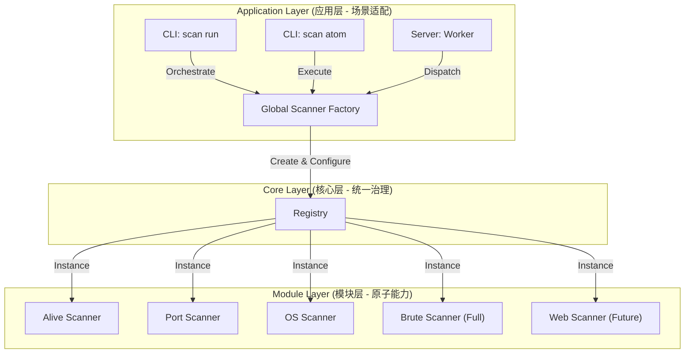

# 全局能力工厂与统一治理架构设计 (Global Capability Factory & Governance Architecture)

## 1. 背景与挑战

随着 NeoScan Agent 的能力不断扩展（从 Alive, Port, OS, Brute 到未来的 WebScan），我们在代码架构上面临着严峻的挑战。

### 1.1 核心矛盾
我们拥有三种截然不同的使用场景，但它们依赖于同一套核心扫描能力：
1.  **Orchestration (编排模式)**: `scan run`。一键自动化，追求速度与覆盖率的平衡，需要智能决策和流程编排。
2.  **Atomic (原子模式)**: `scan brute/port`。单点工具，追求深度与可控性，完全听从用户指令。
3.  **Distributed (集群模式)**: `server mode`。被动接收指令，需要上报能力清单，执行远程下发的任务。

### 1.2 现状痛点
*   **代码重复 (Violation of DRY)**: `AutoRunner` 和 `RunnerManager` 各自维护了一套扫描器的初始化逻辑。
*   **一致性风险**: 新增能力（如 MongoDB 爆破）时，容易遗漏某个入口，导致 "本地能跑但集群不能跑" 或 "单点能跑但流程里没有" 的 Bug。
*   **扩展性瓶颈**: 每次新增 Scanner 类型（如 WebScan），需要修改多处代码。

## 2. 架构设计：六边形核心 (Hexagonal Core)

本方案旨在建立一个 **Single Source of Truth (唯一真理源)**，将 "能力的构建" 与 "能力的使用" 彻底分离。

### 2.1 架构蓝图



### 2.2 核心组件

#### 2.2.1 Scanner Factory (工厂)
*   **职责**: 负责实例化所有 Scanner，并根据场景（Profile）注入不同的配置。
*   **位置**: `internal/core/factory/scanner_factory.go`
*   **接口**:
    ```go
    type ScannerType string
    const (
        TypeBrute ScannerType = "brute"
        TypePort  ScannerType = "port"
        // ...
    )

    func NewScanner(t ScannerType, opts ...Option) (Runner, error)
    ```

#### 2.2.2 Brute Factory (子工厂)
*   **职责**: 专门负责组装 Brute Scanner 的全套协议栈。
*   **位置**: `internal/core/factory/brute_factory.go` (已创建)
*   **逻辑**: 统一注册 SSH, RDP, MySQL 等 15+ 种协议，确保所有入口获得的爆破能力一致。

#### 2.2.3 Capability Registry (能力注册表)
*   **职责**: 动态维护当前 Agent 支持的所有能力列表，用于 Server 模式下的心跳上报。
*   **逻辑**: `Factory` 能够返回 `SupportedTypes[]`，Server 启动时读取此列表上报给 Master。

## 3. 实施方案

### 3.1 阶段一：收敛 Brute 能力 (已完成)
*   **动作**: 使用 `brute.NewFullScanner()` 替换 `AutoRunner` 和 `RunnerManager` 中的重复注册代码。
*   **收益**: 消除 "unsupported service" 风险，新增协议只需修改一处。

### 3.2 阶段二：建立全局工厂 (已完成)
*   **动作**: 创建 `internal/core/factory/` 下的 `alive_factory.go`, `port_factory.go`, `os_factory.go`，将 Alive, Port, OS, Brute 的构建逻辑集中管理。
*   **收益**: `NewAutoRunner` 和 `NewRunnerManager` 代码大幅简化，逻辑更清晰。

### 3.3 阶段三：集群能力动态上报 (Future)
*   **动作**: 修改 Server 的心跳逻辑，通过 Factory 获取当前支持的 Scanner 列表并上报。
*   **收益**: Master 可以根据 Worker 的实际能力进行智能调度（例如：只把 Web 扫描任务发给安装了 Web 插件的 Worker）。

## 4. 对现有系统的影响

*   **Zero Breaking Changes**: 本重构纯粹是内部代码结构的优化，**不改变**任何 CLI 参数、输出格式或 Server 通信协议。
*   **Agent Server**: Server 模式完全不受影响，反而因为底层能力的统一而变得更健壮。

## 5. 决策建议

✅ **推荐立即执行**: 
该方案是解决当前代码 "坏味道" 的最佳实践，且风险极低。它为 Phase 4.1 的并行编排和未来的 WebScan 铺平了道路。

**Linus 的评价**: 
"This is how code should be written. Simple, orthogonal, and no duplicated logic."
