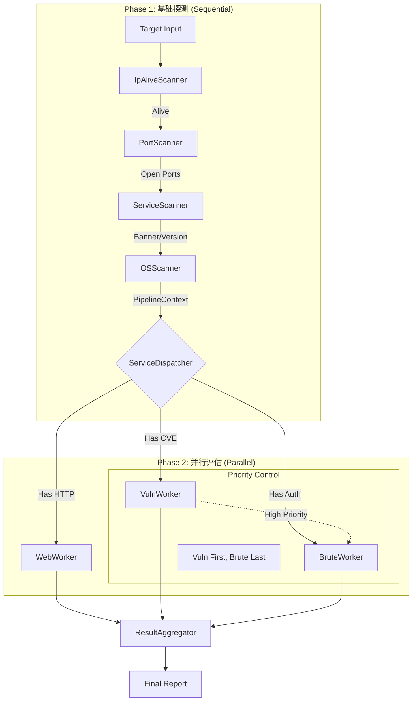

# Phase 4.1 全流程编排融合设计方案 (Fusion Design)

## 1. 设计背景

本方案旨在融合 **"Pipeline 后期升级规划 (Old Plan)"** 的数据模型优势与 **"Parallel Dispatch (New Plan)"** 的架构优势。
我们在保留 `PipelineContext` 这一核心数据载体的同时，摒弃复杂的 YAML 模板配置，采用硬编码的策略模式来实现灵活高效的并行扫描编排。

## 2. 核心架构：Phase-based Orchestration

整体流程分为两个阶段：**串行探测 (Phase 1)** 和 **并行评估 (Phase 2)**。



## 3. 数据模型：PipelineContext (Evolution)

`PipelineContext` 是贯穿全流程的血液。它在 Phase 1 被逐步填充，在 Phase 2 被分发和读取。

```go
type PipelineContext struct {
    IP string
    
    // Phase 1 Results
    Alive      bool
    Hostname   string
    OSInfo     *model.OsInfo
    OpenPorts  []int
    Services   map[int]*model.PortServiceResult // Port -> Service Info
    
    // Phase 2 Results (New)
    WebResults   []*model.WebResult
    VulnResults  []*model.VulnResult
    BruteResults []*model.BruteResult
    
    // Sync Control
    mu sync.RWMutex
}

// 辅助方法：快速判断服务类型
func (c *PipelineContext) HasService(svcName string) bool
func (c *PipelineContext) GetPortsByService(svcName string) []int
```

## 4. 核心组件：ServiceDispatcher

`ServiceDispatcher` 是 Phase 1 和 Phase 2 的连接点。它取代了原计划中的 YAML 模板引擎，通过**代码逻辑**来决定后续任务。

### 4.1 分发逻辑 (Hardcoded Intelligence)

```go
func (d *ServiceDispatcher) Dispatch(ctx context.Context, pCtx *PipelineContext) {
    // 1. Web Dispatch
    if pCtx.HasService("http") || pCtx.HasService("https") {
        d.webQueue <- NewWebTask(pCtx)
    }

    // 2. Vuln Dispatch (Based on Banner)
    // e.g. if banner contains "WebLogic", trigger WebLogic Vuln Scan
    
    // 3. Brute Dispatch (Low Priority)
    // Protocols: ssh, rdp, mysql, redis, postgres, etc.
    supportedProtos := []string{"ssh", "rdp", "mysql", "redis", "postgres", "mssql", "ftp", "telnet"}
    for _, proto := range supportedProtos {
        if ports := pCtx.GetPortsByService(proto); len(ports) > 0 {
            d.bruteQueue <- NewBruteTask(pCtx, proto, ports)
        }
    }
}
```

### 4.2 策略配置 (Presets)

保留 `Preset` 概念，但作为 Dispatcher 的配置选项，而非 YAML 文件。

```go
type DispatchStrategy int

const (
    StrategyDefault DispatchStrategy = iota
    StrategyQuick                    // Skip Brute, Skip Deep Web
    StrategyFull                     // All In
    StrategySafe                     // Skip Brute
)

type ServiceDispatcher struct {
    strategy DispatchStrategy
    // ...
}
```

## 5. 优先级控制 (Vuln First, Brute Last)

为了避免爆破的高噪音导致 IP 被封禁，从而影响漏洞扫描，我们需要实现简单的依赖控制。

**实现方案**：
在 `WorkerPool` 中，Brute 任务的执行可以被推迟。
或者简单地：在 Dispatch 时，先 await Vuln/Web 任务完成，再 dispatch Brute 任务（如果不需要极致的并行）。
考虑到代码复杂度，**v1 版本** 可以采用 "Channel 优先级" 或 "Phase 2 内部串行"：
- **方案 A (简单)**: Parallel Web/Vuln -> Wait -> Parallel Brute.
- **方案 B (复杂)**: 真正的 DAG 依赖。

**推荐方案 (Pragmatism)**:
Phase 2 分为 **2a (Web/Vuln)** 和 **2b (Brute)**。
`ServiceDispatcher` 先启动 Web/Vuln 任务，使用 `WaitGroup` 等待它们完成（或超时），然后再启动 Brute 任务。这虽然牺牲了一点点并发度，但极大简化了状态管理，且符合安全最佳实践。

## 6. 实施路线图

1.  **Refactor PipelineContext**: 扩展字段以支持 Phase 2 结果。
2.  **Implement ServiceDispatcher**: 实现分发逻辑和策略控制。
3.  **Upgrade AutoRunner**: 
    - 接入 Dispatcher。
    - 实现 "Phase 2a -> Wait -> Phase 2b" 的执行流。
4.  **CLI Integration**: 将 `--preset` 参数映射到 `DispatchStrategy`。

此方案融合了原计划的清晰数据流和新计划的高效执行流，完全符合 Linus 的 "Good Taste" 和 "Pragmatism" 原则。
