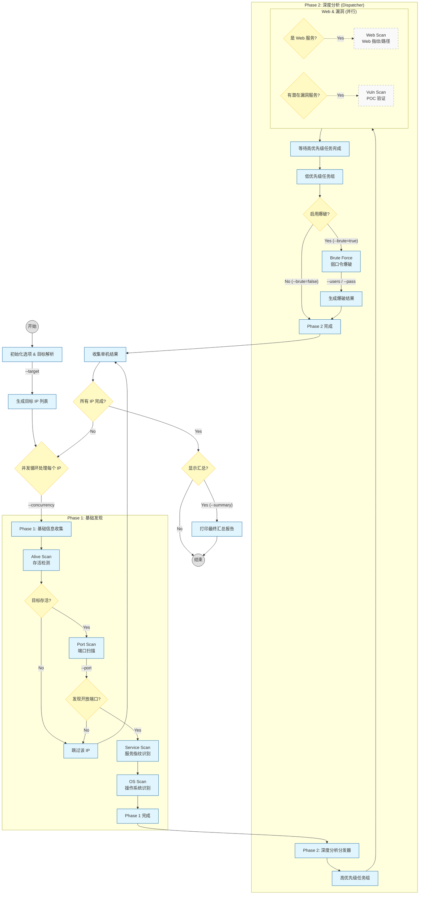

# scan run 全流程处理逻辑

本文档描述了 `scan run` 命令的完整执行流程，包括当前已实现的模块和未来规划的功能。

## 流程图

## 关键流程说明

### Phase 1: 基础发现 (已完全实现)
- **Alive Scan**: 使用 ICMP/ARP/TCP Ping 检测主机存活。不存活的主机直接跳过。
- **Port Scan**: 扫描开放端口，受 `--port` 参数控制范围。
- **Service Scan**: 基于 nmap-service-probes 指纹库识别服务版本。
- **OS Scan**: 基于 TTL 和指纹推断操作系统。

### Phase 2: 深度分析 (部分实现)
- **Dispatcher**: 负责根据服务类型分发后续任务。
- **Web/Vuln (规划中)**: 针对 Web 服务进行指纹识别和漏洞扫描。
- **Brute Force (已实现)**: 
  - 受 `--brute` 参数控制开启。
  - 针对 SSH, FTP, Telnet, MySQL, Postgres, Redis 等服务进行弱口令检测。
  - 支持 `--users` 和 `--pass` 自定义字典。

## 参数影响总结
| 参数 | 影响阶段 | 说明 |
| :--- | :--- | :--- |
| `--target` | 初始化 | 决定扫描目标的数量和范围 |
| `--concurrency` | 循环控制 | 决定同时进行 Phase 1 的 IP 数量 |
| `--port` | Phase 1 | 决定端口扫描的覆盖范围 |
| `--brute` | Phase 2 | **关键开关**，决定是否进行弱口令爆破 |
| `--users/--pass` | Phase 2 | 仅在爆破开启时生效，覆盖默认字典 |
| `--summary` | 结束阶段 | 决定是否输出统计报告 |
