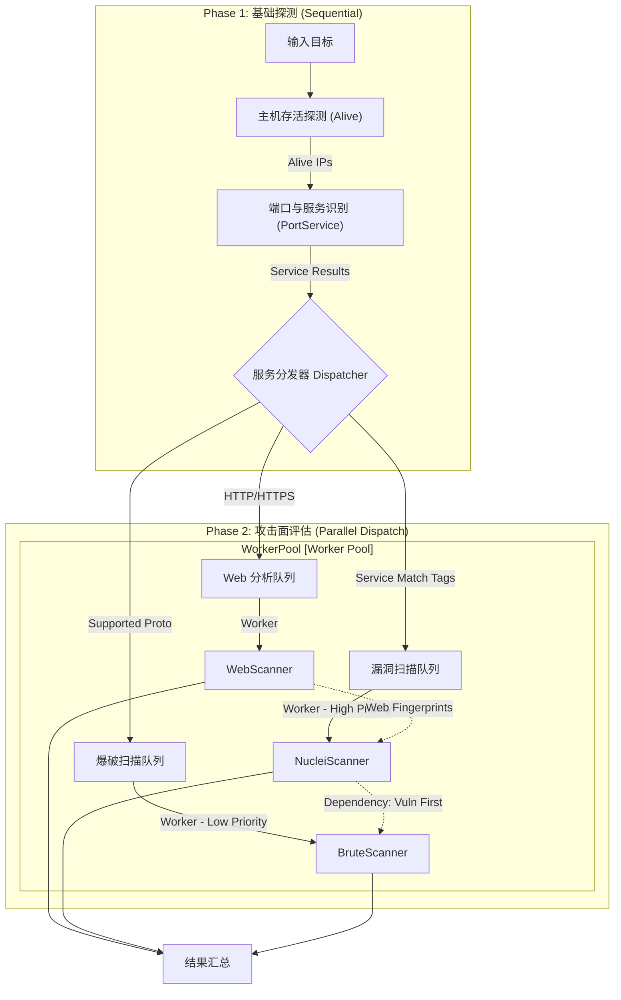

# 全流程扫描与编排设计 (Scan Orchestration)

## 1. 设计背景
目前的 `neoAgent` 拥有一系列强大的原子扫描能力 (`alive`, `port`, `web` 等)，非常适合作为分布式系统中的执行单元接受 Master 调度。然而，作为单机工具使用时，用户往往需要一个“一站式”的入口来执行复杂的扫描任务链，而不是手动串联多个子命令。

## 2. 核心理念：分层设计
为了兼顾“Master 调度的原子性”和“单机使用的便捷性”，我们将 CLI 设计分为两层：

1.  **原子层 (Atomic Layer)**: `alive`, `port`, `web` 等子命令。
    - **特点**: 职责单一，输入输出明确，无副作用。
    - **场景**: Master 调度、脚本集成、精细化诊断。
2.  **编排层 (Orchestration Layer)**: `run` 子命令。
    - **特点**: 聚合多个原子能力，内部维护流水线 (Pipeline)，支持智能决策。
    - **场景**: 日常单机扫描、红队作业、全自动化评估。

## 3. `scan run` 命令设计

### 3.1 基础语法
```bash
neoAgent scan run -t <target> [flags]
```

### 3.2 模式与参数

#### 模式 A: 自动化流水线 (Pipeline Mode)
用户通过开关参数自由组合扫描阶段。

| 参数 | 对应原子能力 | 描述 |
| :--- | :--- | :--- |
| `-p <ports>` | `port` | 端口扫描 (默认 Top 1000) |
| `-s` | `port -s` | 开启服务识别 |
| `-o` | `os` | 开启操作系统识别 (基于 TTL + Nmap 指纹) |
| `--vuln` | `vuln` | 开启漏洞扫描 (基于 Nuclei/POC) |
| `--brute` | `brute` | 开启弱口令爆破 (SSH/Redis/MySQL 等) |
| `--web` | `web` | 开启 Web 爬虫与指纹识别 |

**示例**:
```bash
# 全流程：端口 -> 服务 -> OS -> 漏洞 -> 爆破
neoAgent scan run -t 192.168.1.1 -p 1-65535 -s -o --vuln --burst
```

#### 模式 B: 智能自动模式 (Auto Mode)
为懒人准备的“一键扫描”。

```bash
neoAgent scan run -t 192.168.1.1 --auto
```

**`--auto` 的默认策略**:
1.  **Alive**: ICMP + TCP Ping 探测存活。
2.  **Port**: 扫描 Top 1000 端口。
3.  **Service**: 对开放端口进行服务识别。
4.  **Web**: 如果发现 HTTP/HTTPS，自动进行基础 Web 指纹识别。
5.  **Vuln**: 仅进行高危漏洞检测 (High/Critical)。
6.  **Brute**: 关闭 (避免锁定账户)。

### 3.3 内部流水线逻辑 (The Pipeline)

`PipelineRunner` 采用 **"串行探测 + 并行分发" (Serial Probe + Parallel Dispatch)** 的模式：

#### Phase 1: 基础探测 (Sequential)
所有后续扫描的基础，必须串行执行。

1.  **Stage 1: Host Discovery (主机发现)**
    - **Input**: CIDR/IPs
    - **Action**: 调用 `IpAliveScanner`
    - **Output**: Alive IPs List
    - **Decision**: 如果无存活，立即终止。

2.  **Stage 2: Port & Service (端口与服务识别)**
    - **Input**: Alive IPs
    - **Action**: 调用 `PortServiceScanner` (Rate Limited)
    - **Output**: `[]ServiceResult` (IP, Port, Protocol, Product, Version)

#### Phase 2: 攻击面评估 (Parallel Dispatch)
基于 Stage 2 的结果，通过 **Service Dispatcher** 并行分发任务。



3.  **Branch A: Web Analysis (Web 分析)**
    - **Trigger**: `Service` 包含 `http`, `https`, `ssl/http`。
    - **Action**: 
        - 基础指纹识别 (Wappalyzer)。
        - 爬虫 (如果开启 `--crawl`)。
    - **Output**: Web Fingerprints (CMS, Framework, Tech)。

4.  **Branch C: Vulnerability Scanning (漏洞扫描) - High Priority**
    - **Trigger**: 显式开启 `--vuln`。
    - **Logic**:
        - **通用漏洞**: 基于端口和服务版本匹配 Nuclei 模板 (e.g. `redis-unauth`, `ssh-weak-algo`)。
        - **Web 漏洞**: 必须等待 **Branch A** 完成，获取 Web 指纹后，进行精准匹配 (e.g. `log4j`, `struts2`, `thinkphp`)。
    - **Priority**: **高于 Brute Force**。
        - 理由 1 (价值): 如果直接发现 RCE 漏洞，无需再进行耗时的密码爆破。
        - 理由 2 (隐蔽): 漏洞探测通常流量较小，优先执行可避免因爆破触发防火墙而导致漏扫。

5.  **Branch B: Brute Force (暴力破解) - Low Priority**
    - **Trigger**: `Service` 在爆破支持列表中 (ssh, mysql, redis...) **且** 显式开启 `--brute`。
    - **Policy**: **默认关闭**。`--auto` 模式下不开启，必须用户手动指定。
    - **Dependency**: 建议在同端口的 **Branch C (Vuln)** 完成后执行，或作为最后手段 (Last Resort)。
    - **Action**: 调用 `BruteScanner` 进行弱口令检测。

## 4. 优势分析
- **解耦**: 原子 Scanner 不需要知道自己在流水线中的位置，保持纯粹。
- **灵活**: 用户既可以像 Nmap 一样使用 (`scan run`)，也可以像 Masscan 一样使用 (`scan port`)。
- **可扩展**: 新增原子能力（如子域名挖掘）后，只需在 `PipelineRunner` 中增加一个 Stage 即可集成到 `run` 命令中。

## 5. 实施计划 (Roadmap)
1.  **Refactor**: 确保 `IpAliveScanner` 和 `PortServiceScanner` 可以被代码调用并返回结构化数据（而非直接打印到控制台）。
2.  **Impl**: 实现 `internal/core/pipeline` 包，定义 `Pipeline` 和 `Stage` 接口。
3.  **CLI**: 实现 `cmd/agent/scan/run.go`，解析聚合参数并启动 Pipeline。
4.  **Auto**: 定义 `--auto` 的默认配置集 (Profile)。
