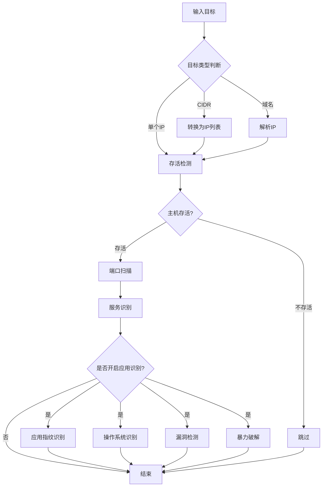

# Agent 的扫描流程

```mermaid
graph TD
    A[输入目标] --> B{目标类型判断}
    B -->|CIDR| C[转换为IP列表]
    B -->|域名| D[解析IP]
    B -->|单个IP| E[存活检测]
    C --> E
    D --> E
    
    E --> F{主机存活?}
    F -->|存活| G[端口扫描]
    F -->|不存活| H[跳过]
    
    G --> I[服务识别]
    I --> J{是否开启应用识别?}
    J -->|是| K[应用指纹识别]
    J -->|是| R[操作系统识别]
    J -->|是| L[漏洞检测]
    J -->|是| M[暴力破解]
    J -->|否| N[结束]
    
    K --> N
    R --> N
    L --> N
    M --> N
    H --> N
```