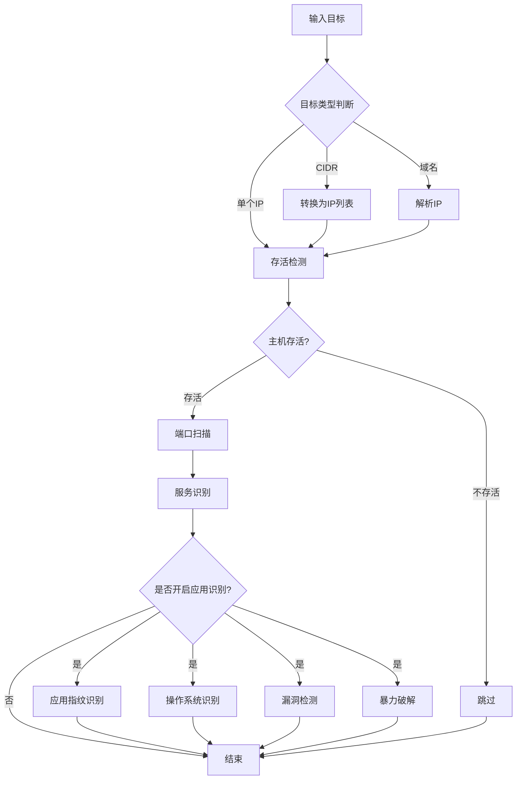
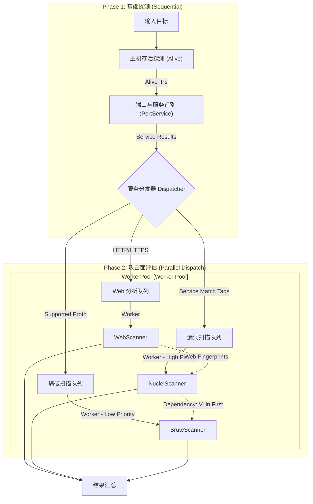

# Agent 的扫描流程

## v1.0 基础线性流程 (Linear Flow)
*适用场景：早期原子能力验证，简单任务串联。*

---

## v2.0 并行分发编排流程 (Parallel Orchestration Flow)
*演进原因：*
1.  **性能瓶颈**: v1.0 的线性流程导致 Web 扫描（慢速）阻塞了其他无关服务（如 MySQL）的检测，资源利用率低。
2.  **风控需求**: 爆破与漏洞扫描同时进行可能触发目标防火墙，需要精细的优先级控制。
3.  **架构解耦**: 引入 "Dispatcher" 概念，将基础探测（Phase 1）与攻击面评估（Phase 2）解耦，支持更复杂的依赖管理。

### 核心变更
*   **Phase 1 (串行)**: 基础信息收集 (Alive -> Port -> Service)，确保数据准确性。
*   **Phase 2 (并行)**: 基于 Service 结果进行**并行分发**，Web、漏洞、爆破互不阻塞。
*   **优先级控制**: 引入 `Vuln First, Brute Last` 策略，降低攻击噪音。

