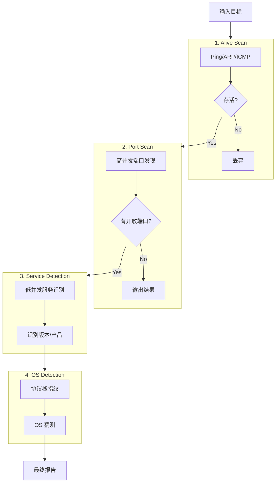

# Pipeline 核心编排模块

## 1. 模块职责
`pipeline` 模块是 NeoAgent 自动化扫描的大脑，负责将独立的扫描能力（Scanner）串联成有逻辑、高效的执行流。它管理着从目标输入到最终结果输出的全生命周期。

### 核心组件
- **AutoRunner**: 自动化编排器，负责调度和执行扫描流程。
- **PipelineContext**: 上下文对象，在各个扫描阶段之间传递数据（如存活状态、开放端口、指纹信息）。
- **TargetGenerator**: 目标生成器，负责解析 CIDR、IP 列表等输入源。

---

## 2. 扫描流程 (The Linear Flow)

目前的默认流程采用了 **"漏斗式过滤" (Funnel Filtering)** 策略，旨在尽早剔除无效目标，将昂贵的扫描资源集中在有效目标上。

---

## 3. 关键设计决策 (Design Decisions)

### 3.1 为什么将 Port Scan 和 Service Scan 分离？

虽然底层 `PortServiceScanner` 支持一次性完成端口发现和服务识别，但在 Pipeline 中我们将它们拆分为两个独立阶段：

1.  **效率漏斗 (The Efficiency Funnel)**
    -   **Port Scan** 是"粗粒度、高并发"的筛选。它的成本极低，速度极快（可达数千 PPS）。
    -   **Service Scan** 是"细粒度、低并发"的交互。它需要发送 Nmap 探针并等待响应，成本昂贵且耗时。
    -   **策略**：先用极快的 Port Scan 将扫描范围从 65535 个端口缩小到 几个开放端口，然后再对这几个端口进行精细的服务识别。

2.  **并发控制 (Concurrency Control)**
    -   如果合并执行，整体并发度必须迁就于服务识别的限制（为了防止被防火墙阻断或耗尽资源，通常需限制在 10-20 并发）。
    -   这意味着端口发现的速度会被严重拖慢。
    -   分离后，Port Scan 阶段可以全速跑满带宽，而 Service Scan 阶段则可以精细控制，互不干扰。

3.  **快速失败 (Fail Fast)**
    -   对于有防火墙或不响应的目标，Port Scan 可以快速跳过，避免了服务识别阶段漫长的超时等待。

### 3.2 Context 数据传递
- 使用 `PipelineContext` 结构体在各个阶段间传递数据。
- 它是线程安全的（Thread-Safe），支持并发读写。
- 包含 `Alive` (bool), `OpenPorts` ([]int), `Services` (map), `OSInfo` (struct) 等字段，确保后续阶段能利用前序阶段的信息（例如 OS 扫描会利用 Open Ports 列表）。

---

## 4. 并发模型 (Concurrency Model)

目前 `AutoRunner` 采用 **IP 级并发 (Per-IP Concurrency)**：
- 用户通过 `-c` 参数指定并发数（Worker 数量）。
- 每个 Worker 负责一个 IP 的完整生命周期（Alive -> Port -> Service -> OS）。
- **注意**：这种模式在处理大网段时可能面临 "Head-of-Line Blocking" 问题（即少数存活主机的耗时扫描阻塞了对其他 IP 的快速发现）。
- **未来演进**：计划向 **分层解耦流水线 (Stage-Decoupled Pipeline)** 演进，为每个阶段分配独立的 Worker Pool，进一步提升吞吐量。
