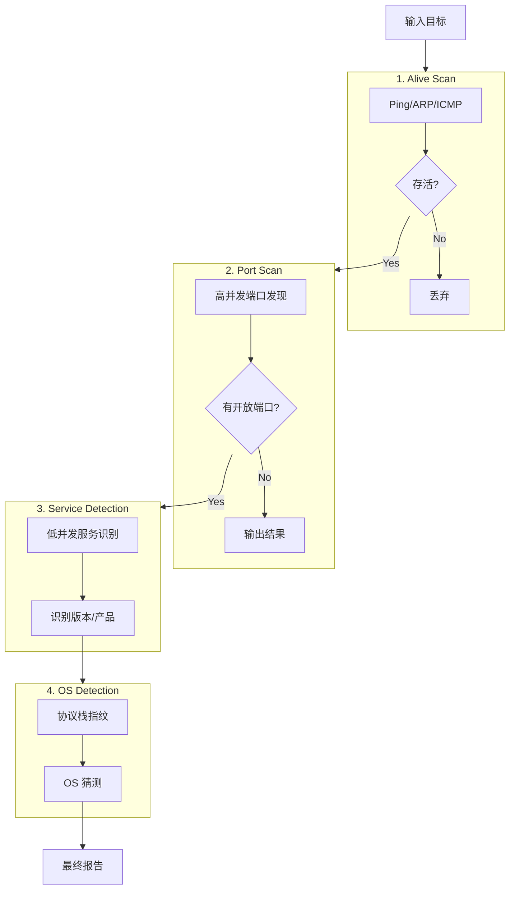

# Pipeline 核心编排模块

> **版本**: v1.1  
> **更新日期**: 2026-08-14  
> **状态**: 活跃开发中

---

## 修改记录

| 日期 | 版本 | 变更说明 |
|------|------|---------|
| 2026-08-14 | v1.1 | 新增第 5 节：Phase 2 扫描器接入计划（DirScanner / API Scanner / Vuln Scanner） |
| — | v1.0 | 初始版本，记录线性漏斗流程和设计决策 |

---

## 1. 模块职责
`pipeline` 模块是 NeoAgent 自动化扫描的大脑，负责将独立的扫描能力（Scanner）串联成有逻辑、高效的执行流。它管理着从目标输入到最终结果输出的全生命周期。

### 核心组件
- **AutoRunner**: 自动化编排器，负责调度和执行扫描流程。
- **PipelineContext**: 上下文对象，在各个扫描阶段之间传递数据（如存活状态、开放端口、指纹信息）。
- **TargetGenerator**: 目标生成器，负责解析 CIDR、IP 列表等输入源。

---

## 2. 扫描流程 (The Linear Flow)

目前的默认流程采用了 **"漏斗式过滤" (Funnel Filtering)** 策略，旨在尽早剔除无效目标，将昂贵的扫描资源集中在有效目标上。


```mermaid
graph TD
    Target[输入目标] --> Stage1
    
    subgraph Stage1 [1. Alive Scan]
        direction TB
        Ping/ARP/ICMP --> IsAlive{存活?}
        IsAlive -- No --> Drop[丢弃]
    end
    
    IsAlive -- Yes --> Stage2
    
    subgraph Stage2 [2. Port Scan]
        direction TB
        SynScan[高并发端口发现] --> HasOpenPorts{有开放端口?}
        HasOpenPorts -- No --> Report[输出结果]
    end
    
    HasOpenPorts -- Yes --> Stage3
    
    subgraph Stage3 [3. Service Detection]
        direction TB
        ServiceProbe[低并发服务识别] --> Identify[识别版本/产品]
    end
    
    Identify --> Stage4
    
    subgraph Stage4 [4. OS Detection]
        direction TB
        StackFingerprint[协议栈指纹] --> OSGuess[OS 猜测]
    end
    
    OSGuess --> FinalReport[最终报告]
```

---

## 3. 关键设计决策 (Design Decisions)

### 3.1 为什么将 Port Scan 和 Service Scan 分离？

虽然底层 `PortServiceScanner` 支持一次性完成端口发现和服务识别，但在 Pipeline 中我们将它们拆分为两个独立阶段：

1.  **效率漏斗 (The Efficiency Funnel)**
    -   **Port Scan** 是"粗粒度、高并发"的筛选。它的成本极低，速度极快（可达数千 PPS）。
    -   **Service Scan** 是"细粒度、低并发"的交互。它需要发送 Nmap 探针并等待响应，成本昂贵且耗时。
    -   **策略**：先用极快的 Port Scan 将扫描范围从 65535 个端口缩小到 几个开放端口，然后再对这几个端口进行精细的服务识别。

2.  **并发控制 (Concurrency Control)**
    -   如果合并执行，整体并发度必须迁就于服务识别的限制（为了防止被防火墙阻断或耗尽资源，通常需限制在 10-20 并发）。
    -   这意味着端口发现的速度会被严重拖慢。
    -   分离后，Port Scan 阶段可以全速跑满带宽，而 Service Scan 阶段则可以精细控制，互不干扰。

3.  **快速失败 (Fail Fast)**
    -   对于有防火墙或不响应的目标，Port Scan 可以快速跳过，避免了服务识别阶段漫长的超时等待。

### 3.2 Context 数据传递
- 使用 `PipelineContext` 结构体在各个阶段间传递数据。
- 它是线程安全的（Thread-Safe），支持并发读写。
- 包含 `Alive` (bool), `OpenPorts` ([]int), `Services` (map), `OSInfo` (struct) 等字段，确保后续阶段能利用前序阶段的信息（例如 OS 扫描会利用 Open Ports 列表）。

---

## 4. 并发模型 (Concurrency Model)

目前 `AutoRunner` 采用 **IP 级并发 (Per-IP Concurrency)**：
- 用户通过 `-c` 参数指定并发数（Worker 数量）。
- 每个 Worker 负责一个 IP 的完整生命周期（Alive -> Port -> Service -> OS）。
- **注意**：这种模式在处理大网段时可能面临 "Head-of-Line Blocking" 问题（即少数存活主机的耗时扫描阻塞了对其他 IP 的快速发现）。
- **未来演进**：计划向 **分层解耦流水线 (Stage-Decoupled Pipeline)** 演进，为每个阶段分配独立的 Worker Pool，进一步提升吞吐量。

---

## 5. 后续改造计划（Phase 2 扫描器接入）

> **时间**: 2026-08-14 规划  
> **状态**: 待实施

### 5.1 现状

目前 Pipeline 的 Stage 2 仅有 **Web Scanner**（Phase 2a）和 **Brute Scanner**（Phase 2b），以下原子扫描器尚未接入 Pipeline：

| 扫描器 | 当前状态 | CLI 独立命令 | Pipeline 接入 |
|--------|---------|:---:|:---:|
| Web Scanner | ✅ 已有 | ✅ | ✅ Phase 2a |
| Brute Scanner | ✅ 已有 | ✅ | ✅ Phase 2b |
| API Scanner | ✅ 已有 | ✅ | ❌ 未接入 |
| Dir Scanner | 📝 设计中 | ✅ | ❌ 未接入 |
| Vuln Scanner | 📝 待实现 | ❌ | ❌ 未接入 |

### 5.2 功能依赖分析

```
Service Scanner（已有）
    ↓ 产出：哪些端口是 Web 服务
    │
    ├──→ Web Scanner（已有）
    │        ↓ 产出：页面结构、HTML 链接、JS 文件、TechStack
    │        │
    │        ├──→ API Scanner（依赖 Web Scan 产出）
    │        │
    │        └──→ Vuln Scanner（依赖 Web Scan 产出）
    │
    └──→ Dir Scanner（不依赖 Web Scan，只要 Web 端口就扫）
```

### 5.3 各扫描器接入决策

#### API Scanner — **必须接入**

**理由**：
- API Scanner 的核心是从**页面中的 JS 文件**提取 API 端点
- CLI 独立运行只能指定 `--url` 扫单页，覆盖率低
- Pipeline 中 Web Scanner 先爬取整个站点 → 产出 JS 列表 → API Scanner 对每个 JS 提取 API
- 覆盖率比独立运行高一个数量级

**Pipeline 位置**：Phase 2b（被动深度分析），**紧跟 Web Scanner 之后**（必须依赖 Web Scan 产出）

#### Dir Scanner — **应该接入**

**理由**：
- 不依赖 Web Scanner 的页面内容，只需要 Service Scanner 识别出 Web 端口
- 可以**和 Web Scanner 并行**，不阻塞
- 覆盖互补：Web Scanner（被动爬取）vs Dir Scanner（主动爆破）
- 某些 JS 文件藏在非标准路径中，Dir Scanner 能发现 Web Scanner 爬不到的东西

**Pipeline 位置**：Phase 2a（主动探测），**和 Web Scanner 并行**

### 5.4 建议的 Pipeline 重构

```
AutoRunner.executePipeline()
    │
    ├── Stage 1（线性漏斗）
    │   1. Alive Scan
    │   2. Port Scan（快速发现）
    │   3. Service Scan（服务识别）
    │   4. OS Scan
    │
    ├── Stage 2a（并行主动探测）← ServiceDispatcher.Dispatch()
    │   ┌─────────────────────────────────────────┐
    │   │  Web Scanner    ─────────→──┐           │
    │   │  Dir Scanner    ────────────┼──→ 结果收集  │
    │   │  Vuln Scanner   ────────────┘           │
    │   └─────────────────────────────────────────┘
    │         ↑ 全部并行，无依赖关系
    │
    ├── Stage 2b（被动深度分析）← 新增
    │   ┌─────────────────────────────────────────┐
    │   │  API Scanner  ─→───┐                   │
    │   │  Vuln Deep  ─────────┼──→ 结果收集     │
    │   └─────────────────────────────────────────┘
    │         ↑ 依赖 Web Scanner 的页面/JS 产出
    │
    ├── Stage 2c（低优先级爆破）← 已有
    │   └── Brute Force
    │
    └── Report
```

### 5.5 需改造的代码

| 文件 | 改动内容 |
|------|---------|
| `PipelineContext` | 新增 `DirResults []*model.DirResult`、`ApiResults []*model.ApiResult` |
| `ServiceDispatcher` | 新增 `dirScanner` 字段、新增 `dispatchHighPriority` 中调用 DirScan |
| `dispatcher.go` | 新增 Stage 2b（API Scanner + Vuln Deep） |
| `auto_runner.go` | 新增 DirScanner 实例初始化 |
| `factory` | 注册 DirScanner Factory |

### 5.6 核心设计原则

**能并行的就并行**（提高吞吐量），**有依赖的就串行**（提高覆盖率）。

---
