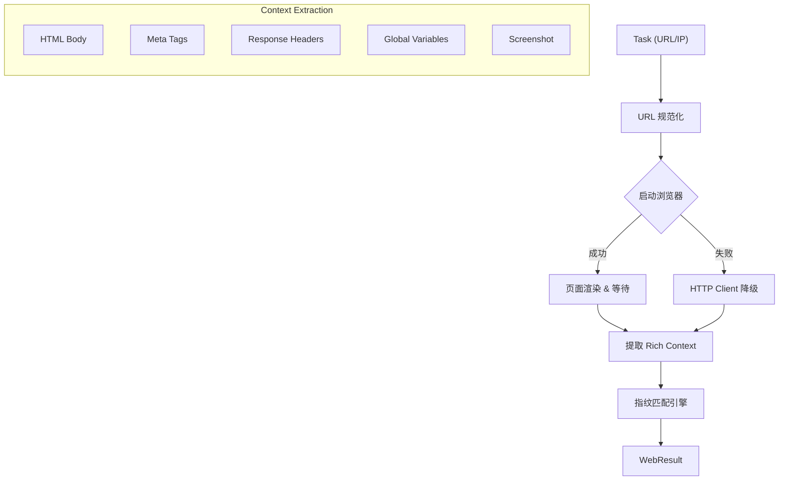

# Web Scanner 模块

`web` 模块是 NeoAgent 的核心组件之一，负责对 Web 服务进行深度分析和指纹识别。它采用了 **"Headless Browser + HTTP Fallback"** 的混合架构，既保证了对现代 SPA（单页应用）的解析能力，又具备了传统扫描器的鲁棒性。

## 1. 核心能力

### 1.1 动态渲染与交互 (Headless Browser)
集成 `go-rod` (Chromium Driver)，能够完整渲染 JavaScript 动态生成的页面内容。
- **DOM 解析**: 获取渲染后的最终 HTML，识别隐藏在 JS 中的链接和指纹。
- **截图能力**: 支持网页截图 (Base64)，直观展示目标界面。
- **JS 环境分析**: 提取全局变量 (Window Object)，识别前端框架（如 Vue, React, Webpack）。

### 1.2 智能降级 (Smart Fallback)
为了应对无头服务器、网络受限或浏览器崩溃等极端情况，模块内置了自动降级机制。
- 当浏览器导航失败（如超时、证书错误）时，自动切换为 Go 原生 `net/http` 客户端。
- 确保即使无法截图，也能获取 HTTP 头、Title 和基础 HTML 源码进行指纹匹配。

### 1.3 深度指纹识别 (Fingerprinting)
基于 NeoScan 内部定义的指纹规则格式（兼容 Wappalyzer 识别逻辑），支持多维度特征匹配：
- **Headers**: 匹配 Server, X-Powered-By, Cookie 等。
- **HTML/Meta**: 匹配 meta 标签、特定 DOM 结构。
- **Scripts**: 分析引入的 JS 文件路径。
- **JavaScript Variables**: 独有的 **Iframe Trick** 技术，精准提取用户定义的全局变量，过滤浏览器内置干扰。

### 1.4 智能调度 (Smart Dispatch)
- **协议推断**: 自动识别非标准端口的 HTTP/HTTPS 协议（如 8443, 8080）。
- **QoS 控制**: 内置自适应限流器，防止对目标造成过大压力或耗尽本地资源。

## 2. 架构设计



## 3. 使用方式

### 3.1 原子扫描 (`scan web`)
直接针对特定目标进行扫描，适合调试或单点测试。

```bash
# 基础扫描
neoAgent scan web -t www.example.com

# 指定端口并开启截图
neoAgent scan web -t 192.168.1.1 --ports 8443 --screenshot

# 输出 JSON 格式
neoAgent scan web -t www.example.com --oj result.json
```

### 3.2 全流程集成 (`scan run`)
在自动化流水线中，`scan run` 会自动识别开放的 Web 端口并调度 Web Scanner。

```bash
# 自动发现端口并扫描 Web 服务
neoAgent scan run -t 192.168.1.0/24
```

## 4. 输出字段说明

| 字段 | 说明 |
| :--- | :--- |
| `url` | 完整的访问 URL (含协议和端口) |
| `status_code` | HTTP 状态码 |
| `title` | 网页标题 |
| `server` | Web 服务器 Banner (如 nginx/1.20.1) |
| `tech_stack` | 识别到的技术栈列表 (如 [Vue.js, jQuery, Nginx]) |
| `screenshot` | 网页截图 (Base64 编码，仅在开启时返回) |
| `headers` | 完整的响应头 |

## 5. 开发指南

- **JS 提取逻辑**: 位于 `context.go`，使用 `iframe` 对比法提取全局变量。
- **降级逻辑**: 位于 `web_scanner.go` 的 `fallbackScan` 方法。
- **指纹规则**: 默认加载 `rules/fingerprint/web/web_fingerprints.json`。
