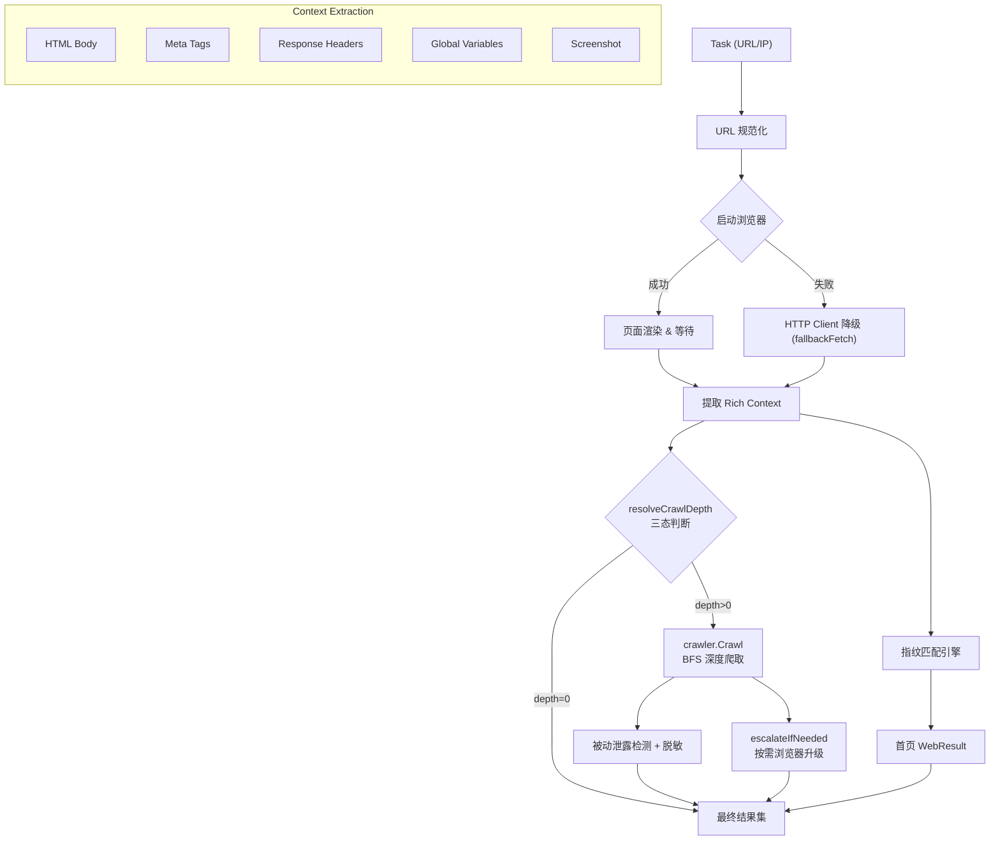

# Web Scanner 模块

> **文档版本**: v2.1
> **最后更新**: 2026-07-31
> **更新说明**: 同步 Sprint 6（真实站点测试驱动的原生缺陷修复）落地能力：第 1.4 节补充「多端口并发探测」与「协议自适应双发选优」两条能力说明；第 5 节补充 `runOnePort`/`fallbackFetchBestProtocol` 的位置说明。此前版本（v2.0）同步 Phase 5.1 Sprint 0-5 落地能力：新增第 2 节「BFS 深度爬取与被动分析」，修正第 3 节使用示例与第 5 节开发指南中已过时的方法名（`fallbackScan` → `fallbackFetch`）。

`web` 模块是 NeoAgent 的核心组件之一，负责对 Web 服务进行深度分析、指纹识别、站内爬取与被动敏感信息检测。它采用了 **"Headless Browser + HTTP Fallback"** 的混合架构，既保证了对现代 SPA（单页应用）的解析能力，又具备了传统扫描器的鲁棒性。

## 1. 核心能力

### 1.1 动态渲染与交互 (Headless Browser)
集成 `go-rod` (Chromium Driver)，能够完整渲染 JavaScript 动态生成的页面内容。
- **DOM 解析**: 获取渲染后的最终 HTML，识别隐藏在 JS 中的链接和指纹。
- **截图能力**: 支持网页截图 (Base64)，直观展示目标界面。
- **JS 环境分析**: 提取全局变量 (Window Object)，识别前端框架（如 Vue, React, Webpack）。

### 1.2 智能降级 (Smart Fallback)
为了应对无头服务器、网络受限或浏览器崩溃等极端情况，模块内置了自动降级机制。
- 当浏览器导航失败（如超时、证书错误）时，自动切换为 Go 原生 `net/http` 客户端。
- 确保即使无法截图，也能获取 HTTP 头、Title 和基础 HTML 源码进行指纹匹配。

### 1.3 深度指纹识别 (Fingerprinting)
基于 NeoScan 内部定义的指纹规则格式（兼容 Wappalyzer 识别逻辑），支持多维度特征匹配：
- **Headers**: 匹配 Server, X-Powered-By, Cookie 等。
- **HTML/Meta**: 匹配 meta 标签、特定 DOM 结构。
- **Scripts**: 分析引入的 JS 文件路径。
- **JavaScript Variables**: 独有的 **Iframe Trick** 技术，精准提取用户定义的全局变量，过滤浏览器内置干扰。

### 1.4 智能调度 (Smart Dispatch)
- **协议推断**: 自动识别非标准端口的 HTTP/HTTPS 协议（如 8443, 8080）。
- **多端口并发探测**: `--ports` 支持 `"80,443"`/`"1-100"`/`"top100"` 等范围写法（复用 `port_service/nmap_service.ParsePortList`），每个端口各自独立探测（各自猜协议、各自抓取、各自可能触发 BFS），互不影响、并发执行；单个端口失败不会连累其他端口的结果丢失。
- **协议自适应双发选优**: 当协议是自动猜测（而非用户显式指定）时，如果拿到的响应是协议不匹配的典型特征（400），会用 `net/http` 并发对 HTTP/HTTPS 两个方向各发一次请求，用响应质量客观选出更可信的结果——参考 `httpx` 的做法，不依赖脆弱的错误类型/错误文案判断。这个校验同时覆盖 go-rod（Headless Chromium）和降级路径两条数据来源，因为真实 Chrome 环境下验证过：协议猜错时浏览器不会导航失败，而是会把对端返回的合法 400 提示当成一次「成功」的抓取。
- **QoS 控制**: 内置自适应限流器，防止对目标造成过大压力或耗尽本地资源。

### 1.5 BFS 深度爬取 (`crawler` 子包)
首页扫描完成后，可对站内链接做广度优先遍历，发现更多攻击面（子页面、表单、参数）。
- **三态开关**：`crawl` 参数支持 `auto`（默认，基于状态码/Content-Type/种子链接数三个免费信号自动判断是否值得深爬）、`true`（强制开启，`crawl-depth` 控制深度）、`false`（强制关闭）。用户显式意图永远盖过系统的自动判断。
- **同源范围限制**：默认只在种子 URL 所在 Host 内爬取，不会跑到外部域名（`crawler.Options.AllowCrossHost`，默认为 `false`）。
- **并发与硬上限**：内置 Worker Pool 并发抓取，`MaxPages`（默认 200）防止爬虫在大型站点上失控。
- **按需浏览器升级**：对 `net/http` 抓取到的、被静态检测判定为「JS 跳转」或「SPA 空壳页」的页面，用 Headless Browser 串行重新渲染一次，回填正文与新链接；`defaultMaxEscalationPages`（默认 10）硬上限，超限直接放弃升级、保留原始内容，避免因识别误判导致浏览器开销失控。

### 1.6 被动敏感信息检测 (Passive Leak Detection)
在 BFS 爬取的同时，对每个页面的原始 HTML/JS 文本顺手做一遍正则扫描，不发起任何额外网络请求：
- 内置规则：AWS AccessKey (`AKIA...`)、阿里云 AccessKey (`LTAI...`)、JWT、内网 IP（RFC 1918 三个私有网段）。
- **强制脱敏**：命中的原始明文任何时候都不会出现在扫描结果或日志里，统一经过掩码处理（如 `AKIA****MNOP`）后才对外暴露。

## 2. 架构设计


```mermaid
graph TD
    Input["Task (URL/IP)"] --> Normalizer["URL 规范化"]
    Normalizer --> Browser{"启动浏览器"}
    
    Browser -- 成功 --> Render["页面渲染 & 等待"]
    Browser -- 失败 --> Fallback["HTTP Client 降级 (fallbackFetch)"]
    
    Render --> Context["提取 Rich Context"]
    Fallback --> Context
    
    subgraph Context Extraction
        direction TB
        DOM["HTML Body"]
        Meta["Meta Tags"]
        Headers["Response Headers"]
        JS["Global Variables"]
        Screen["Screenshot"]
    end
    
    Context --> Matcher["指纹匹配引擎"]
    Matcher --> HomeResult["首页 WebResult"]

    Context --> Decide{"resolveCrawlDepth\n三态判断"}
    Decide -- depth>0 --> BFS["crawler.Crawl\nBFS 深度爬取"]
    Decide -- depth=0 --> Result["最终结果集"]
    BFS --> Leak["被动泄露检测 + 脱敏"]
    BFS --> Escalate["escalateIfNeeded\n按需浏览器升级"]
    Leak --> Result
    Escalate --> Result
    HomeResult --> Result
```

## 3. 使用方式

### 3.1 原子扫描 (`scan web`)
直接针对特定目标进行扫描，适合调试或单点测试。

```bash
# 基础扫描
neoAgent scan web -t www.example.com

# 指定端口并开启截图
neoAgent scan web -t 192.168.1.1 --ports 8443 --screenshot

# 输出 JSON 格式
neoAgent scan web -t www.example.com --oj result.json

# 强制开启深度爬取，深度为 3
neoAgent scan web -t www.example.com --crawl=true --crawl-depth 3

# 强制关闭深度爬取，只扫首页
neoAgent scan web -t www.example.com --crawl=false
```

> `--crawl` 默认值为 `auto`：由 `decideCrawlDepth` 基于首页状态码、Content-Type、种子链接数自动判断是否值得深爬，无需手动干预。

### 3.2 全流程集成 (`scan run`)
在自动化流水线中，`scan run` 会自动识别开放的 Web 端口并调度 Web Scanner，`--crawl`/`--crawl-depth` 参数与 `scan web` 语义完全一致。

```bash
# 自动发现端口并扫描 Web 服务（爬虫开关默认 auto）
neoAgent scan run -t 192.168.1.0/24

# 全流程中强制开启深度爬取
neoAgent scan run -t 192.168.1.0/24 --crawl=true
```

## 4. 输出字段说明

| 字段 | 说明 |
| :--- | :--- |
| `url` | 完整的访问 URL (含协议和端口) |
| `status_code` | HTTP 状态码 |
| `title` | 网页标题 |
| `server` | Web 服务器 Banner (如 nginx/1.20.1) |
| `tech_stack` | 识别到的技术栈列表 (如 [Vue.js, jQuery, Nginx]) |
| `screenshot` | 网页截图 (Base64 编码，仅在开启时返回) |
| `headers` | 完整的响应头 |
| `forms` | 页面提取到的表单信息（action/method/fields），BFS 子页面同样会提取 |
| `depth` | 该页面相对首页的 BFS 深度，首页恒为 0 |
| `leaks` | 命中的敏感信息泄露项（已脱敏），无命中则为空 |

## 5. 开发指南

- **JS 提取逻辑**: 位于 `context.go`，使用 `iframe` 对比法提取全局变量。
- **降级逻辑**: 位于 `web_scanner.go` 的 `fallbackFetch` 方法（只负责抓取，不组装结果、不跑指纹匹配）。
- **多端口编排**: `Run()` 是纯编排层（解析端口列表 → 并发调用 `runOnePort` → 汇总），单端口的完整探测流程（猜协议 → go-rod 抓取 → 降级/协议校验 → 组装结果 → 按需 BFS）在 `runOnePort` 里。
- **协议自适应双发选优**: 核心逻辑在 `fallbackFetchBestProtocol`（http/https 并发双发）与 `pickBestFetchOutcome`（响应质量排序，同时接纳 go-rod 结果与 fallback 结果参与比较）。
- **指纹规则**: 默认加载 `rules/fingerprint/web/web_fingerprints.json`。
- **BFS 爬取核心**: 位于 `crawler/crawler.go`，`Options.AllowCrossHost` 默认 `false`（零值即安全，只在种子 Host 内爬），显式传 `true` 才允许跨域。
- **被动泄露检测规则**: 位于 `crawler/leak.go` 的 `defaultLeakRules`，新增规则类型直接往这个 slice 追加即可。
- **爬取三态开关落地**: 位于 `web_scanner.go` 的 `decideCrawlDepth`（自动判断）与 `resolveCrawlDepth`（叠加 `task.Params["crawl"]` 显式开关）。
- **详细设计文档**: 完整架构方案与 Sprint 实施记录见 [`docs/爬虫/Web爬虫与被动分析器架构方案-sonnet5-v3.0.md`](../../../../docs/爬虫/Web爬虫与被动分析器架构方案-sonnet5-v3.0.md) 与 [`docs/爬虫/Web爬虫与被动分析器实施文档-v1.0.md`](../../../../docs/爬虫/Web爬虫与被动分析器实施文档-v1.0.md)。
