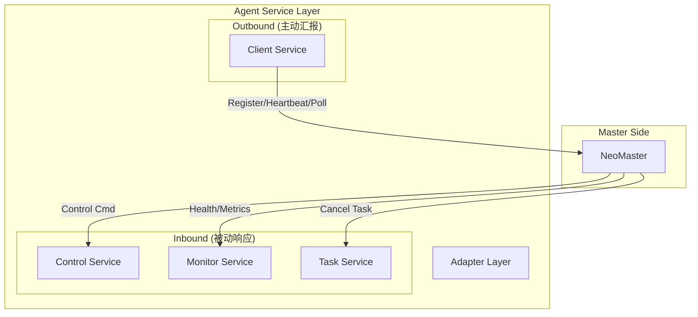

# Service Layer (业务服务层)

## 模块总览
Service 层是 Agent 的大脑，负责处理所有的业务逻辑。根据通信方向，可以清晰地分为两类：**出站服务 (Outbound)** 和 **入站服务 (Inbound)**。

---

## 1. 出站服务 (Outbound Services)
**方向**：Agent -> Master
**核心职责**：主动向 Master 汇报数据，拉取任务。这是 Agent 的"日常工作"。

### `client` (通信服务)
*   **状态**：✅ 已实现 (部分)
*   **职责**：
    *   **注册与认证**：启动时向 Master 报到。
    *   **心跳维持**：告诉 Master "我还活着"。
    *   **任务拉取 (Poll)**：主动询问 "有活干吗？"。
    *   **结果上报**：干完活后提交报告。
*   **关键文件**：`internal/service/client/master_service.go`

---

## 2. 入站服务 (Inbound Services)
**方向**：Master -> Agent
**核心职责**：响应 Master 的远程调用。这是 Agent 的"被动响应"，通常用于紧急控制或实时监控。
**依赖**：需要 Agent 开启 HTTP Server。

### `control` (控制服务)
*   **状态**：📝 规划中 (Placeholder)
*   **职责**：**远程遥控器**
    *   **进程控制**：远程重启、停止 Agent 进程 (紧急熔断)。
    *   **配置热更新**：不重启进程的情况下动态调整配置。
    *   **版本升级**：接收升级指令，自我更新。
*   **关键文件**：`internal/service/control/agent_control.go`

### `monitor` (监控服务)
*   **状态**：📝 规划中 (Placeholder)
*   **职责**：**实时仪表盘**
    *   **指标暴露**：提供 `/metrics` 接口供 Prometheus 或 Master 拉取实时性能数据 (CPU/Mem)。
    *   **健康检查**：提供 `/health` 接口，用于负载均衡器或 K8s 探针。
    *   **日志查询**：允许 Master 远程查看最近的运行日志（用于排错）。
*   **关键文件**：`internal/service/monitor/agent_monitor.go`

### `task` (任务管理服务)
*   **状态**：📝 规划中 (Placeholder)
*   **职责**：**任务指挥塔**
    *   **任务查询**：Master 查询当前正在运行的任务列表。
    *   **紧急停止**：Master 强制取消某个正在执行的任务 (例如任务导致目标服务崩溃)。
    *   **任务暂停/恢复**：动态调整任务执行状态。
*   **关键文件**：`internal/service/task/agent_task.go`

---

## 3. 适配层 (Adapter)
**核心职责**：**外交官 (防腐层)**
*   **状态**：✅ 已实现
*   **职责**：负责将 Master 的通信协议 (JSON/DTO) 转换为 Agent 内部的核心模型 (`internal/core/model`)。
*   **位置**：`internal/service/adapter`
*   **价值**：确保核心业务逻辑不受外部协议变更的影响。

---

## 架构总结

**Linus 的评价**：
这种**双向通信设计**是企业级 Agent 的标配。
*   **Client** 保证了基础的稳定性（只要能连网就能工作）。
*   **Server (Inbound Services)** 提供了高级的可运维性（实时控制、紧急干预）。
缺一不可。
