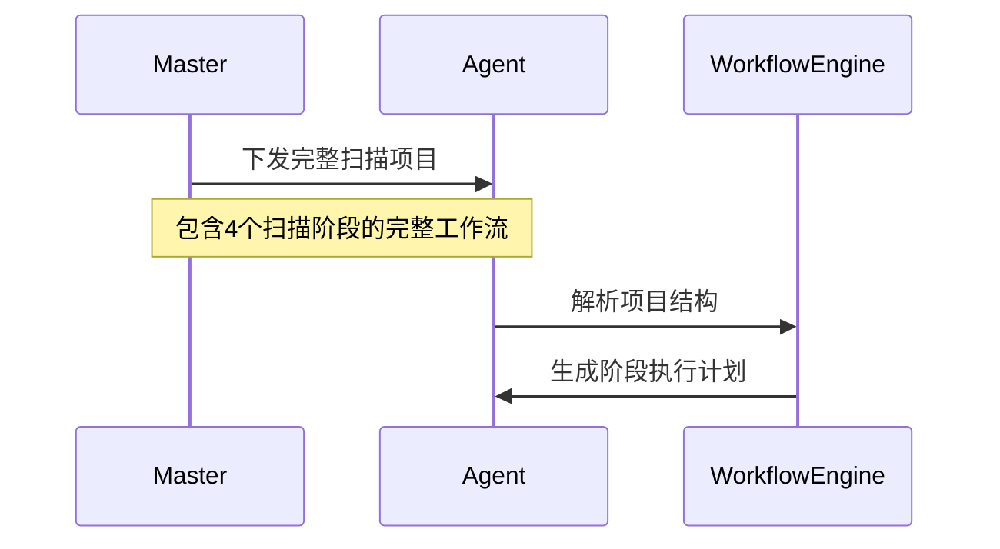
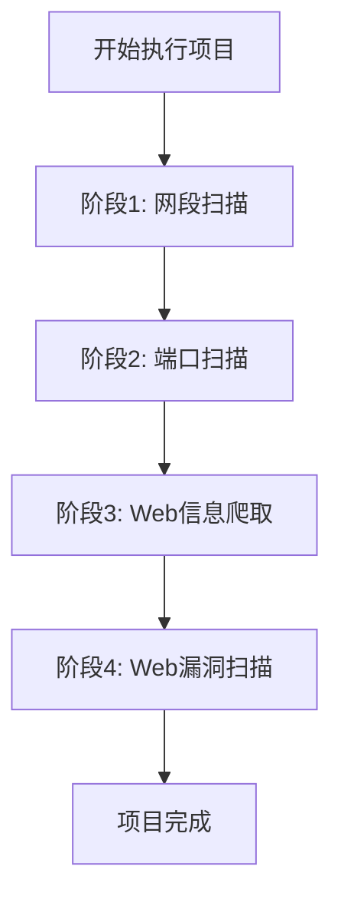
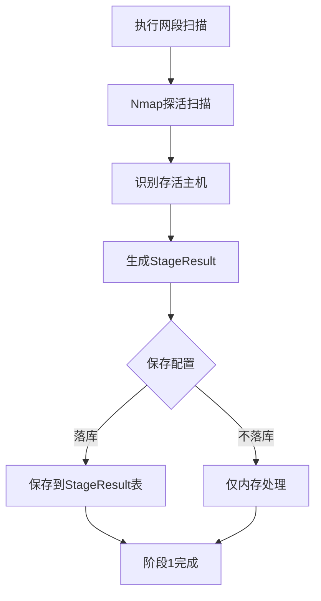
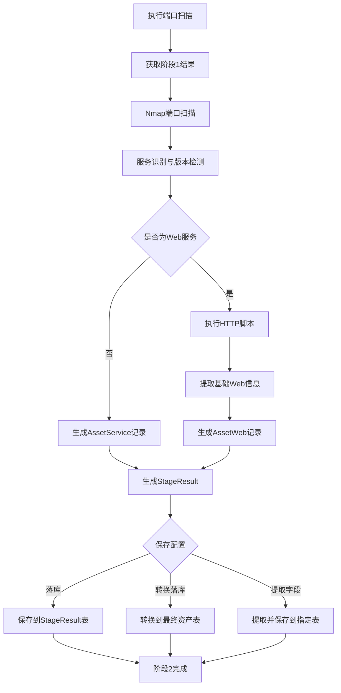
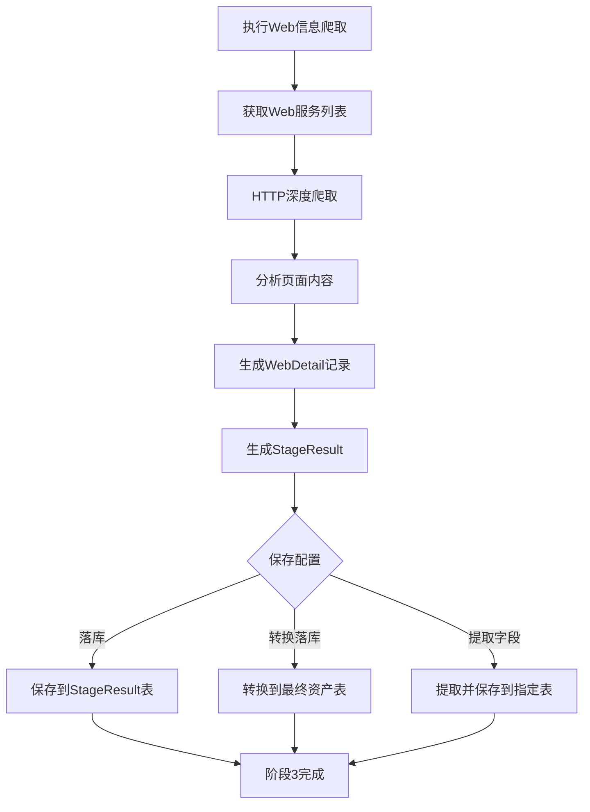
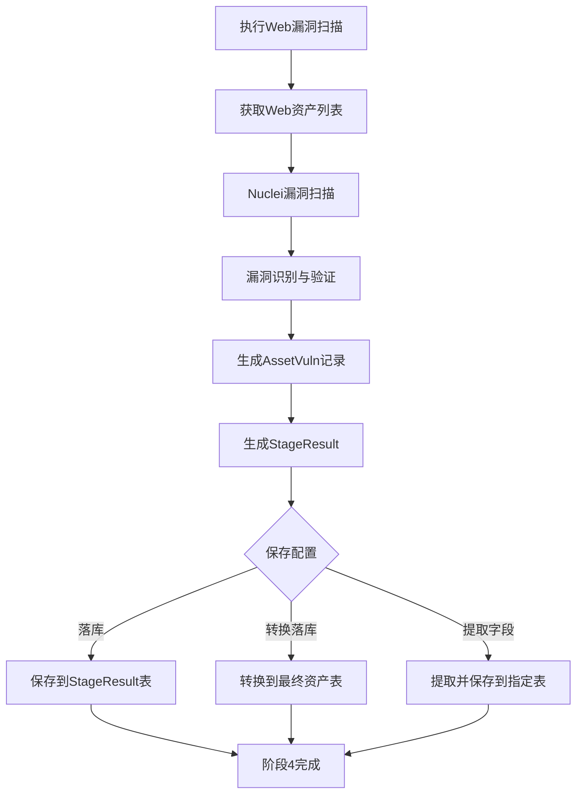
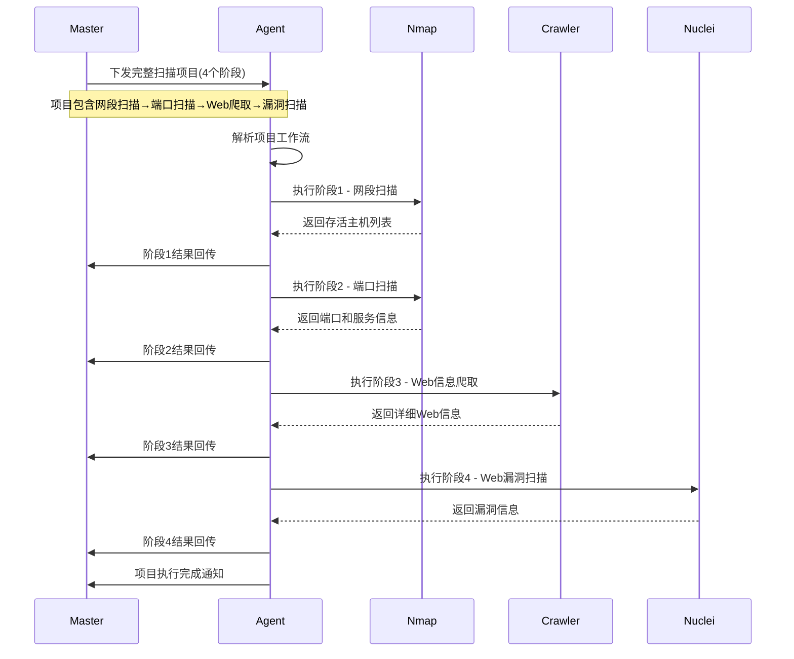
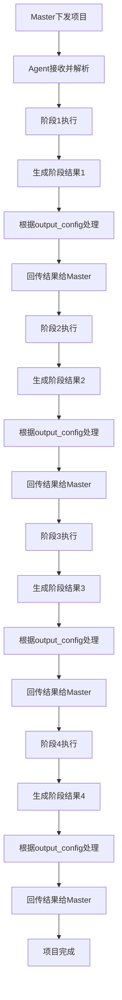

# Agent执行扫描项目完整流程

## 概述

本文档详细描述了Agent接收并执行完整扫描项目的流程。一个扫描项目包含多个按顺序执行的扫描阶段，Agent需要依次执行所有阶段，而非根据扫描类型选择性执行。

## 完整执行流程

### 1. 项目接收与解析

### 2. 阶段顺序执行流程

### 3. 各阶段详细执行过程

#### 阶段1: 网段扫描

#### 阶段2: 端口扫描

#### 阶段3: Web信息爬取

#### 阶段4: Web漏洞扫描

### 4. 完整项目执行流程

### 5. 数据流转与处理

## 关键设计要点

### 1. 顺序执行
- 严格按照项目定义的阶段顺序执行
- 每个阶段必须完成后才能进入下一阶段

### 2. 阶段依赖
- 后续阶段可以使用前一阶段的结果作为输入
- 阶段间数据通过StageResult模型传递

### 3. 统一结果处理
- 每个阶段都生成StageResult，并根据output_config进行相应处理
- 支持多种结果处理方式：落库、转换落库、提取字段等

### 4. 灵活配置
- 每个阶段的结果处理方式可通过配置灵活调整
- 支持不同的保存类型和目标表配置

### 5. 完整回溯
- 保持完整的阶段执行链路，便于审计和问题排查
- 通过source_stage_ids维护结果来源信息

## 总结

这种设计确保了扫描项目的完整性和一致性，同时保持了各阶段处理的灵活性。Agent严格按照项目定义的顺序执行所有阶段，确保扫描结果的完整性和准确性。