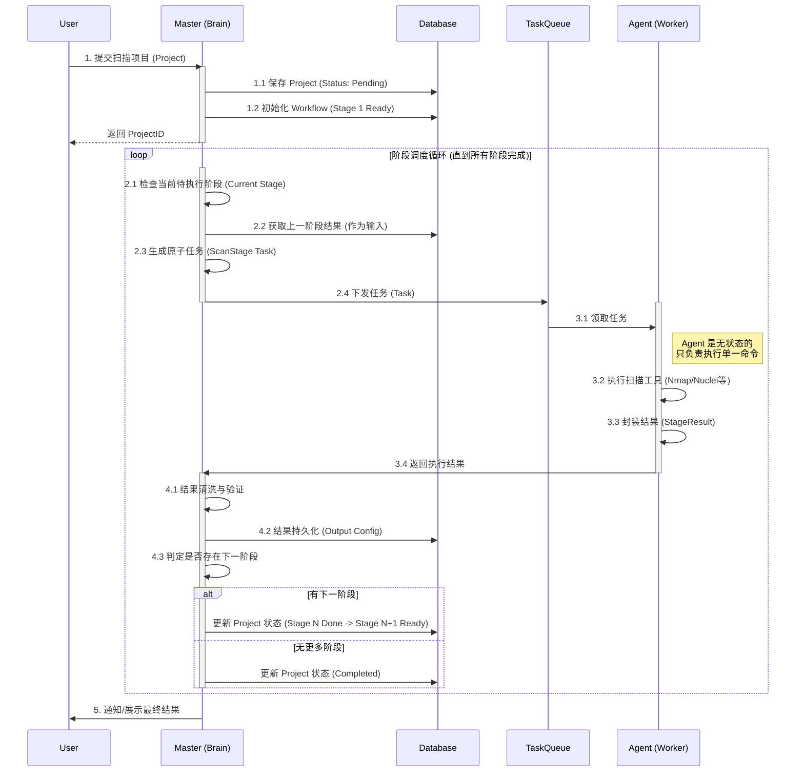
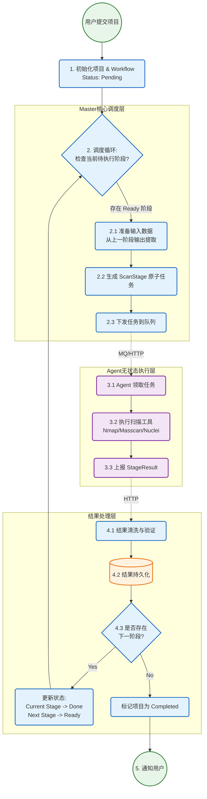
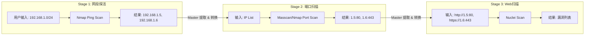

# Agent执行扫描项目完整流程 v2.0

## 1. 核心架构变更说明

相较于 v1.0 版本，v2.0 采用了 **"Thin Agent" (瘦客户端)** 架构模式。

- **Master (主脑)**: 承担所有状态维护、工作流编排、数据清洗和决策逻辑。
- **Agent (执行器)**: 变为无状态的纯执行单元，只负责接收单一 `ScanStage` 任务，执行并返回结果，不感知整个 `Project` 的存在。

这种架构使得系统具备了更高的弹性、容错性和可扩展性。

## 2. 完整执行流程概览

整个流程由 Master 端的 **"阶段调度循环" (Stage Scheduling Loop)** 驱动。

### 逻辑流程图 (Logic Flowchart)

为了更直观地展示 **"阶段调度循环"** 的逻辑判定与数据流向，补充如下流程图：

## 3. 详细执行步骤

### 3.1 项目初始化 (Project Initialization)
用户提交扫描请求后，Master 并不直接将整个请求发给 Agent，而是：
1.  **解析工作流**: 确定该项目需要执行哪些阶段（例如：IP探活 -> 端口扫描 -> Web爬虫）。
2.  **持久化状态**: 在数据库中创建 `Project` 记录，状态置为 `Pending`，并将指针指向 `Stage 1`。

### 3.2 任务分发 (Task Dispatch)
Master 的调度器周期性或事件驱动地检查待执行的 Stage：
1.  **输入准备**: 根据 `TargetPolicy`，从上一阶段的输出（或用户初始输入）中提取当前阶段的目标（如 IP 列表）。
2.  **任务封装**: 将工具配置、目标列表、超时设置等封装为一个独立的 `ScanStage` 对象。
3.  **路由分发**: 将任务推送到任务队列或直接 RPC 调用空闲 Agent。此时可以选择 **任意** Agent，不需要与上一阶段是同一个 Agent。

### 3.3 Agent 执行 (Stateless Execution)
Agent 接收到的是一个自包含的原子任务：
1.  **环境准备**: 下载必要的脚本或插件。
2.  **工具运行**: 调用底层安全工具（Nmap, Masscan, Nuclei 等）。
3.  **结果封装**: 将工具的原始输出（Raw Output）和结构化数据封装为 `StageResult`。
4.  **立即销毁**: 任务完成后，Agent 立即销毁上下文，恢复空闲状态。

### 3.4 结果处理与流转 (Result Processing & Transition)
Master 收到 `StageResult` 后：
1.  **数据清洗**: 根据 `OutputConfig` 过滤无效数据（如去除重复 IP、过滤白名单等）。
2.  **持久化**: 将结果存入数据库，作为 **"中间资产"** 或 **"最终资产"**。
3.  **状态流转**: 
    - 检查当前 Workflow 是否还有后续阶段。
    - 如果有，将当前结果标记为下一阶段的潜在输入源。
    - 更新 Project 进度。

## 4. 数据流转机制 (Data Flow)

数据如何在不同阶段间流转是 v2.0 的核心。

## 5. 为什么选择这种架构？(Advantages)

1.  **弹性伸缩 (Scalability)**:
    - 不同的阶段可以由不同的 Agent 执行。
    - 端口扫描阶段任务重，可以动态增加 10 个 Agent 并行处理，而 Web 扫描阶段可能只需要 2 个 Agent。
    
2.  **容错性 (Resilience)**:
    - 如果 Agent A 在执行 Stage 2 时崩溃，Master 只需将该 Stage 任务重新分配给 Agent B，而不需要重跑 Stage 1。
    - v1.0 中 Agent 崩溃会导致整个 Project 失败。

3.  **资源管控 (Resource Control)**:
    - Master 可以精确控制并发度。例如，限制同时进行端口扫描的任务数，防止打崩网络，而让轻量级的探活任务先行。

4.  **逻辑解耦**:
    - Agent 不需要知道业务逻辑（如"扫完端口后要扫Web"），它只需要知道"现在扫这个端口"。这使得 Agent 代码极度简化且稳定。
