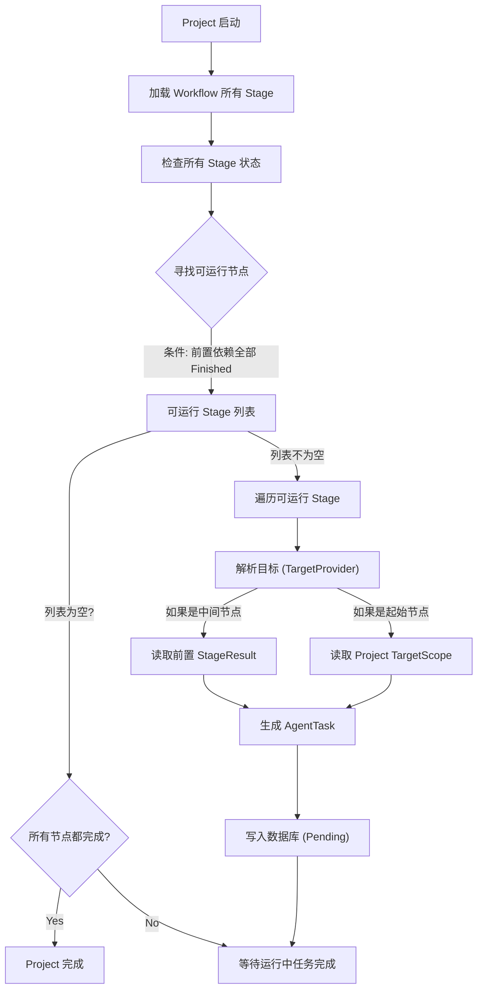
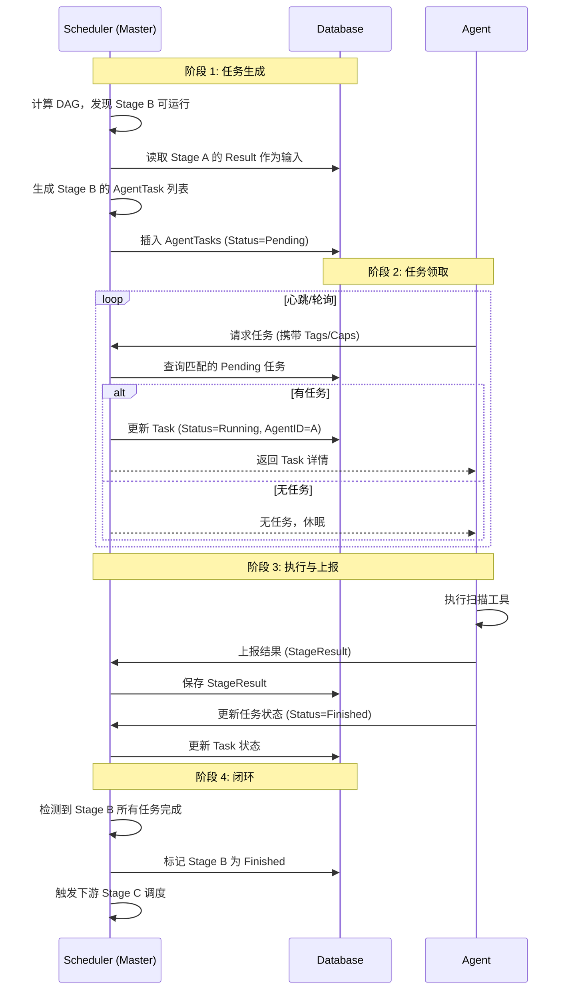

# DAG 调度与执行流程详解

> **Author**: Sun977
> **Date**: 2025-12-12
> **Version**: 1.0
> **Status**: Final

本文档详细描述了 NeoScan 在 DAG (有向无环图) 模式下的核心调度机制、数据流转以及 Master 与 Agent 之间的交互流程。

---

## 1. 核心架构概览 (Architecture Overview)

在 NeoScan 的新架构中，编排器不再受限于线性的 `StageOrder`，而是采用基于图论的 DAG 调度模型。

*   **Project (项目)**: 任务的顶层容器，定义了目标范围 (`TargetScope`)。
*   **Workflow (工作流)**: 编排逻辑的载体，包含多个扫描阶段 (`ScanStage`)。
*   **ScanStage (扫描阶段)**: DAG 中的节点。每个阶段定义了具体的扫描工具、策略以及**前置依赖 (`Predecessors`)**。
*   **AgentTask (任务)**: 调度的最小执行单元。当一个 Stage 被激活时，调度器会将其拆分为多个 Task 下发给 Agent。

---

## 2. 数据模型变更 (Data Model Changes)

为了支持 DAG，`ScanStage` 模型发生了关键变更：

```go
type ScanStage struct {
    // ... 基础字段

    // [核心变更] 移除 StageOrder，新增 Predecessors
    // 存储前置依赖阶段 ID 的 JSON 数组，例如 "[101, 102]"
    // 空数组 "[]" 表示起始节点 (Root Node)
    Predecessors string `json:"predecessors" gorm:"type:json"`

    // [前端支持] UI 布局配置，与业务逻辑分离
    // 存储前端画布的坐标信息，例如 {"x": 100, "y": 200}
    UIConfig string `json:"ui_config" gorm:"type:json"`
    
    // ...
}
```

---

## 3. 调度引擎机制 (Scheduler Engine Mechanics)

调度引擎 (`SchedulerService`) 负责驱动整个 DAG 的流转。

### 3.1 前向链式调度 (Forward Chaining)

传统的调度器寻找 `Order = CurrentOrder + 1`，而 DAG 调度器执行以下逻辑：

1.  **加载图谱**：获取当前 Workflow 下所有启用的 Stage。
2.  **状态检查**：识别哪些 Stage 已经完成 (`Finished`)，哪些正在运行 (`Running`)。
3.  **依赖计算**：遍历所有**未开始**的 Stage，检查其 `Predecessors`：
    *   如果 `Predecessors` 为空或 `[]` -> **立即调度** (起始节点)。
    *   如果 `Predecessors` (JSON数组，如 `[101, 102]`) 中的所有 ID 都存在于 `FinishedStages` (当前项目中所有任务都已完成的阶段ID集合) 列表中 -> **立即调度**。
    *   否则 -> **等待**。

### 3.2 并行执行 (Parallel Execution)

得益于 DAG 结构，调度器天然支持并行：
*   如果 Stage B 和 Stage C 都只依赖 Stage A。
*   当 Stage A 完成时，调度器会在同一轮次中同时发现 B 和 C 满足条件。
*   B 和 C 将被同时激活，生成任务并并行执行。

---

## 4. 完整执行流程 (End-to-End Flow)

### Step 1: 项目启动 (Project Start)
*   用户创建并启动 Project。
*   Project 状态置为 `Running`。

### Step 2: 调度决策 (Scheduling Decision)
*   `SchedulerService` 轮询检测到运行中的 Project。
*   调用 `findNextStages()` 计算当前可执行的 Stage 列表（可能包含多个）。

### Step 3: 任务生成 (Task Generation)
*   对于每个可执行的 Stage：
    1.  **目标解析 (`TargetProvider`)**：
        *   如果是起始节点：从 Project 的 `TargetScope` 解析目标。
        *   如果是中间节点：通过 `PreviousStageProvider` 读取前置 Stage 的 `StageResult` 作为输入。
    2.  **策略应用**：应用去重、黑白名单过滤。
    3.  **任务拆分**：根据并发策略，将目标拆分为一个或多个 `AgentTask`。
    4.  **持久化**：将 `AgentTask` 写入数据库，状态为 `Pending`。

### Step 4: 任务分发 (Task Distribution)
*   **Agent 侧**：Agent 定期向 Master 发送心跳或轮询请求任务 (`GetTask`)。
*   **Master 侧**：查找 `Pending` 状态的任务，根据 Agent 的 `Tags` 和 `Capabilities` 进行匹配。
*   **锁定**：将任务分配给 Agent，状态更新为 `Assigned` -> `Running`。

### Step 5: 执行与结果回传 (Execution & Reporting)
*   Agent 执行具体的扫描工具 (Nmap, Masscan, Nuclei 等)。
*   Agent 将扫描结果封装为标准化的 `StageResult`。
*   Agent 调用 Master API 回传结果，并更新 Task 状态为 `Finished`。

### Step 6: 状态流转 (State Transition)
*   调度器检测到某 Stage 下的所有 Task 都已完成。
*   更新该 Stage 状态为 `Finished`。
*   触发下一轮调度（回到 Step 2），下游节点将被激活。

---

## 5. 工作流程图 (Workflows)

### 5.1 DAG 调度逻辑图



### 5.2 Master-Agent 交互与分发流程


