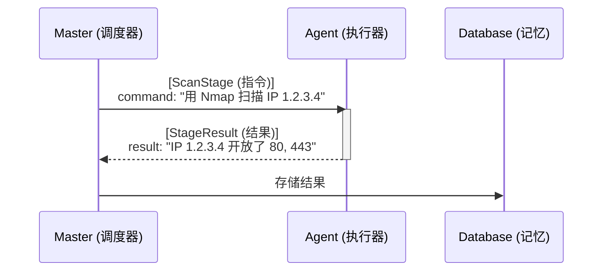
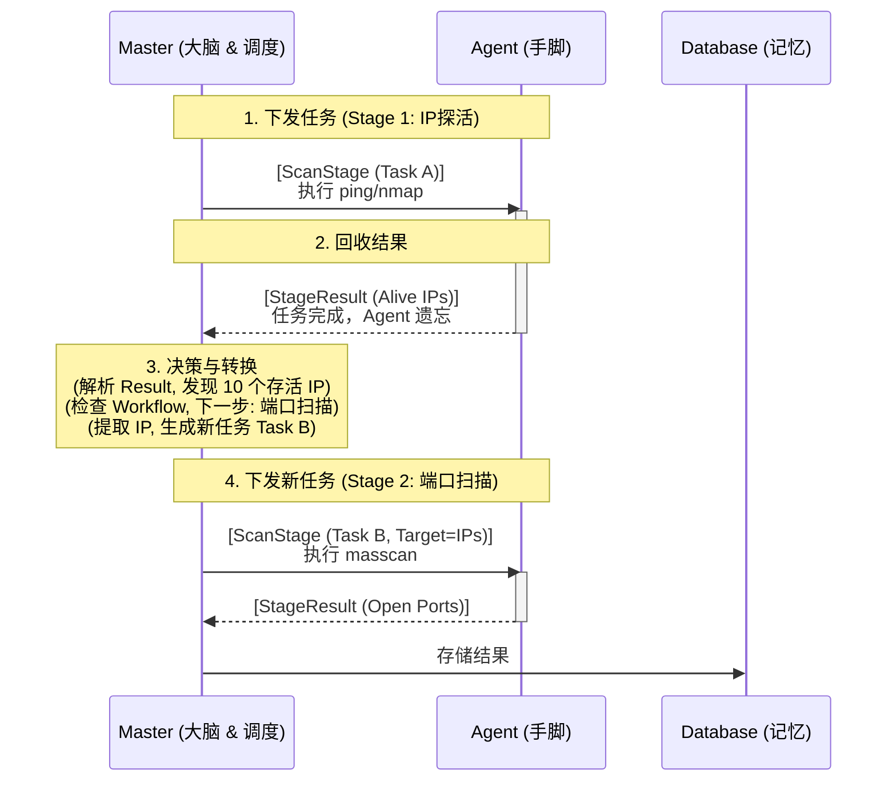

# Master-Agent 交互与多阶段调度架构

## 1. 核心哲学

本架构遵循 **"智能中心化，执行分布式"** 的设计原则。

- **Master (大脑)**：拥有全部上下文，负责逻辑判断、任务调度、状态维护和数据清洗。它是"有状态"的。
- **Agent (手脚)**：纯粹的执行器，负责运行工具、采集原始数据。它是"无状态"的。

**铁律**：Agent 永远不知道"工作流"的存在，它只知道"执行这个单一任务"。所有关于"下一步做什么"的决策，完全由 Master 在接收到结果后决定。

## 2. 交互模型

Master 与 Agent 之间的通讯契约由两个核心实体构成：



- **ScanStage (Input)**：Master 下发给 Agent 的原子任务包，包含工具配置、目标列表、超时设置等。
- **StageResult (Output)**：Agent 返回给 Master 的执行结果，包含标准化数据和原始证据。

## 3. 多阶段调度流程 (Loop Control)

多阶段扫描本质上是 **"下发 -> 回收 -> 决策 -> 再下发"** 的循环过程。Master 在每一轮循环中充当转换器和路由器的角色。

### 流程图解



### 详细步骤说明

1.  **初始下发 (Dispatch)**：
    - Master 读取 Workflow 定义，找到第一个 ScanStage。
    - 根据 TargetPolicy 解析出初始目标（如用户输入的 IP 网段）。
    - 将配置和目标封装成 Task A，通过 RPC/MQ 下发给任意空闲 Agent。

2.  **执行与反馈 (Execute & Report)**：
    - Agent 收到 Task A，调用底层工具执行。
    - Agent 将工具输出解析为标准化的 StageResult。
    - Agent 将 StageResult 回传给 Master。
    - **关键点**：Agent 执行完即销毁上下文，不保留任何状态。

3.  **决策与转换 (Decide & Transform)**：
    - Master 收到 Result，根据 OutputConfig 决定是否入库。
    - Master 检查 Workflow 定义，判断是否存在 Next Stage。
    - **关键逻辑**：如果存在下一阶段，Master 从当前 Result 中提取关键数据（如存活 IP），将其作为 Next Stage 的输入目标。

4.  **后续调度 (Next Dispatch)**：
    - Master 生成新的 Task B (包含下一阶段的配置 + 上一阶段提取的目标)。
    - Master 可以选择将 Task B 下发给 **另一个** 完全不同的 Agent。
    - 循环回到步骤 2。

## 4. 数据流转机制

Master 如何将 Stage A 的输出转化为 Stage B 的输入？

依靠 `ScanStage` 中的 `target_policy` 和 `output_config`：

1.  **Stage A (Producer)**:
    - `output_config`: 定义了如何输出。
    - 产生结果：`StageResult { target_value: "192.168.1.1", result_type: "ip_alive" }`

2.  **Master (Transformer)**:
    - 暂存 Stage A 的结果。
    - 准备 Stage B。

3.  **Stage B (Consumer)**:
    - `target_policy`:
      ```json
      {
        "source_type": "previous_stage",
        "source_value": "stage_1_id",
        "target_type": "ip"
      }
      ```
    - Master 解析此策略，查询 Stage A 的结果，提取所有 `target_value`。
    - Master 构造 Task B，将提取出的 IP 列表直接填入 Task B 的目标字段。

## 5. 架构优势

为什么不让 Agent 直接调用 Agent？

1.  **分布式负载均衡 (Distributed Load Balancing)**：
    - 探活任务 (Stage 1) 很轻，可能只需要 1 个 Agent。
    - 端口扫描 (Stage 2) 很重，Master 可以将生成的 1000 个 IP 拆分成 10 个任务，分发给 10 个不同的 Agent 并行处理。
    - 如果 Agent 自己流转，这种动态扩缩容是不可能实现的。

2.  **容错性 (Fault Tolerance)**：
    - 如果 Agent A 在执行 Stage 2 时崩溃，Master 知道任务失败，可以立即重新调度给 Agent B。
    - 如果状态在 Agent 内部流转，Agent 挂了，整个工作流的数据链就断了。

3.  **逻辑解耦 (Decoupling)**：
    - 增加新的扫描阶段（如 "API 扫描"）只需要修改 Master 的编排逻辑。
    - Agent 不需要升级，因为它只需要执行标准的 "Command -> Result" 协议。
    - 可以在不停止扫描的情况下，动态调整后续阶段的策略。

## 6. 核心设计问答：为什么不采用 "Fat Agent" 模式？

**问题**：为什么不让 Master 直接生成一个包含完整工作流（Project JSON）的文件发送给 Agent，让 Agent 自主执行完所有阶段后再统一返回结果？

**回答**：这是一个经典但极其危险的陷阱。在工业级分布式扫描引擎中，必须坚持 **"Thin Agent" (瘦客户端)** 模式，拒绝 **"Fat Agent" (胖客户端)**。原因如下：

### 6.1 负载均衡失效 (Load Balancing Failure) —— 最致命的问题
- **场景**：扫描一个 C 段 (256 IP)。第一阶段探活发现 200 个存活 IP。第二阶段是耗时的全端口扫描。
- **Fat Agent 缺陷**：单个 Agent 必须独自完成这 200 个 IP 的全端口扫描，可能耗时 10 小时。与此同时，集群中其他 9 个 Agent 处于空闲状态。**扫描速度被单节点性能锁死**。
- **Thin Agent 优势**：Master 收到 200 个 IP 后，将其切分为 10 个任务，分发给 10 个 Agent 并行处理，1 小时即可完成。

### 6.2 容错性崩溃 (Fault Tolerance Collapse)
- **场景**：Agent 在执行第 3 阶段（共 5 阶段）时崩溃（OOM 或网络中断）。
- **Fat Agent 缺陷**：整个 Project 任务失败，前两个阶段已耗费数小时的成果全部丢失，必须重头再来。导致 **"单点故障" (Single Point of Failure)** 放大。
- **Thin Agent 优势**：Master 感知任务失败，仅标记该原子任务需重试，并可立即调度给另一个 Agent。前序阶段成果已安全入库。

### 6.3 实时控制丧失 (Loss of Control)
- **Fat Agent 缺陷**：一旦任务下发，Master 难以干预。若用户配置错误想紧急停止，必须实现复杂的异步中断机制。
- **Thin Agent 优势**：Master 掌握绝对控制权，停止下发后续任务即可瞬间暂停整个工作流。

### 6.4 复杂度爆炸 (Complexity Explosion)
- **Fat Agent 缺陷**：Agent 需要内置完整的工作流引擎、状态机、持久化存储（防崩溃丢数据）和复杂的条件判断逻辑。Agent 代码变得臃肿且难以维护。
- **Thin Agent 优势**：Agent 保持 "愚蠢" 和简单。复杂的业务逻辑、状态流转全部收敛在 Master (Go 代码) 中，易于测试和迭代。

**结论**：不要为了逃避编写调度逻辑的困难，而将复杂度推给 Agent。**Master 累一点，整个系统才能活得久一点。**

