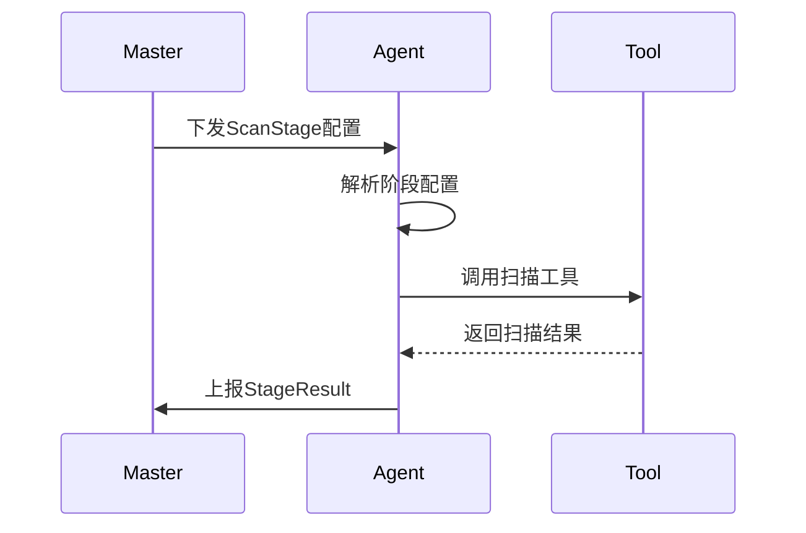

# ScanStage实体模型定义

## 概述

ScanStage实体用于定义扫描工作流中的单个扫描阶段。它包含了执行特定类型扫描所需的所有配置信息，包括工具选择、参数配置、目标策略、输出配置等。


## ScanStage 和 StageResult 的关系
Master (大脑)                      Agent (手脚)
      |                                 ^
      |--[ ScanStage (JSON/RPC) ]------>|  (Master 告诉 Agent 做什么)
      |                                 |
      |<--[ StageResult (JSON/RPC) ]----|  (Agent 告诉 Master 结果是什么)
      v                                 
Database (记忆)

## 模型结构

### 核心字段

| 字段名 | 类型 | 描述 |
|--------|------|------|
| `id` | uint | 自增主键 |
| `workflow_id` | uint | 所属工作流 ID |
| `stage_order` | int | 阶段顺序（在工作流中的执行顺序） |
| `stage_name` | string | 阶段名称 |
| `stage_type` | string | 阶段类型枚举 |
| `tool_name` | string | 使用的扫描工具名称 |
| `tool_params` | string | 扫描工具参数 |
| `target_policy` | JSON | 目标策略配置 |
| `execution_policy` | JSON | 执行策略配置 |
| `performance_settings` | JSON | 性能设置配置 |
| `output_config` | JSON | 输出配置 |
| `notify_config` | JSON | 通知配置 |
| `enabled` | bool | 阶段是否启用 |
| `created_at` | timestamp | 创建时间 |
| `updated_at` | timestamp | 更新时间 |

### 字段详解

#### 1. stage_type（阶段类型）
定义此阶段要执行的扫描类型：
- `ip_alive_scan`：IP探活扫描
- `fast_port_scan`：快速端口扫描
- `full_port_scan`：全端口扫描
- `service_scan`：服务识别扫描
- `vuln_scan`：漏洞扫描
- `poc_scan`：PoC验证扫描
- `web_crawl`：Web信息爬取
- `web_vuln_scan`：Web漏洞扫描
- `password_audit`：密码安全审计
- `proxy_detection`：代理检测
- `directory_scan`：目录扫描
- `subdomain_discovery`：子域发现
- `api_discovery`：API发现
- `file_discovery`：文件发现
- `other_scan`：其他类型扫描

#### 2. target_policy（目标策略）
定义扫描目标的获取方式和策略：

```json
{
  "target_sources": [
    {
      "source_type": "file",           // 来源类型：file/db/view/sql/manual/api/previous_stage【上一个阶段结果】
      "source_value": "/path/to/targets.txt",  // 根据类型的具体值
      "target_type": "ip_range"        // 目标类型：ip/ip_range/domain/url
    }
  ],
  "whitelist_enabled": true,           // 是否启用白名单
  "whitelist_sources": [               // 白名单来源
    {
      "source_type": "file",
      "source_value": "/path/to/whitelist.txt"
    }
  ],
  "skip_enabled": true,                // 是否启用跳过条件
  "skip_conditions": [                 // 跳过条件,列表中可添加多个条件
    {
      "condition_field": "device_type",
      "operator": "equals",
      "value": "honeypot"
    }
  ]
}
```

#### 3. execution_policy（执行策略）
定义扫描过程中的各种执行策略：

```json
{
  "proxy_config": {                    // 代理配置
    "enabled": true,
    "proxy_type": "http",             // http/https/socks4/socks5
    "address": "proxy.example.com",
    "port": 8080,
    "username": "user",
    "password": "pass"
  },
  // "schedule_config": {                 // 调度配置 --- 20251208 不再在stage配置中支持调度方式，使用project.schedule_type从项目维度统一调度
  //   "execution_mode": "immediate",     // immediate/scheduled/cron
  //   "scheduled_time": "2023-01-01T00:00:00Z"
  // }
  "priority": 1,                       // 任务优先级（1-10，默认5） --- 编排器-任务生成器-使用
}
```

#### 4. performance_settings（性能设置）
定义扫描过程中的性能相关参数：

```json
{
  "scan_rate": 50,                     // 扫描速率（每秒发包数）
  "scan_depth": 1,                     // 扫描深度（爬虫类工具参数）
  "concurrency": 50,                   // 扫描并发数
  "process_count": 50,                 // 扫描进程数
  "chunk_size": 50,                    // 分块大小（批量处理目标数） --- 编排器-任务生成器-使用
  "timeout": 180,                     // 超时时间（秒） --- 编排器-任务生成器-使用
  "retry_count": 3                     // 重试次数
}
```

#### 5. output_config（输出配置）
定义扫描结果的处理方式：

```json
{
  "output_to_next_stage": {            // 输出到下一阶段
    "enabled": true,
    "output_fields": ["ip", "port", "service"]
  },
  "save_to_database": {                // 保存到数据库
    "enabled": true,
    "save_type": "stage_result",       // stage_result/final_asset/extract_fields
    "table_name": "stage_results",
    "extract_fields": {
      "fields": ["target_value", "result_type"],
      "target_table": "custom_scanned_hosts",
      "field_mapping": {
        "target_value": "ip_address"
      }
    },
    "retention_days": 30
  },
  "save_to_file": {                    // 保存到文件
    "enabled": true,
    "file_path": "/var/scan/results/",
    "file_format": "json",             // json/xml/csv/html/markdown/text
    "retention_days": 7
  }
}
```

##### 配置指纹与引用
- 系统在执行阶段为 `output_config` 计算哈希指纹（如 `sha256`）。
- `StageResult` 不再复制整块配置，只保存 `output_config_hash` 与轻量 `output_actions` 摘要，并通过 `stage_id` 指向本阶段配置，确保审计可复现且避免结果侧膨胀。

#### 6. notify_config（通知配置）
定义扫描阶段的通知设置：

```json
{
  "enabled": false,                    // 是否发送通知
  "notify_methods": ["email"],   // 通知方式：email/sec/wechat/websocket
  "recipients": ["admin@example.com"], // 通知接收人
  "message_template": "Stage {stage_name} completed with {result_count} findings"  // 通知模板
}
```

## 与其他实体的关系

### 1. 与Workflow的关系
- 一个Workflow包含多个ScanStage
- 通过[workflow_id](file:///C:/Users/root/Desktop/code/PythonCode/NeoScan/NeoScan/neoMaster/internal/model/stage_result.go#L27-L27)关联
- 通过stage_order确定执行顺序

### 2. 与StageResult的关系
- 一个ScanStage执行后产生多个StageResult
- StageResult记录实际的扫描结果
- 通过[stage_id](file:///C:/Users/root/Desktop/code/PythonCode/NeoScan/NeoScan/neoMaster/internal/model/stage_result.go#L28-L28)关联

## 使用场景

### 1. 工作流定义
在创建扫描项目时，用户定义包含多个ScanStage的工作流：

```mermaid
graph TD
    A[扫描项目] --> B[工作流]
    B --> C[阶段1: IP探活<br/>(ip_alive_scan)]
    B --> D[阶段2: 端口扫描<br/>(fast_port_scan)]
    B --> E[阶段3: 服务识别<br/>(service_scan)]
    B --> F[阶段4: 漏洞扫描<br/>(vuln_scan)]
    
    style C fill:#FFE4C4
    style D fill:#FFE4C4
    style E fill:#FFE4C4
    style F fill:#FFE4C4
```

### 2. 扫描执行
Agent根据ScanStage定义执行扫描任务：



## 设计优势

### 1. 配置与执行分离
- ScanStage作为配置模板，定义"如何扫描"
- StageResult作为执行结果，记录"扫描发现"
- 实现配置复用，相同的ScanStage可在不同项目中使用

### 2. 灵活的配置选项
- 支持丰富的配置项，满足不同扫描场景需求
- JSON字段提供扩展性，可适应未来新增配置项

### 3. 完整的执行链路
- 通过workflow_id和stage_order维护阶段顺序
- 通过stage_id关联配置和结果
- 支持完整的执行链路追踪

## 最佳实践

### 1. 阶段设计建议
- 合理划分扫描阶段，避免单个阶段过于复杂
- 根据依赖关系安排阶段顺序
- 为常用扫描模式创建标准阶段模板

### 2. 配置管理
- 使用版本控制管理ScanStage配置变更
- 为不同环境（开发/测试/生产）创建不同的配置模板
- 定期审查和优化阶段配置参数

### 3. 性能优化
- 根据网络环境和目标规模调整性能参数
- 合理设置并发数和超时时间
- 使用适当的扫描速率避免对目标系统造成过大压力

## 示例

一个典型的端口扫描阶段配置：

```json
{
  "id": 2,
  "workflow_id": 1,
  "stage_order": 2,
  "stage_name": "Fast Port Scan",
  "stage_type": "fast_port_scan",
  "tool_name": "nmap",
  "tool_params": "-Pn -sS -T4 --open --min-rate=400",
  "target_policy": {
    "target_sources": [
      {
        "source_type": "previous_stage",
        "source_value": "stage_1",
        "target_type": "ip"
      }
    ]
  },
  "performance_settings": {
    "scan_rate": 400,
    "concurrency": 30,
    "timeout_seconds": 120,
    "retry_count": 2
  },
  "output_config": {
    "output_to_next_stage": {
      "enabled": true,
      "output_fields": ["ip", "port"]
    },
    "save_to_database": {
      "enabled": true,
      "save_type": "stage_result"
    }
  },
  "enabled": true
}
```
