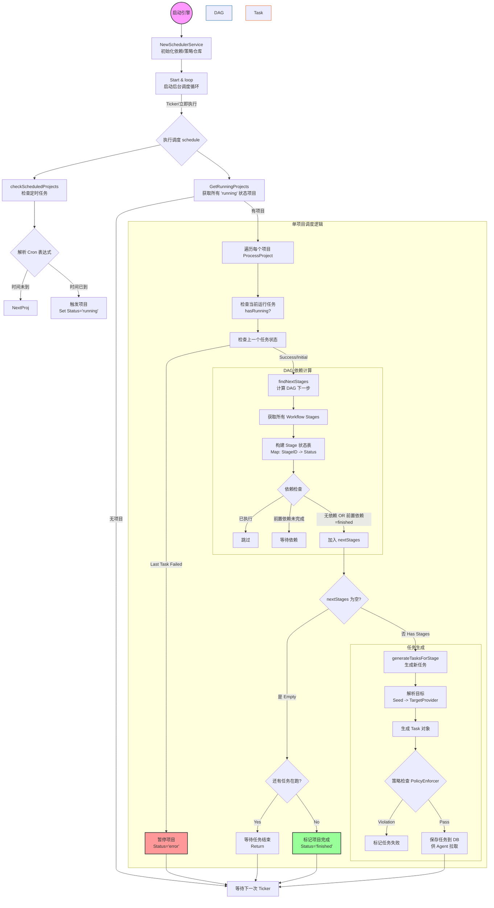

# NeoScan 调度引擎 (Scheduler Engine) 核心设计文档 v2.0

> **文档状态**: 正式 (v2.0)  
> **最后更新**: 2025-12-15  
> **核心改进**: 移除项目级全局锁，实现基于 DAG 依赖的真并行调度。

## 1. 概述

调度引擎 (`SchedulerService`) 是 NeoScan 的核心心脏，负责驱动所有扫描任务的生命周期。它不直接执行扫描，而是作为指挥官，负责：
1.  **定时触发**: 解析 Cron 表达式，按时启动周期性项目。
2.  **DAG 编排**: 解析工作流依赖关系，并行调度互不依赖的扫描阶段 (Stage)。
3.  **策略执行**: 在生成任务前应用目标解析策略和安全合规策略。
4.  **状态流转**: 监控任务状态，推进项目从 `running` 到 `finished` 的流转。

---

## 2. 核心工作流程

调度引擎采用 **"基于状态的轮询模型" (State-based Polling Model)**。它不维护复杂的内存队列，而是通过周期性轮询数据库状态来驱动业务。这种设计确保了无状态性，便于横向扩展和容灾。

### 2.1 整体架构图



---

## 3. 关键机制详解

### 3.1 DAG 并行调度 (核心改进)
在 v2.0 版本中，我们彻底移除了旧版本中的全局锁逻辑。

*   **旧逻辑 (Global Barrier)**: 
    *   `if hasRunning { return }`
    *   只要项目有任何任务在跑，调度器就拒绝调度新 Stage。这导致 A->B 和 C 并行时，C 的运行会阻塞 B 的启动。
*   **新逻辑 (Dependency Awareness)**:
    *   调度器构建一张实时的 **Stage 状态表 (`StageID -> Status`)**。
    *   对每个未执行的 Stage，检查其 **前置依赖 (`Predecessors`)**。
    *   **判定规则**: 仅当所有前置依赖的状态均为 `finished` 时，该 Stage 才被标记为 `Ready`。
    *   **结果**: 即使项目中有慢任务（如 Stage C）在运行，只要 Stage B 的依赖（Stage A）已完成，Stage B 就会立即被调度。

### 3.2 项目完成判定 (Completion Logic)
由于移除了全局锁，项目完成的判定变得更加微妙。

*   **判定条件**: 
    1.  `nextStages` 为空：说明没有新的 Stage 满足启动条件（要么都跑完了，要么依赖卡住了）。
    2.  `!hasRunning`：说明当前没有任何任务在运行。
*   只有同时满足以上两点，才认为项目彻底结束 (`Status = "finished"`)。

### 3.3 目标解析与策略 (Target & Policy)
每个 Stage 在生成任务前，都会经历两层过滤：

1.  **TargetProvider**:
    *   输入：Project 的 `TargetScope` (种子目标，如 CIDR)。
    *   逻辑：结合 Stage 的 `TargetPolicy`（如 `PreviousStageProvider`），动态计算实际扫描目标。
    *   场景：Stage B 使用 Stage A 的结果作为目标。

2.  **PolicyEnforcer**:
    *   输入：生成的具体 Task 对象。
    *   逻辑：检查全局黑白名单、时间窗口策略等。
    *   结果：如果违规，任务会被标记为 `failed` 并记录原因，不会下发给 Agent。

---

## 4. 数据结构引用

### 4.1 Stage 状态表
在内存中构建的临时映射，用于快速 O(1) 查找依赖状态。
```go
stageStatus := make(map[uint64]string)
// Key: StageID
// Value: "pending" | "running" | "finished" | "failed"
```

### 4.2 依赖检查伪代码
```go
dependenciesResolved := true
for _, predID := range stage.Predecessors {
    status, exists := stageStatus[predID]
    if !exists || status != "finished" {
        dependenciesResolved = false
        break
    }
}
if dependenciesResolved {
    // Schedule this stage!
}
```

## 5. 总结
新的调度引擎通过精细化的依赖管理，实现了真正的 DAG 并行执行能力。它既保留了轮询架构的简单性和鲁棒性，又提供了复杂工作流所需的灵活性。
