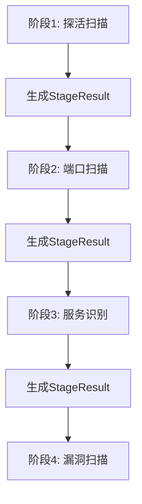
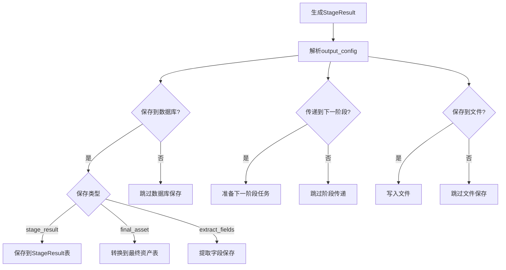

# StageResult模型详细说明

## 概述

StageResult是NeoScan系统中用于统一存储各个扫描阶段结果的核心数据模型。该模型消除了为每个扫描阶段创建专用表的复杂性，通过统一的结构来存储不同类型扫描阶段的输出结果。

## 模型结构

### 核心字段

| 字段名 | 类型 | 描述 |
|--------|------|------|
| `id` | uint | 自增主键 |
| `project_id` | uint | 所属项目 ID（关键冗余，用于快速检索） |
| `workflow_id` | uint | 所属工作流 ID |
| `stage_id` | uint | 阶段 ID（按编排器定义唯一） |
| `agent_id` | uint | 执行扫描的 Agent ID |
| `result_type` | string | 结果类型枚举 |
| `target_type` | string | 目标类型（ip/domain/url） |
| `target_value` | string | 目标值 |
| `attributes` | JSON | 结构化属性 |
| `evidence` | JSON | 原始证据 |
| `produced_at` | timestamp | 产生时间 |
| `producer` | string | 工具标识与版本 |
| `output_config_hash` | string | 输出配置指纹（引用ScanStage.output_config的哈希） |
| `output_actions` | JSON | 实际执行的轻量动作摘要（save_type/target_table/retention等） |
| `created_at` | timestamp | 创建时间 |
| `updated_at` | timestamp | 更新时间 |

### 字段详解

#### 1. result_type（结果类型）
用于区分不同扫描阶段的类型：
- `ip_alive`：探活结果 (ipAliveScan)
- `fast_port_scan`：快速端口扫描结果 (fastPortScan)
- `full_port_scan`：全端口扫描结果 (fullPortScan)
- `service_fingerprint`：服务指纹识别结果 (serviceScan)
- `vuln_finding`：漏洞发现结果 (vulnScan)
- `poc_scan`：PoC验证结果 (pocScan)
- `web_endpoint`：Web端点发现结果 (webScan)
- `password_audit`：密码审计结果 (passScan)
- `proxy_detection`：代理检测结果 (proxyScan)
- `directory_scan`：目录扫描结果 (dirScan)
- `subdomain_discovery`：子域发现结果 (subDomainScan)
- `api_discovery`：API发现结果 (apiScan)
- `file_discovery`：文件发现结果 (fileScan)
- `other_scan`：其他扫描结果 (otherScan)

#### 2. target_type（目标类型）
表示扫描目标的类型：
- `ip`：IP地址
- `domain`：域名
- `url`：URL地址

#### 3. target_value（目标值）
存储具体的扫描目标值，如：
- IP地址："192.168.1.10"
- 域名："example.com"
- URL："https://example.com/api"

#### 4. attributes（结构化属性）
存储与工具输出对齐的结构化数据，不同阶段存储不同内容：

##### 探活阶段（ip_alive）
```json
{
  "hosts": [
    {
      "ip": "192.168.1.10",
      "rtt": 0.45,
      "ttl": 64
    },
    {
      "ip": "192.168.1.11",
      "rtt": 1.20,
      "ttl": 128
    }
  ],
  "summary": {
    "alive_count": 2,
    "total_scanned": 256,
    "elapsed_ms": 1500
  }
}
```

##### 端口扫描阶段（port_scan）
```json
{
  "ports": [
    {"ip": "192.168.1.10", "port": 22, "proto": "tcp", "state": "open", "service_hint": "ssh"},
    {"ip": "192.168.1.10", "port": 80, "proto": "tcp", "state": "open", "service_hint": "http"}
  ]
}
```

##### 服务指纹阶段（service_fingerprint）
```json
{
  "services": [
    {"ip": "192.168.1.10", "port": 22, "proto": "tcp", "name": "OpenSSH", "version": "7.9p1", "cpe": "cpe:/a:openbsd:openssh:7.9p1"},
    {"ip": "192.168.1.10", "port": 80, "proto": "tcp", "name": "Apache httpd", "version": "2.4.41", "cpe": "cpe:/a:apache:http_server:2.4.41"}
  ]
}
```

##### 漏洞发现阶段（vuln_finding）
```json
{
  "findings": [
    {"ip": "192.168.1.10", "id": "CVE-2021-1234", "cve": "CVE-2021-1234", "severity": "high", "confidence": "high", "evidence_ref": "ref1"},
    {"ip": "192.168.1.11", "id": "CVE-2021-5678", "cve": "CVE-2021-5678", "severity": "medium", "confidence": "medium", "evidence_ref": "ref2"}
  ]
}
```

##### Web端点阶段（web_endpoint）
```json
{
  "endpoints": [
    {
      "url": "https://example.com/api",
      "ip": "1.2.3.4",
      "title": "API Documentation",
      "headers": {"Server": "Nginx", "X-Powered-By": "Express"},
      "screenshot": "base64_encoded_image_data...",
      "tech_stack": ["Node.js", "Express", "Nginx"],
      "status_code": 200,
      "favicon": "base64_encoded_favicon_data..."
    },
    {
      "url": "https://example.com/admin",
      "ip": "1.2.3.4",
      "title": "Admin Login",
      "headers": {"Server": "Apache"},
      "tech_stack": ["PHP", "Laravel", "Apache"],
      "status_code": 401
    }
  ]
}
```

##### 快速端口扫描阶段（fast_port_scan）
```json
{
  "ports": [
    {"ip": "192.168.1.10", "port": 22, "proto": "tcp", "state": "open"},
    {"ip": "192.168.1.11", "port": 443, "proto": "tcp", "state": "open"}
  ],
  "summary": {"open_count": 2, "scan_strategy": "top-1000", "elapsed_ms": 1234}
}
```

##### 全端口扫描阶段（full_port_scan）
```json
{
  "ports": [
    {"ip": "192.168.1.10", "port": 1, "proto": "tcp", "state": "closed"},
    {"ip": "192.168.1.10", "port": 80, "proto": "tcp", "state": "open", "service_hint": "http"},
    {"ip": "192.168.1.10", "port": 8080, "proto": "tcp", "state": "open", "service_hint": "http-proxy"}
  ],
  "summary": {"open_count": 2, "total_scanned": 65535, "elapsed_ms": 123456}
}
```

##### PoC验证阶段（poc_scan）
```json
{
  "poc_results": [
    {"ip": "192.168.1.10", "poc_id": "CVE-2021-1234#poc1", "target": "https://example.com", "status": "confirmed", "severity": "high", "evidence_ref": "ref-abc"},
    {"ip": "192.168.1.10", "poc_id": "CVE-2021-5678#poc2", "target": "https://example.com", "status": "not_vulnerable", "severity": "medium", "evidence_ref": "ref-def"}
  ]
}
```

##### 密码审计阶段（password_audit）
```json
{
  "accounts": [
    {"username": "admin", "service": "ssh", "host": "example.com", "port": 22, "weak_password": true, "credential": "admin:admin123", "success": true},
    {"username": "dbuser", "service": "mysql", "host": "db.example.com", "port": 3306, "weak_password": false, "success": false}
  ],
  "policy": {"max_attempts": 3}
}
```

##### 代理检测阶段（proxy_detection）
```json
{
  "proxies": [
    {"ip": "1.2.3.4", "port": 8080, "type": "http", "open": true, "auth_required": false},
    {"ip": "5.6.7.8", "port": 1080, "type": "socks5", "open": true, "auth_required": true}
  ]
}
```

##### 目录扫描阶段（directory_scan）
```json
{
  "paths": [
    {"url": "https://example.com/.git", "status": 200, "length": 1024, "sensitive": true},
    {"url": "https://example.com/admin/", "status": 403, "length": 312}
  ]
}
```

##### 子域发现阶段（subdomain_discovery）
```json
{
  "subdomains": [
    {"host": "api.example.com", "ip": "203.0.113.10", "source": "crt.sh"},
    {"host": "dev.example.com", "ip": "203.0.113.11", "source": "dns-bruteforce"}
  ]
}
```

##### API发现阶段（api_discovery）
```json
{
  "apis": [
    {"method": "GET", "path": "/v1/users", "status": 200, "auth_required": true},
    {"method": "POST", "path": "/v1/login", "status": 200, "auth_required": false}
  ],
  "spec": {"format": "OpenAPI", "version": "3.0"}
}
```

##### 文件发现阶段（file_discovery）
```json
{
  "files": [
    {"path": "/backup.zip", "url": "https://example.com/backup.zip", "size": 1048576, "mime": "application/zip", "sensitive": true},
    {"path": "/robots.txt", "url": "https://example.com/robots.txt", "size": 145, "mime": "text/plain", "sensitive": false}
  ]
}
```

##### 其他扫描阶段（other_scan）
```json
{
  "summary": "Custom scan output",
  "data": {"key": "value", "note": "free-form data"}
}
```

#### 5. evidence（原始证据）
存储工具原始输出的必要片段，用于结果验证和审计。

#### 6. producer（工具标识）
记录产生结果的工具及其版本，如：
- "nmap 7.93"
- "nuclei 3.x"
- "masscan 1.3.2"

#### 7. output_config_hash（输出配置指纹）
记录执行时引用的 `ScanStage.output_config` 的哈希指纹（例如 `sha256`），用于审计与复现，避免在结果侧复制整块配置。

#### 8. output_actions（实际执行摘要）
记录实际执行的轻量动作摘要，而非完整配置，便于快速判断处理行为：

```json
{
  "save_type": "extract_fields",
  "target_table": "custom_scanned_hosts",
  "retention_days": 30,
  "extract_fields_id": "ef-123"
}
```

## 使用场景

### 1. 多阶段扫描流程
StageResult在多阶段扫描流程中起到承上启下的作用：



### 2. 结果处理流程
结果处理以 `ScanStage.output_config` 为意图来源，通过 `stage_id` 获取并解析；同时在 `StageResult` 中记录 `output_config_hash` 与 `output_actions` 作为审计快照：



## 设计优势

### 1. 统一模型设计
- 消除为每个扫描阶段创建专用表的复杂性
- 减少分支与耦合，提高系统可维护性
- 实现不同工具的输出兼容

### 2. 灵活的输出配置
- 支持多种结果处理方式（数据库、文件、下一阶段）
- 可配置的保存类型和目标表
- 支持字段提取和映射

### 3. 可追溯性
- 保留完整的扫描链路信息(source_stage_ids)
- 保存原始证据用于审计和验证
- 记录工具版本和产生时间

## 性能优化建议

### 1. 批量处理
- 批量插入数据库以提高I/O效率
- 使用缓冲队列和后台goroutine处理写入操作
- 合理配置批量大小以平衡性能和内存使用

### 2. 数据清理
- 实施定期清理机制，避免数据量过大
- 根据retention_days配置清理过期数据
- 使用分区表提高查询性能

### 3. 索引优化
- 为常用查询字段建立合适的索引
- 在workflow_id、stage_id、agent_id等字段上建立索引
- 考虑使用复合索引优化复杂查询

## 最佳实践

### 1. 字段使用建议
- 合理使用attributes字段存储结构化数据
- 在evidence字段中保存关键的原始证据
- 充分利用output_config实现灵活的结果处理

### 2. 错误处理
- 实现完善的错误处理机制
- 避免因个别错误影响整个批量操作
- 记录详细的错误信息便于问题排查

### 3. 监控和调优
- 收集性能指标以便优化和故障排查
- 根据系统负载动态调整批量大小和处理策略
- 定期分析查询性能并优化索引设计

## 总结

StageResult模型通过统一的设计理念，成功解决了多阶段扫描结果存储的复杂性问题。其灵活的配置机制和良好的扩展性使其能够适应各种扫描场景的需求，同时通过合理的性能优化措施确保了系统的高效运行。
