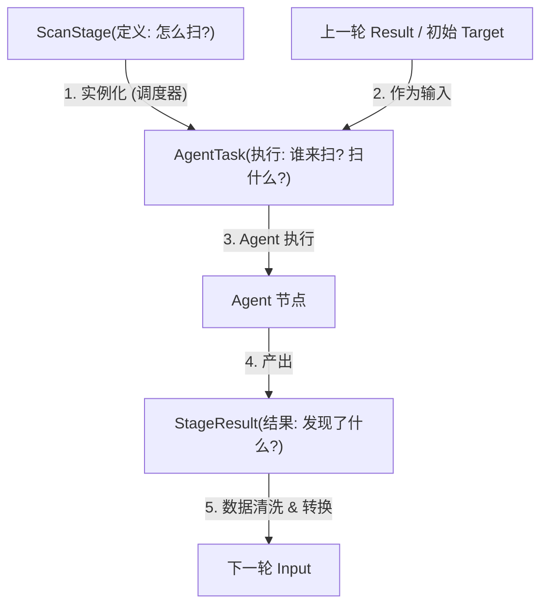

# ScanStage-task-scanResult关系
深入解释一下 `ScanStage`（模板/定义）、`AgentTask`（实例/执行）和 `StageResult`（产出/数据）这三个核心实体在 NeoScan v2.0 Thin Agent 架构中的关系和数据流转机制。

这三个实体共同构成了 **Master 的核心调度闭环**。

---

### 1. 三者关系比喻

如果把 NeoScan 比作一个**工厂流水线**：

1.  **`ScanStage` (图纸/SOP)**：
    *   这是**静态的定义**。
    *   它规定了：“在第 2 步，我们要用‘Nmap’工具，参数是‘-p 1-65535’，对‘上一轮发现的 IP’进行扫描。”
    *   它不包含具体的执行数据，只包含规则。

2.  **`AgentTask` (工单)**：
    *   这是**动态的执行实例**。
    *   当工厂开始运转，调度器会拿着 `ScanStage` 的图纸，结合具体的原材料（如 IP: 1.1.1.1），生成一张具体的工单。
    *   工单上写着：“请 Agent-007 对 1.1.1.1 执行 Nmap 扫描。”
    *   它有状态（Pending -> Running -> Completed）。

3.  **`StageResult` (产品/半成品)**：
    *   这是**执行的产出**。
    *   Agent-007 完成工单后，提交回来的结果（如“发现 1.1.1.1 开放了 80 端口”）。
    *   这个结果会被入库，并且可能成为下一个 `ScanStage` 的原材料。

---

### 2. 实体关系图 (ER 逻辑)



---

### 3. 数据转换与流转细节

让我们看看数据是如何在字段级别流转的。

#### 阶段 1: 从 `ScanStage` 到 `AgentTask` (任务生成)

调度器（Master）检查到某个 `ScanStage` 准备就绪时，会创建一个或多个 `AgentTask`。

*   **配置继承**:
    *   `AgentTask.ToolName` <== `ScanStage.ToolName`
    *   `AgentTask.ToolParams` <== `ScanStage.ToolParams`
    *   `AgentTask.Priority` <== 解析 `ScanStage.ExecutionPolicy` 中的优先级
    *   `AgentTask.Timeout` <== 解析 `ScanStage.PerformanceSettings` 中的超时

*   **目标注入 (关键)**:
    *   `ScanStage.TargetPolicy` 定义了目标来源（例如：“从上一阶段的 StageResult 中提取 IP”）。
    *   调度器执行这个策略，查询 `StageResult` 表，提取数据，填入 `AgentTask.InputTarget`。
    *   **例子**: `InputTarget` = `["192.168.1.1", "192.168.1.2"]` (JSON格式)

#### 阶段 2: 从 `AgentTask` 到 `StageResult` (任务执行与上报)

Agent 领取 `AgentTask`，执行工具，然后返回结果。

*   **关联回溯**:
    *   `StageResult.WorkflowID` <== `AgentTask.WorkflowID`
    *   `StageResult.StageID` <== `AgentTask.StageID`
    *   `StageResult.AgentID` <== 当前执行的 Agent ID

*   **结果封装**:
    *   Agent 运行工具得到的原始输出（如 XML/JSON），经过解析后：
    *   `StageResult.ResultType`：根据 `ScanStage.StageType` 确定（如 `port_scan_result`）。
    *   `StageResult.TargetValue`：发现的具体资产（如 `192.168.1.1:80`）。
    *   `StageResult.Attributes`：详细属性（如 `{"service": "http", "version": "nginx"}`）。
    *   `AgentTask.OutputResult`：Agent 会把结果摘要更新回 Task 表，表示任务完成。

#### 阶段 3: 从 `StageResult` 到 下一个 `ScanStage` (流转)

这是 v2.0 架构最强大的地方。Master 会监听 `StageResult` 的产生。

*   如果下一个 `ScanStage` 的 `TargetPolicy` 说是“输入 = 上一阶段的开放端口”：
*   Master 就会查询 `StageResult` 表，找到 `StageID = 上一阶段` 且 `ResultType = port_scan_result` 的记录。
*   将这些记录的 `TargetValue` (如 `192.168.1.1:80`) 提取出来，作为新任务的 `InputTarget`。

---

### 4. 字段级映射总结

| 字段类别 | ScanStage (定义) | AgentTask (执行) | StageResult (产出) |
| :--- | :--- | :--- | :--- |
| **身份** | `ID` | `TaskID` | `ID` |
| **归属** | `WorkflowID` | `WorkflowID`, `StageID` | `WorkflowID`, `StageID` |
| **工具** | `ToolName`, `ToolParams` | `ToolName`, `ToolParams` | `Producer` (记录实际工具) |
| **输入** | `TargetPolicy` (策略) | `InputTarget` (具体IP列表) | `TargetValue` (发现的资产) |
| **输出** | `OutputConfig` (策略) | `OutputResult` (摘要) | `Attributes`, `Evidence` (详情) |

### 5. 核心洞察 (Linus 视角)

1.  **解耦 (Decoupling)**:
    *   `ScanStage` 和 `StageResult` 完全解耦。Stage 定义规则，Result 存储数据。
    *   `AgentTask` 是中间的**瞬态对象**。任务完成后，Task 的使命就结束了，它的价值转化为了 Result。

2.  **数据驱动 (Data-Driven)**:
    *   整个工作流不是靠代码里的 `if-else` 驱动的，而是靠**数据流动**驱动的。
    *   只要有新的 `StageResult` 产生，就会触发下一个 `ScanStage` 的条件，生成新的 `AgentTask`。

3.  **无状态 Agent**:
    *   Agent 只需要看 `AgentTask` 这一张表（或者对应的 JSON 结构体）就足够了。它不需要知道 `ScanStage` 的复杂策略，也不需要关心 `StageResult` 存哪里。它只管：**拿 Input -> 跑 Tool -> 吐 Output**。


# 详细结果存储
扫描结果的详细信息存储在 `StageResult` 实体的 **`Attributes`** 和 **`Evidence`** 这两个字段中。

### 1. `Attributes` (结构化属性)
这是**核心业务数据**，用于 Master 进行后续逻辑判断、搜索和展示。它是一个 JSON 字段。

*   **存放内容**：提取后的关键信息。
*   **用途**：机器可读，用于生成下一个 Stage 的 Input。
*   **示例 (端口扫描结果)**：
    ```json
    {
      "port": 80,
      "protocol": "tcp",
      "service": "http",
      "product": "nginx",
      "version": "1.18.0",
      "banner": "HTTP/1.1 200 OK..."
    }
    ```
*   **示例 (Web漏洞扫描结果)**：
    ```json
    {
      "vuln_id": "CVE-2021-1234",
      "severity": "high",
      "name": "SQL Injection",
      "url": "http://example.com/login.php"
    }
    ```

### 2. `Evidence` (原始证据)
这是**取证数据**，用于人工审计或调试。它也是一个 JSON 字段。

*   **存放内容**：工具输出的原始片段、截图 Base64、HTTP 响应包原文等。
*   **用途**：人类可读，用于验证漏洞是否存在，或者在出错时排查问题。通常量比较大。
*   **示例**：
    ```json
    {
      "raw_output": "Nmap scan report for 192.168.1.1\nHost is up (0.0010s latency).\n...",
      "http_response": "HTTP/1.1 200 OK\nDate: Mon, 23 May 2022...\n\n<html>...",
      "screenshot_url": "http://minio/bucket/scan_123.png"
    }
    ```

### 3. 为什么不放在 `AgentTask.OutputResult`？
`AgentTask` 里的 `OutputResult` 字段通常只存放一个**摘要 (Summary)** 或 **统计信息**（例如：`{"status": "success", "found_count": 5}`），用于快速更新任务状态。

真正的海量扫描结果（可能成百上千条），会由 Agent 拆分成多条 `StageResult` 记录插入到 `stage_results` 表中。

**设计原则**：
*   **Task** 是轻量的控制流。
*   **Result** 是重量的数据流。
*   两者分离，防止 Task 表膨胀导致调度变慢。