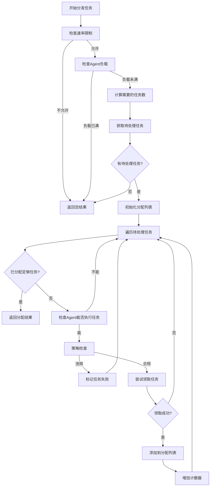

## 任务分发器代码分析

### 包声明和导入

```go
package task_dispatcher

import (
    "context"
    "neomaster/internal/model/orchestrator"
    agentRepo "neomaster/internal/repo/mysql/orchestrator"

    agentModel "neomaster/internal/model/agent"
    "neomaster/internal/pkg/logger"
    "neomaster/internal/service/orchestrator/allocator"
    "neomaster/internal/service/orchestrator/policy"
)
```


这部分声明了`task_dispatcher`包，并导入了所需的依赖项，包括：
- `context`: 用于上下文管理
- 各种内部模型和服务模块
- 日志记录工具
- 资源分配器和策略执行器

### 接口定义

```go
type TaskDispatcher interface {
    Dispatch(ctx context.Context, agent *agentModel.Agent, currentLoad int) ([]*orchestrator.AgentTask, error)
}
```


定义了[TaskDispatcher](NeoScan\neoMaster\internal\service\orchestrator\export.go#L13-L13)接口，包含一个[Dispatch](NeoScan\neoMaster\internal\service\orchestrator\core\task_dispatcher\dispatcher.go#L45-L128)方法，用于为指定的Agent分配任务。该方法接收上下文、Agent信息和当前负载量，返回分配给该Agent的任务列表及可能的错误。

### 结构体定义

```go
type taskDispatcher struct {
    taskRepo  agentRepo.TaskRepository
    policy    policy.PolicyEnforcer
    allocator allocator.ResourceAllocator
}
```


定义了`taskDispatcher`结构体，包含：
- `taskRepo`: 任务仓库，用于访问任务数据
- `policy`: 策略执行器，用于检查任务是否符合策略要求
- `allocator`: 资源分配器，用于检查Agent是否有能力执行任务

### 构造函数

```go
func NewTaskDispatcher(
    taskRepo agentRepo.TaskRepository,
    policy policy.PolicyEnforcer,
    allocator allocator.ResourceAllocator,
) TaskDispatcher {
    return &taskDispatcher{
        taskRepo:  taskRepo,
        policy:    policy,
        allocator: allocator,
    }
}
```


构造函数创建一个新的任务分发器实例，注入所需的依赖项。

### 核心分发逻辑

```go
func (d *taskDispatcher) Dispatch(ctx context.Context, agent *agentModel.Agent, currentLoad int) ([]*orchestrator.AgentTask, error) {
    if !d.allocator.Allow(ctx, agent.AgentID) {
        return nil, nil
    }
```


分发方法首先检查资源分配器是否允许该Agent请求任务，防止请求过于频繁。

```go
    maxTasks := 5

    if currentLoad >= maxTasks {
        return nil, nil
    }

    needed := maxTasks - currentLoad
```


设置每个Agent的最大任务数量为5（TODO注释指出这应该从配置中获取）。如果当前负载已经达到最大值，则不分配新任务。否则计算还需要多少任务。

```go
    pendingTasks, err := d.taskRepo.GetPendingTasks(ctx, needed*3)
    if err != nil {
        logger.LogError(err, "failed to get pending tasks", 0, "", "service.orchestrator.dispatcher.Dispatch", "REPO", nil)
        return nil, err
    }

    if len(pendingTasks) == 0 {
        return nil, nil
    }
```


从任务仓库获取待处理的任务，获取的数量是所需数量的3倍（考虑到一些任务可能会被过滤掉）。如果没有待处理任务，则返回空结果。

```go
    var assignedTasks []*orchestrator.AgentTask
    assignedCount := 0
```


初始化已分配任务列表和计数器。

```go
    for _, task := range pendingTasks {
        if assignedCount >= needed {
            break
        }
```


遍历待处理任务，直到分配到足够的任务数量。

```go
        if !d.allocator.CanExecute(ctx, agent, task) {
            continue
        }
```


使用资源分配器检查Agent是否能够执行该任务（例如检查能力和标签匹配）。如果不能执行，则跳过该任务。

```go
        if err := d.policy.Enforce(ctx, task); err != nil {
            logger.LogInfo("Task policy violation, marking as failed", "", 0, "", "service.orchestrator.dispatcher.Dispatch", "", map[string]interface{}{
                "task_id": task.TaskID,
                "reason":  err.Error(),
            })
            d.taskRepo.UpdateTaskResult(ctx, task.TaskID, "", "Policy Violation: "+err.Error(), "failed")
            continue
        }
```


使用策略执行器进行策略检查，确保任务符合规定（如白名单、作用域等）。如果违反策略，则记录日志并将任务标记为失败，然后继续处理下一个任务。

```go
        if err := d.taskRepo.ClaimTask(ctx, task.TaskID, agent.AgentID); err != nil {
            logger.LogInfo("failed to claim task (race condition?)", "", 0, "", "service.orchestrator.dispatcher.Dispatch", "", map[string]interface{}{
                "task_id":  task.TaskID,
                "agent_id": agent.AgentID,
                "error":    err.Error(),
            })
            continue
        }
```


尝试领取任务，这是一个原子操作（通常使用CAS或事务）。如果领取失败（可能是由于竞争条件，其他Agent抢占了该任务），则记录日志并继续处理下一个任务。

```go
        logger.LogInfo("Task assigned to Agent", "", 0, "", "service.orchestrator.dispatcher.Dispatch", "", map[string]interface{}{
            "task_id":  task.TaskID,
            "agent_id": agent.AgentID,
        })

        if t, err := d.taskRepo.GetTaskByID(ctx, task.TaskID); err == nil {
            assignedTasks = append(assignedTasks, t)
            assignedCount++
        }
```


成功分配任务后，记录日志，并重新获取任务详情（确保状态是最新的），然后将其添加到已分配任务列表中并增加计数器。

```go
    return assignedTasks, nil
}
```


最后返回分配给Agent的任务列表。

## 工作流程图




## 核心逻辑总结

任务分发器遵循以下原则：

1. **速率限制**：使用资源分配器防止Agent请求过于频繁
2. **负载均衡**：考虑Agent当前负载，不超过最大任务数限制
3. **能力匹配**：确保Agent有能力执行任务（通过资源分配器检查）
4. **策略合规**：最后一道防线，确保任务符合安全和合规要求
5. **并发安全**：使用原子操作防止多个Agent同时领取同一任务
6. **容错处理**：优雅处理各种异常情况，如竞争条件、策略违规等

这种设计确保了任务能够高效、安全地分发给合适的Agent执行。