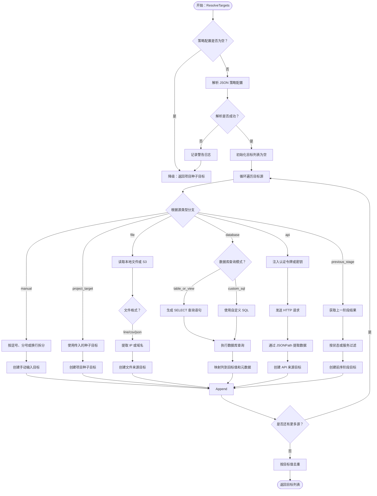
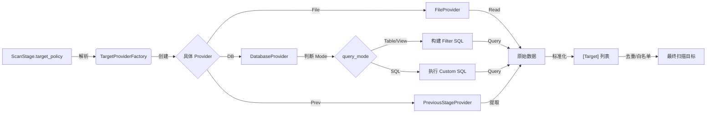

# TargetProvider 逻辑实体设计

## 概述

TargetProvider 是一个 **逻辑实体**（不对应数据库表），负责在运行时解析 `ScanStage.target_policy` 配置，从不同来源（文件、数据库、API、上阶段结果）“供应”标准化的扫描目标列表。它是连接“静态配置”与“动态执行”的桥梁。

## 核心模型

虽然 TargetProvider 不落库，但它有严格的配置结构（Schema）和运行时对象模型。

### 1. 配置结构 (TargetSource Config)

这是 `ScanStage.target_policy.target_sources` 数组中每一项的 JSON 结构：

| 字段名 | 类型 | 必填 | 描述 |
|--------|------|------|------|
| `source_type` | string | 是 | 来源类型枚举 (`file`, `database`, `api`, `manual`, `previous_stage`) |
| `query_mode` | string | 否 | 查询模式 (`table`, `view`, `sql`)，默认 `table`，仅针对 `database` 类型有效 |
| `target_type` | string | 是 | 目标数据类型 (`ip`, `ip_range`, `domain`, `url`) |
| `source_value` | string | 否 | 来源主值（表名、视图名、文件路径、API地址） |
| `custom_sql` | string | 否 | 自定义 SQL 语句（当 query_mode=sql 时必填） |
| `filter_rules` | JSON | 否 | 过滤/查询规则（针对 table/view/api/previous_stage） |
| `auth_config` | JSON | 否 | 认证配置（针对 API/DB） |
| `parser_config` | JSON | 否 | 解析配置（如 CSV 分隔符、JSON 路径） |

### 2. 运行时对象 (Target Object)

TargetProvider 解析后输出的标准目标对象：

| 字段名 | 类型 | 描述 |
|--------|------|------|
| `Type` | string | 目标类型 (`ip`, `domain`, `url`) |
| `Value` | string | 目标值 (`192.168.1.1`, `example.com`) |
| `Source` | string | 来源标识（用于回溯，如 `file:hosts.txt`） |
| `Meta` | map | 元数据（如端口、协议、标签，随目标携带） |

## 策略详解

不同 `source_type` 对应的特有配置字段设计。

### 1. FileProvider (文件来源)

从本地文件或对象存储读取目标。

- **source_value**: 文件绝对路径 或 S3 URI。
- **parser_config**:
  ```json
  {
    "format": "line", // line (每行一个), csv, json_array
    "csv_column": "ip", // 如果是 CSV，指定列名
    "json_path": "data.targets[*].ip" // 如果是 JSON，指定提取路径
  }
  ```

### 2. DatabaseProvider (数据库来源)

从系统资产表或外部数据库查询目标。

#### 模式 A: Table/View (默认)
- **query_mode**: `table` 或 `view`
- **source_value**: 表名或视图名 (如 `asset_networks`)。
- **filter_rules** (SQL 构建器):
  ```json
  {
    "where": [
      {"field": "status", "op": "=", "value": "active"},
      {"field": "tags", "op": "contains", "value": "production"}
    ],
    "limit": 1000
  }
  ```

#### 模式 B: Custom SQL (高级)
- **query_mode**: `sql`
- **custom_sql**: 完整的 SELECT 语句。
  ```sql
  SELECT ip_address 
  FROM assets a 
  JOIN departments d ON a.dept_id = d.id 
  WHERE d.name = 'Finance' 
    AND a.last_scan_time < DATE_SUB(NOW(), INTERVAL 7 DAY)
  ```
- **安全约束**: 
  - 仅允许 SELECT 语句。
  - 必须指定返回列名映射（默认取第一列作为 value）。
- **parser_config** (可选映射):
  ```json
  {
    "value_column": "ip_address", // 哪一列是目标值
    "meta_columns": ["hostname", "os"] // 哪些列作为 meta 数据携带
  }
  ```

- **auth_config** (可选): 如果是连接外部数据库，需提供连接凭证引用。

### 3. APIProvider (API 来源)

调用外部 CMDB 或资产管理系统的 API 获取目标。

- **source_value**: API URL (如 `https://cmdb.example.com/api/v1/hosts`)。
- **auth_config**:
  ```json
  {
    "type": "bearer_token", // basic, api_key
    "token_env": "CMDB_API_TOKEN" // 从环境变量读取 Token，不硬编码
  }
  ```
- **parser_config**:
  ```json
  {
    "response_format": "json",
    "extract_path": "data.items[*].primary_ip"
  }
  ```

### 4. PreviousStageProvider (上阶段结果)

最常用的策略，依赖上一个扫描阶段的 `StageResult`。由于 `StageResult` 的 `attributes` 字段通常包含嵌套数组（如端口列表、漏洞列表），本 Provider 支持**展开 (Unwind)** 和 **投影 (Projection)** 操作，以处理一对多的目标生成场景。

- **source_value**: 上一阶段的 `stage_name` 或相对引用 (`prev`, `stage_1`)。
- **filter_rules**:
  ```json
  {
    "result_type": ["port_scan", "service_scan"], // 第一层过滤：仅提取特定类型的输出
    "stage_status": "finished" // 可选：仅提取已完成阶段的结果
  }
  ```
- **unwind** (数组展开配置 - 解决"一对多"问题):
  ```json
  {
    "path": "attributes.ports", // 指定要展开的数组路径 (JSONPath)
    "filter": {
      "item.state": "open", // 仅保留数组中 state=open 的元素
      "item.service": ["http", "https"] // 可选：仅保留特定服务的元素
    }
  }
  ```
- **generate** (目标生成模板):
  ```json
  {
    "value_template": "{{target_value}}:{{item.port}}", // 组合生成新目标值 (如 192.168.1.1:80)
    "type": "ip_port", // 新目标的类型
    "meta_map": {
      "protocol": "{{item.service}}", // 从展开项提取元数据
      "origin_ip": "{{target_value}}", // 从根对象提取元数据
      "banner": "{{item.version}}"
    }
  }
  ```

### 5. ManualProvider (人工输入)

用于测试或临时任务，直接在配置中写死目标。

- **source_value**: 逗号分隔的字符串 (`192.168.1.1, 10.0.0.1/24`)。
- **parser_config**:
  ```json
  {
    "delimiter": "," // 分隔符
  }
  ```

## 接口定义 (Go Interface)

```go
type TargetProvider interface {
    // Name 返回 Provider 名称
    Name() string
    
    // Provide 执行获取逻辑
    // ctx: 包含 workflow_id, stage_id 等上下文
    // config: 上述 JSON 配置结构
    Provide(ctx context.Context, config TargetSourceConfig) ([]Target, error)
}
```

## 逻辑流程 (Logic Flow)



## 数据流向


