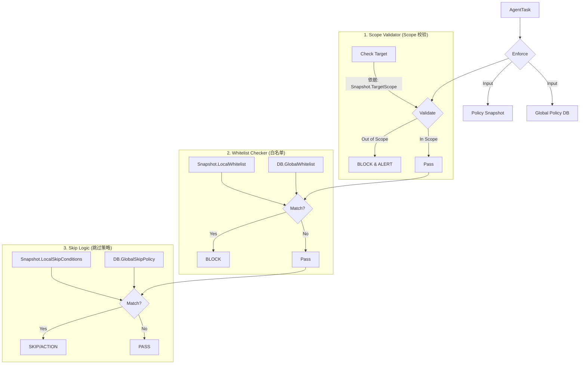

# 需求核对文档：Policy Enforcer 重构与逻辑修正

## 1. 核心变更背景
基于 Linus 的代码审查与用户最新指令，当前的 `PolicyEnforcer` 设计存在架构层级与数据来源的偏差。本特定文档旨在拉齐需求，消除文档与代码之间的矛盾。

## 2. 现状偏差分析 (Discrepancy Analysis)

| 维度 | 旧设计/当前代码 (Old/Current) | 用户新指令 (New Instruction) | 偏差影响 |
| :--- | :--- | :--- | :--- |
| **执行对象** | `Project` (项目级) | **`ScanStage` (阶段级)** | Enforcer 不应跨层级去查 Project 表，应聚焦于当前 Stage 的上下文。 |
| **Scope 定义** | `Project.TargetScope` (项目定义范围) | **"Project 没有 Scope 但有 TargetScope"** | 用户澄清：Project 虽无名为 "Scope" 的字段，但有 "TargetScope" 字段，且必须作为授权范围。 |
| **策略来源** | 仅依赖 DB (Global Policies) | **`ScanStage` JSON + DB** | 当前代码忽略了 Stage 局部定义的白名单和跳过条件，导致局部策略失效。 |
| **策略关系** | 单一来源 | **逻辑或 (OR)** | 需实现 `Local_Policy || Global_Policy` 的合并逻辑。 |

## 3. 逻辑重构方案 (Refactored Logic Proposal)

### 3.1 核心原则
1.  **ScanStage 为王**: Enforcer 的所有输入依据（包括策略配置）必须源自 `ScanStage`（或由 Scheduler 在生成任务时注入的 Stage 快照）。
2.  **混合策略 (Hybrid Policy)**: 必须同时评估局部配置与全局规则。
3.  **Snapshot 机制**: 在任务生成时，将 Project.TargetScope 和 ScanStage.TargetPolicy 快照化到 AgentTask 中，保证执行时的原子性。

### 3.2 重构后的校验流程

## 4. 已确认事项 (Confirmed Items)

### Q1: Scope 到底定义在哪里？
**确认**: **Project.TargetScope**。
虽然用户最初说 "Project 没有 Scope"，但后续澄清 "Project 中有 TargetScope，使用它作为授权范围"。
**结论**: `ScopeValidator` 必须校验目标是否在 `Project.TargetScope` 定义的范围内。

### Q2: 策略注入方式
**确认**: **支持 PolicySnapshot**。
**结论**: 修改 `AgentTask` 模型，增加 `PolicySnapshot` 字段。在 `Scheduler` 生成任务时，将以下内容打包注入：
*   `Project.TargetScope` (作为 Scope 校验依据)
*   `ScanStage.TargetPolicy` (作为局部白名单/跳过策略依据)

### Q3: 全局策略触发机制
**确认**: **全局策略强制执行**。
**结论**: `ScanStage` 中的 `whitelist_enabled` 和 `skip_enabled` 开关仅控制 **局部策略** 的开启/关闭，**不影响** 全局策略的执行。全局白名单和全局跳过策略始终生效 (Always On)，除非数据库中全局配置本身被禁用。

## 5. 开发任务清单 (Action Items)

1.  **Model Update**: 修改 `AgentTask` 结构体，添加 `PolicySnapshot` (JSON) 字段。
2.  **Scheduler Refactor**:
    *   在 `TaskGenerator` 中，解析 `Project.TargetScope` 和 `ScanStage.TargetPolicy`。
    *   构造 `PolicySnapshot` 对象并赋值给新生成的 `AgentTask`。
3.  **Enforcer Refactor**:
    *   移除 `projectRepo` 依赖（不再查 Project 表）。
    *   修改 `Enforce` 方法，优先从 `task.PolicySnapshot` 读取配置。
    *   实现 Scope 校验逻辑（基于 Snapshot）。
    *   实现 WhiteList/Skip 逻辑（Snapshot || DB）。
