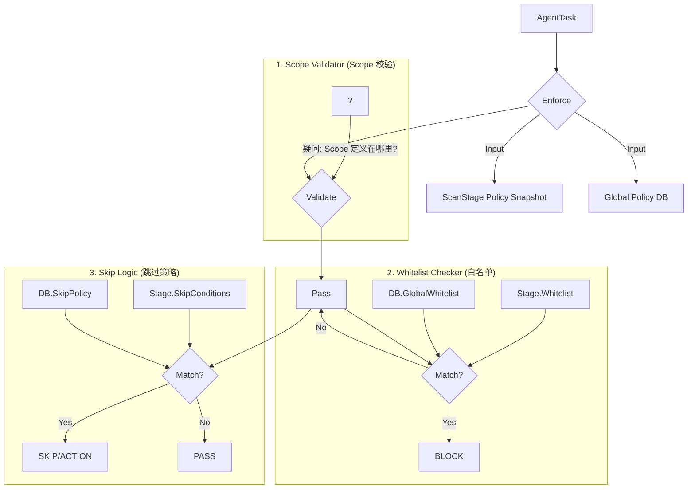

# 需求核对文档：Policy Enforcer 重构与逻辑修正

## 1. 核心变更背景
基于 Linus 的代码审查与用户最新指令，当前的 `PolicyEnforcer` 设计存在架构层级与数据来源的偏差。本特定文档旨在拉齐需求，消除文档与代码之间的矛盾。

## 2. 现状偏差分析 (Discrepancy Analysis)

| 维度 | 旧设计/当前代码 (Old/Current) | 用户新指令 (New Instruction) | 偏差影响 |
| :--- | :--- | :--- | :--- |
| **执行对象** | `Project` (项目级) | **`ScanStage` (阶段级)** | Enforcer 不应跨层级去查 Project 表，应聚焦于当前 Stage 的上下文。 |
| **Scope 定义** | `Project.TargetScope` (项目定义范围) | **"Project 没有 Scope"** | 原有的 `validateScope` 逻辑失效，Scope 校验失去依据，需重新定义 Scope 的来源。 |
| **策略来源** | 仅依赖 DB (Global Policies) | **`ScanStage` JSON + DB** | 当前代码忽略了 Stage 局部定义的白名单和跳过条件，导致局部策略失效。 |
| **策略关系** | 单一来源 | **逻辑或 (OR)** | 需实现 `Local_Policy || Global_Policy` 的合并逻辑。 |

## 3. 逻辑重构方案 (Refactored Logic Proposal)

### 3.1 核心原则
1.  **ScanStage 为王**: Enforcer 的所有输入依据（包括策略配置）必须源自 `ScanStage`（或由 Scheduler 在生成任务时注入的 Stage 快照）。
2.  **混合策略 (Hybrid Policy)**: 必须同时评估局部配置与全局规则。
3.  **移除 Project 依赖**: Enforcer 不再查询 `ProjectRepository` 获取 Scope。

### 3.2 重构后的校验流程

## 4. 关键待确认事项 (Critical Questions)

### Q1: Scope 到底定义在哪里？
**现状**: 用户明确指出 "Project 没有 Scope"。
**问题**: 如果 Project 不定义 Scope（授权范围），那么 `ScopeValidator` 依据什么来防止越权扫描？
**可能选项**:
*   **Option A (下沉)**: 每个 `ScanStage` 都在其 JSON 配置中显式定义 `target_scope`？
*   **Option B (隐式)**: `ScanStage.TargetSource` 解析出来的目标即为 Scope，不再做额外的范围校验？（风险：如果 Source 配置了 `0.0.0.0/0` 怎么办？）
*   **Option C (外部)**: Scope 由工作流（Workflow）或其他上层结构定义？

### Q2: 策略注入方式
**建议**: 为了保证原子性，建议在 `Scheduler` 生成 `AgentTask` 时，将 `ScanStage` 的策略配置（JSON）**解析并快照化**，存入 `AgentTask` 的一个新字段（如 `PolicySnapshot`）。
**确认**: 是否同意此方案？这样 Enforcer 接口只需接收 `AgentTask`，无需额外参数。

### Q3: 数据库中的全局策略触发机制
**现状**: `ScanStage` JSON 中有 `whitelist_enabled` 字段。
**确认**:
*   如果 `whitelist_enabled = false`，是否**强制跳过**数据库的全局白名单检查？
*   还是说全局白名单是**强制执行**的，不受 `ScanStage` 开关控制？(建议：全局白名单应强制执行，这是底线)。

---
**请确认以上理解，特别是 Q1 (Scope 的去向)。**
