# 资产与调度系统全景 ER 图

## 图例说明
- **[Table]** : 需要在数据库中建立物理表。
- **[Struct]** : 仅作为代码中的 Go Struct 或 JSON 对象，不需要建表。
- **实线** : 强关联 (Foreign Key)。
- **虚线** : 逻辑关联 (ID Reference)。

```mermaid
erDiagram
    %% ========================================================
    %% 1. 调度域 (Scheduling Domain) - Master 核心配置
    %% ========================================================
    Project ||--o{ ProjectWorkflow : "包含"
    Workflow ||--o{ ProjectWorkflow : "被引用"
    Workflow ||--o{ ScanStage : "定义"
    
    Project {
        uint id PK "[Table]"
        string name "项目唯一标识名"
        string display_name "显示名称"
        text description "项目描述"
        string status "运行状态 (idle/running/paused/finished/error)"
        bool enabled "是否启用"
        string schedule_type "调度类型 (immediate/cron/api/event)"
        string cron_expr "Cron 表达式"
        string exec_mode "工作流执行模式 (sequential/parallel)"
        json notify_config "通知配置聚合"
        json export_config "结果导出配置"
        json extended_data "扩展数据"
        json tags "标签列表"
        timestamp last_exec_time "最后一次执行开始时间"
        string last_exec_id "最后一次执行的任务 ID"
        uint created_by "创建者 UserID"
        uint updated_by "更新者 UserID"
        timestamp created_at "创建时间"
        timestamp updated_at "更新时间"
        timestamp deleted_at "软删除时间"
    }

    Workflow {
        uint id PK "[Table]"
        string name "工作流唯一标识名"
        string display_name "显示名称"
        string version "版本号"
        text description "描述"
        bool enabled "启用状态"
        string exec_mode "阶段执行模式 (sequential/parallel/dag)"
        json global_vars "全局变量定义"
        json policy_config "执行策略配置 (超时/重试/通知)"
        json tags "标签列表"
        uint created_by "创建者 ID"
        uint updated_by "更新者 ID"
        timestamp created_at "创建时间"
        timestamp updated_at "更新时间"
        timestamp deleted_at "软删除时间"
    }

    ProjectWorkflow {
        uint id PK "[Table] 代理主键"
        uint project_id FK "项目ID"
        uint workflow_id FK "工作流ID"
        int sort_order "执行顺序"
        timestamp created_at "创建时间"
        timestamp updated_at "更新时间"
    }

    ScanStage {
        uint id PK "[Table]"
        uint workflow_id FK "所属工作流 ID"
        int stage_order "阶段顺序"
        string stage_name "阶段名称"
        string stage_type "阶段类型枚举"
        string tool_name "使用的扫描工具名称"
        string tool_params "扫描工具参数"
        json target_policy "目标策略配置"
        json execution_policy "执行策略配置"
        json performance_settings "性能设置配置"
        json output_config "输出配置"
        json notify_config "通知配置"
        bool enabled "阶段是否启用"
        timestamp created_at "创建时间"
        timestamp updated_at "更新时间"
    }

    TargetProvider {
        string source_type "[Struct] 逻辑实体"
        string target_type
        json filter_rules
    }
    ScanStage ||..|| TargetProvider : "包含(target_policy)"

    %% ========================================================
    %% 2. 执行域 (Execution Domain) - 任务与结果
    %% ========================================================
    ScanStage ||--o{ StageResult : "产生"
    WorkflowStats ||--|| Workflow : "统计"

    StageResult {
        uint id PK "[Table] 海量数据"
        uint workflow_id FK "所属工作流 ID"
        uint stage_id FK "阶段 ID"
        uint agent_id FK "执行扫描的 Agent ID"
        string result_type "结果类型枚举"
        string target_type "目标类型 (ip/domain/url)"
        string target_value "目标值"
        json attributes "结构化属性 JSON"
        json evidence "原始证据 JSON"
        timestamp produced_at "产生时间"
        string producer "工具标识与版本"
        string output_config_hash "输出配置指纹"
        json output_actions "实际执行的轻量动作摘要"
        timestamp created_at "创建时间"
        timestamp updated_at "更新时间"
    }

    WorkflowStats {
        uint id PK "[Table] 代理主键"
        uint workflow_id FK "工作流ID"
        int total_execs "总执行次数"
        int success_execs "成功次数"
        int failed_execs "失败次数"
        int avg_duration_ms "平均执行耗时"
        string last_exec_id "最后一次执行 ID"
        string last_exec_status "最后一次执行状态"
        timestamp last_exec_time "最后一次执行时间"
        timestamp created_at "创建时间"
        timestamp updated_at "更新时间"
    }

    %% ========================================================
    %% 3. 资产域 (Asset Domain) - 结果沉淀
    %% ========================================================
    StageResult }|..|{ AssetHost : "ETL转换"
    
    AssetHost ||--o{ AssetService : "开放端口"
    AssetHost ||--o{ AssetWeb : "Web服务"
    AssetWeb ||--|| AssetWebDetail : "详细信息"
    AssetService ||--o{ AssetVuln : "存在漏洞"
    AssetWeb ||--o{ AssetVuln : "存在漏洞"
    AssetVuln ||--o{ AssetVulnPoc : "包含PoC"

    AssetHost {
        uint id PK "[Table]"
        string ip "IP地址"
        string hostname "主机名"
        string os "操作系统"
        json tags "标签"
        timestamp last_seen_at "最后发现时间"
        json source_stage_ids "来源阶段 ID 列表"
    }

    AssetService {
        uint id PK "[Table]"
        uint host_id FK "主机ID"
        int port "端口号"
        string proto "协议"
        string name "服务名称"
        string version "服务版本"
        string cpe "CPE标识"
        json fingerprint "指纹信息"
        string asset_type "资产类型(service|database|container)"
        json tags "标签"
        timestamp last_seen_at "最后发现时间"
    }

    AssetWeb {
        uint id PK "[Table]"
        uint host_id FK "主机ID(可选)"
        string domain "域名(可选)"
        string url "完整的URL地址"
        string asset_type "资产类型(web|api|domain)"
        json tech_stack "技术栈信息"
        string status "资产状态"
        json tags "标签信息"
        json basic_info "基础Web信息"
        int scan_level "扫描级别"
        timestamp last_seen_at "最后发现时间"
        timestamp created_at "创建时间"
        timestamp updated_at "更新时间"
    }

    AssetWebDetail {
        uint id PK "[Table]"
        uint asset_web_id FK "关联AssetWeb表"
        timestamp crawl_time "爬取时间"
        string crawl_status "爬取状态"
        string error_message "错误信息"
        json content_details "详细内容信息"
        string login_indicators "登录相关标识"
        string cookies "Cookie信息"
        string screenshot "页面截图"
        timestamp created_at "创建时间"
        timestamp updated_at "更新时间"
    }

    AssetVuln {
        uint id PK "[Table]"
        string target_type "目标类型(host|service|web|api)"
        uint target_ref_id "指向对应实体的 ID"
        string cve "CVE编号"
        string id_alias "漏洞标识(id)"
        string severity "严重程度"
        float confidence "置信度"
        json evidence "原始证据"
        json attributes "结构化属性"
        timestamp first_seen_at "首次发现时间"
        timestamp last_seen_at "最后发现时间"
        string status "状态(open/confirmed/resolved/ignored/false_positive)"
        string verify_status "验证过程状态(not_verified/queued/verifying/completed)"
        string verified_by "验证来源"
        timestamp verified_at "验证完成时间"
        string verify_result "验证结果快照(成功时回填Poc输出)"
        timestamp created_at "创建时间"
        timestamp updated_at "更新时间"
    }

    AssetVulnPoc {
        uint id PK "[Table]"
        uint vuln_id FK "关联漏洞ID"
        string poc_type "PoC类型(payload/script/yaml/command)"
        string name "PoC名称"
        string verify_url "PoC验证URL(可选)"
        string content "PoC内容"
        string description "使用说明"
        string source "来源"
        bool is_valid "是否可用(工具有效性)"
        int priority "执行优先级"
        string author "作者"
        string note "备注"
        timestamp created_at "创建时间"
        timestamp updated_at "更新时间"
    }

    %% ========================================================
    %% 4. 外部导入域 (Import Domain) - 资产来源 B
    %% ========================================================
    RawAsset ||--o{ RawAssetNetwork : "规范化"
    RawAssetNetwork ||--o{ AssetNetwork : "拆分/实例化"
    AssetNetwork }|..|{ ScanStage : "作为扫描目标"

    RawAsset {
        uint id PK "[Table] 原始导入记录"
        string source_type "数据来源类型"
        string source_name "来源名称"
        string external_id "外部ID"
        json payload "原始数据 JSON"
        string checksum "校验和"
        string import_batch_id "导入批次标识"
        int priority "处理优先级"
        json asset_metadata "资产元数据"
        json tags "标签"
        json processing_config "处理配置"
        timestamp imported_at "导入时间"
        string normalize_status "规范化状态"
        string normalize_error "规范化失败原因"
        timestamp created_at "创建时间"
        timestamp updated_at "更新时间"
    }

    RawAssetNetwork {
        uint id PK "[Table] 待确认网段"
        string network "网段"
        string name "资产名称"
        string description "描述"
        string exclude_ip "排除的IP"
        string location "地理位置"
        string security_zone "安全区域"
        string network_type "网络类型"
        int priority "调度优先级"
        json tags "标签"
        string source_type "数据来源类型"
        string source_identifier "来源标识"
        string status "状态"
        string note "备注"
        string created_by "创建人"
        timestamp created_at "创建时间"
        timestamp updated_at "更新时间"
    }

    AssetNetwork {
        uint id PK "[Table] 正式网段资产"
        string network "原始网段"
        string cidr "拆分后的网段"
        uint split_from_id FK "拆分来源ID"
        int split_order "拆分顺序"
        int round "扫描轮次"
        string network_type "网络类型"
        int priority "调度优先级"
        json tags "标签"
        string source_ref "来源引用"
        string status "调度状态"
        string scan_status "扫描状态"
        timestamp last_scan_at "最后扫描时间"
        timestamp next_scan_at "下次扫描时间"
        string note "备注"
        string created_by "创建人"
        timestamp created_at "创建时间"
        timestamp updated_at "更新时间"
    }

    AssetNetworkScan {
        uint id PK "[Table] 网段扫描记录"
        uint network_id FK "网段ID"
        uint agent_id FK "执行Agent ID"
        string scan_status "扫描状态"
        int round "扫描轮次"
        string scan_tool "扫描工具"
        json scan_config "扫描配置快照"
        int result_count "结果数量"
        int duration "扫描耗时"
        string error_message "错误信息"
        timestamp started_at "开始时间"
        timestamp finished_at "完成时间"
        timestamp assigned_at "分配时间"
        string scan_result_ref "结果引用"
        string note "备注"
        int retry_count "重试次数"
        timestamp created_at "创建时间"
        timestamp updated_at "更新时间"
    }
    
    AssetNetwork ||--o{ AssetNetworkScan : "记录历史"

    %% ========================================================
    %% 5. 辅助域 (Auxiliary Domain)
    %% ========================================================
    AssetWhitelist {
        uint id PK "[Table]"
        string whitelist_name "白名单名称"
        string whitelist_type "白名单类型"
        string target_type "目标类型"
        string target_value "目标值"
        string description "描述信息"
        timestamp valid_from "生效开始时间"
        timestamp valid_to "生效结束时间"
        string created_by "创建人"
        json tags "标签信息"
        json scope "作用域配置"
        bool enabled "是否启用"
        string note "备注信息"
        timestamp created_at "创建时间"
        timestamp updated_at "更新时间"
    }
    
    AssetSkipPolicy {
        uint id PK "[Table]"
        string policy_name "策略名称"
        string policy_type "策略类型"
        string description "策略描述"
        json condition_rules "条件规则"
        json action_config "动作配置"
        json scope "作用域配置"
        int priority "优先级"
        bool enabled "是否启用"
        string created_by "创建人"
        json tags "标签信息"
        timestamp valid_from "生效开始时间"
        timestamp valid_to "生效结束时间"
        timestamp created_at "创建时间"
        timestamp updated_at "更新时间"
        string note "备注信息"
    }
```

## 实体类型清单

### 1. 必须建表 (Physical Tables)
这些实体承载核心业务数据，必须持久化。

- **Project**: 项目主表。
- **Workflow**: 工作流定义表。
- **ProjectWorkflow**: 项目与工作流的多对多关联表。
- **ScanStage**: 扫描阶段定义表。
- **StageResult**: 扫描结果表（日志型，数据量大）。
- **WorkflowStats**: 运行时统计表（读写分离优化）。
- **AssetHost / Service / Web / Vuln**: 最终资产表（业务核心）。
- **AssetVulnPoc**: 漏洞验证/利用代码表（独立实体）。
- **AssetWebDetail**: Web资产详细信息表（爬虫结果）。
- **RawAsset / RawAssetNetwork / AssetNetwork**: 外部导入与网段管理表。
- **AssetNetworkScan**: 网段扫描历史记录表。
- **AssetWhitelist / AssetSkipPolicy**: 全局策略表。

### 2. 逻辑实体 (Logical Structs)
这些实体仅存在于代码逻辑或 JSON 字段中，**不需要**单独建表。

- **TargetProvider**: 实际上是 `ScanStage.target_policy` 字段解析后的逻辑对象。
- **WorkflowPolicy**: 实际上是 `Workflow.policy_config` 字段对应的 Go Struct。
- **NotifyConfig**: 实际上是 `Project.notify_config` 字段对应的 Go Struct。

## 数据流转视图

1.  **配置流**：用户创建 `Project` -> 关联 `Workflow` -> 定义 `ScanStage`。
2.  **执行流**：Master 读取 `ScanStage` -> 解析 `TargetProvider` -> 下发任务 -> Agent 返回 `StageResult`。
3.  **数据流**：Master 收到 `StageResult` -> (根据 OutputConfig) -> 清洗并 Upsert 到 `AssetHost/Service/...` 表。
