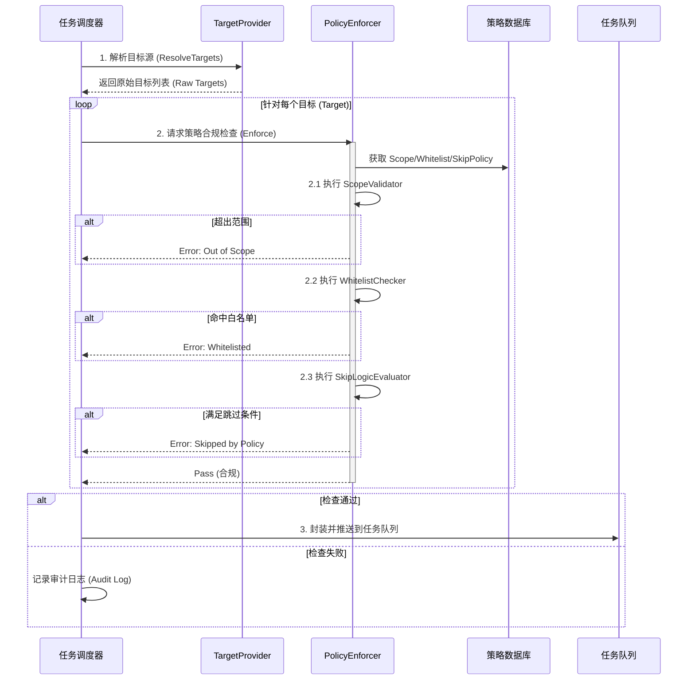

# 资产与调度系统重构方案 (Linus's Taste Edition)

## 核心哲学
**"Bad programmers worry about the code. Good programmers worry about data structures."**
本重构方案基于 **State-Machine Based Pipeline (基于状态机的流水线架构)**，旨在消除传统 "Loop" 模式的复杂性，将系统解耦为职责单一、数据驱动的核心组件。

不再构建大而全的"统一配置中心"，而是实现以下具体的、可组合的原子组件。

## 1. 控制面 (Control Plane) - "大脑"

负责决策、调度与策略执行，不处理具体的大规模数据流。

### 1.1 Orchestrator (编排器)
*   **职责**: 系统的心脏。读取 `Project` 和 `Workflow` 定义，维护状态机，推动流程流转。
*   **核心组件**:
    *   **ScheduleManager**: 解析 Cron 表达式，定时触发 Project 执行。
    *   **StageTransitionEngine**: 状态机引擎。
        *   监听 Stage 完成事件。
        *   基于 `ScanStage` 表定义的规则，判断是否满足进入下一阶段的条件 (Next Stage Logic)。
        *   支持 DAG (有向无环图) 执行流。
    *   **TaskDispatcher**: 将逻辑上的 `ScanStage` 拆分为具体的 Task (Job)，分发给 Resource Allocator。

### 1.2 Policy Enforcer (策略执行器)

**定位与职责**:
Policy Enforcer 是任务调度链路中的**核心合规网关**。它位于目标解析（Target Resolution）之后、任务分发（Task Dispatch）之前，作为最后一道防线，强制执行所有安全策略与业务规则。严禁任何未经清洗和验证的目标流入执行终端（Agent）。

**核心组件架构**:

1.  **ScopeValidator (范围合规校验器)**
    *   **职责**: 确保所有扫描目标严格收敛于 Project 定义的 `TargetScope` 及其授权范围内。
    *   **机制**:
        *   基于 CIDR、域名后缀或精确匹配进行集合包含性检查。
        *   防止因配置错误导致的越权扫描（如意外扫描公网或非授权内网段）。
    *   **判定**: `Out of Scope` -> **Drop & Alert**。

2.  **WhitelistChecker (全局白名单阻断器)**
    *   **职责**: 强制执行全局或租户级别的 `AssetWhitelist` 策略，保护敏感资产（如政务网、核心生产库、蜜罐）。
    *   **原则**: **Master 端拦截**。绝对禁止将白名单内的目标下发给 Agent，避免引发不必要的网络警报或法律风险。
    *   **判定**: `Match Whitelist` -> **Block**。

3.  **SkipLogicEvaluator (动态跳过策略引擎)**
    *   **职责**: 基于环境上下文动态评估是否执行扫描任务。
    *   **场景示例**:
        *   **时间窗限制**: 仅允许在非业务高峰期（如 02:00-06:00）扫描生产环境。
        *   **环境标签限制**: 当 `Env=Production` 且 `RiskLevel=High` 时，自动跳过破坏性扫描插件。
    *   **判定**: `Match Skip Condition` -> **Skip**。

**执行与管控流程**:

**关键交互关系**:
*   **Upstream**: 接收来自 `TargetProvider` 解析后的标准化 `Target` 对象。
*   **Downstream**: 仅向任务队列（Task Queue）输出经过清洗的、合规的 `AgentTask`。
*   **Dependency**: 强依赖于 `ProjectRepository` (获取 Scope) 和 `PolicyRepository` (获取白名单/跳过规则)。

### 1.3 Resource Allocator (资源调度器)
*   **职责**: 管理 Agent 资源池，实现最优分配。
*   **核心组件**:
    *   **AgentSelector**: 智能匹配。
        *   基于 Capability (能力) 匹配: 只有安装了 Masscan 的 Agent 才能领 Masscan 任务。
        *   基于 Tag (标签) 匹配: 只有 "Zone:Inside" 的 Agent 才能扫内网。
    *   **RateLimiter**: 速率限制。
        *   全局限速: 防止 Master 被大量心跳打挂。
        *   目标限速: 防止把目标网段打挂。

### 1.4 Local Agent (System Executor) - "特种部队"
*   **职责**: 运行在 Master 进程内的特殊执行单元，负责执行由于数据量大或权限要求高而不适合下发给远程 Agent 的任务。
*   **核心特征**:
    *   **In-Process**: 与 Master 同进程，零网络开销。
    *   **Direct DB Access**: **实用主义特权**。为了追求极致的批量处理性能（如 `FindInBatches`），它被允许绕过 Repo 层直接操作数据库。它是系统的 "DBA"。
    *   **System Tasks**: 专属消费 `category='system'` 的任务（如：全量资产标签传播、过期资产清洗）。
*   **调度模型**:
    *   Scheduler 将任务标记为 `category='system'` -> Local Agent 自动认领并执行 -> 结果直接回写 Asset 表。

---

## 2. 数据面 (Data Plane) - "流水线"

负责高吞吐的数据处理、清洗与存储。

### 2.1 Target Provider (数据面与实现)

**定位与职责**:
作为 "Resolve & Enforce" 双子星架构的第一环，Target Provider 负责解决"扫谁"的问题。它通过 `TargetProvider` 接口屏蔽了底层数据源的差异，将各种异构输入（CIDR、文件、API、数据库）统一转换为标准化的 `Target` 对象流，供下游 `Policy Enforcer` 进行合规审查。

**核心组件架构 (TargetProvider Interface)**:

`TargetProvider` 采用策略模式设计，支持以下原子化提供者：

1.  **ManualProvider (手动/静态)**
    *   **职责**: 处理用户直接输入的静态目标。
    *   **格式**: 支持 CIDR (`192.168.1.0/24`)、IP 范围 (`1.1.1.1-1.1.1.5`)、域名列表。

2.  **FileProvider (文件导入)**
    *   **职责**: 处理大批量目标的文件导入。
    *   **格式**: 支持 `.txt`, `.csv`, `.json` 等格式的解析与去重。

3.  **DatabaseProvider (资产库联动)**
    *   **职责**: 直接从 `Asset` 表中提取目标。
    *   **场景**: "全量资产复查"或"高危资产定期巡检"。

4.  **ApiProvider (外部集成)**
    *   **职责**: 对接 CMDB 或第三方资产系统的 API。
    *   **场景**: 实时同步云资源变化。

5.  **PreviousStageProvider (Pipeline Core)**
    *   **职责**: 实现扫描流水线的核心——**动态解析**。
    *   **逻辑**: 从上一阶段 (`Stage N-1`) 的执行结果中提取目标。
    *   **示例**: Stage 1 (端口扫描) 发现 80 端口 -> Provider 提取 IP:80 -> Stage 2 (Web 探测) 针对这些目标进行识别。

**关键交互关系**:
*   **Upstream**: 接收 `Project` 配置中的 `TargetSource` 定义。
*   **Downstream**: 向 **Policy Enforcer** 输出原始目标列表（Raw Targets）。**注意：此时的目标尚未经过合规清洗，必须强制经过 Enforcer 才能下发。**

### 2.2 Result Ingestor (结果摄入器)
*   **职责**: 高吞吐地接收 Agent 的汇报，削峰填谷。
*   **核心组件**:
    *   **ResultQueue**: 缓冲队列 (Kafka / Redis List)。解耦 Agent 提交与 Master 处理速率。
    *   **ResultValidator**: 数据校验。验证 `StageResult` 的格式合法性、签名正确性。
    *   **EvidenceArchiver**: 原始证据归档。将 Agent 上报的原始 JSON/XML 存入对象存储 (S3/MinIO)，作为审计依据，永不篡改。

### 2.3 Asset ETL Engine (资产清洗引擎)
*   **职责**: 也就是 "Result Processor"。将碎片化的 `StageResult` 拼凑成完整的 `Asset` 视图。
*   **核心组件**:
    *   **Merger**: 状态合并逻辑。
        *   收到 "Port 80 Open" -> 查找 `AssetHost` -> 更新或插入 `AssetService` -> 更新 `LastSeen`。
    *   **FingerprintMatcher (Standardizer & Re-identifier)**: 离线治理与标准化引擎。
        *   **入库标准化**: 针对非 Agent 来源（如文件导入、API 同步、原生 Nmap XML）的原始 Banner/Header 数据，进行 CPE 标准化映射，确保数据库内数据口径一致。
        *   **存量再识别**: 当指纹库更新时，支持触发后台任务，基于 **AssetUnified 表中持久化存储的** Banner/Headers/Body 数据重新计算指纹，无需重新发包扫描即可发现新组件。（注：不依赖可能被清理的原始 StageResult）
        *   **冲突仲裁**: 当不同扫描阶段（如 PortScan vs WebScan）对同一服务的识别结果不一致时，基于置信度权重进行合并决策。
    *   **WebCrawlerDataHandler**: 专用处理器。
        *   处理 `AssetWebDetail` 这种大体积、非结构化数据 (HTML body, Screenshots)。

---

## 3. 基础设施面 (Infrastructure Plane) - "基石"

### 3.1 Tool Adapter Layer (工具适配层)
*   **职责**: 将异构的扫描工具（Nmap, Masscan, Nuclei, Yakit）抽象为统一的系统能力。**工具是机制，不是策略。**
*   **核心组件**:
    *   **Tool Registry**: 工具注册表。
        *   管理工具的元数据、版本、Docker 镜像/二进制路径。
        *   支持 `ToolHealthCheck`，确保 Agent 端工具可用。
    *   **Command Factory (Master端)**: 命令工厂。
        *   **Template Engine**: 使用模板将 `ScanConfig` 转换为具体的 CLI 命令 (e.g., `nmap -sS -p {{.Ports}}`).
        *   **Argument Builder**: 动态注入参数 (如自动添加 `--exclude` 白名单参数)。
    *   **Output Normalizer (Agent/Master端)**: 结果标准化器。
        *   **Parsers**: 针对每种工具实现解析器 (XML/JSON/Text -> `StageResult`).
        *   **Standardization**: 统一字段命名 (e.g., 统一 `service_name`, `protocol`, `severity`)。

---

## 4. 重构路线图 (Implementation Path)

1.  **Phase 1: Data Structures First (已完成)**
    *   确立 `Asset*`, `ScanStage`, `StageResult` 等核心 ER 模型。

2.  **Phase 2: The Pipeline Core**
    *   实现 `Tool Adapter Layer` (Command Factory & Output Normalizer)。
    *   实现 `TaskDispatcher` 与 Agent 的通信协议。

3.  **Phase 3: The Brain**
    *   实现 `Orchestrator` 的状态机逻辑。
    *   实现 `Target Provider` (Static & Dynamic)。

4.  **Phase 4: The Cleaner**
    *   实现 `Result Ingestor` 和 `Asset ETL Engine`。
    *   打通 "扫描 -> 结果 -> 资产" 的闭环。

5.  **Phase 5: Policy & Optimization**
    *   加入 `Policy Enforcer` (白名单/跳过策略)。
    *   优化 `Resource Allocator` (调度算法)。
