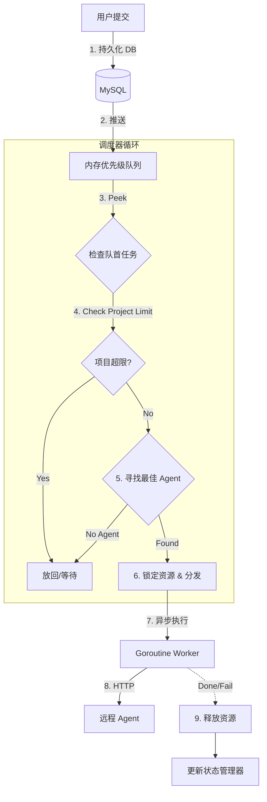

# NeoScan 纯内存并发调度器设计方案 (Go-Native Scheduler)

## 1. 核心哲学 (Philosophy)

**"Go 的并发哲学是：不要通过共享内存来通信，而要通过通信来共享内存。"**

本项目放弃引入 Redis 等外部组件进行并发控制，转而利用 Go 语言原生的 **Channels (通道)** 和 **Goroutines (协程)** 构建一个高性能、低延迟、自包含的调度系统。

### 设计目标
1.  **高性能 (High Performance)**: 纳秒级任务调度，消除网络 I/O 开销。
2.  **强一致性 (Consistency)**: 通过 `sync.Mutex` 和原子操作保证状态准确。
3.  **双层限流 (Two-Layer Limiting)**: 同时控制 **项目级并发** (保护目标) 和 **Agent 级负载** (保护扫描节点)。
4.  **优雅降级 (Graceful Degradation)**: 支持任务持久化与启动恢复，防止重启丢单。

---

## 2. 核心数据结构 (Data Structures)

### 2.1 优先级任务队列 (Priority Queue)
使用 Go 标准库 `container/heap` 实现一个线程安全的最小堆，确保高优先级任务优先出队。

```go
// TaskItem 队列中的任务项
type TaskItem struct {
    TaskID    string
    ProjectID string
    Priority  int       // 优先级: 数字越小优先级越高 (1: High, 2: Normal, 3: Low)
    Weight    int       // 负载权重: Ping=1, PortScan=10, WebScan=20
    Timestamp int64     // 入队时间，用于 FIFO
    Index     int       // heap 需要的索引
}

// PriorityQueue 线程安全的优先级队列
type PriorityQueue struct {
    mu    sync.RWMutex
    items []*TaskItem
}
```

### 2.2 状态管理器 (Concurrency State)
维护实时的并发计数器，作为调度的决策依据。

```go
type StateManager struct {
    mu sync.RWMutex
    
    // 项目并发控制: ProjectID -> 当前运行的任务数
    // 限制: 保护目标网络不被扫崩
    ProjectActive map[string]int
    
    // Agent 负载控制: AgentID -> 当前负载权重总和
    // 限制: 保护 Agent 不被累死
    // Capacity: 每个 Agent 有最大权重 (如 100)
    AgentLoad map[string]int
}
```

---

## 3. 调度循环 (The Scheduler Loop)

调度器运行在一个独立的 Goroutine 中，是一个永不停止的循环。

### 3.1 架构图



### 3.2 伪代码逻辑

```go
func (s *Scheduler) Run() {
    ticker := time.NewTicker(100 * time.Millisecond) // 防止 CPU 空转
    
    for {
        select {
        case <-s.quit:
            return
        case <-ticker.C:
            s.schedule()
        case <-s.trigger: // 有新任务入队时的即时触发信号
            s.schedule()
        }
    }
}

func (s *Scheduler) schedule() {
    // 1. 锁定队列，取出最高优任务
    task := s.queue.Peek()
    if task == nil {
        return
    }

    // 2. 检查项目并发限制
    if !s.state.CanScheduleProject(task.ProjectID) {
        // 该项目满了，暂时跳过或等待
        // 策略: 可以实现一个 PendingMap 暂存，或者简单地让出时间片
        return 
    }

    // 3. 寻找最佳 Agent
    // 遍历所有在线 Agent，找到 Load + Task.Weight <= Capacity 的节点
    // 且选择当前 Load 最小的那个 (Least Connection 策略)
    agent := s.agentMgr.FindBestAgent(task.Weight)
    if agent == nil {
        return // 资源不足，稍后重试
    }

    // 4. 真正出队并分发 (Transaction)
    s.queue.Pop() 
    s.state.Incr(task.ProjectID, agent.ID, task.Weight)

    // 5. 异步执行，不阻塞调度循环
    go s.executeTask(task, agent)
}
```

---

## 4. 关键机制实现

### 4.1 "项目级" 令牌桶 (Project Rate Limiter)
虽然我们可以用计数器，但 Go 的 `Buffered Channel` 是天然的令牌桶。

```go
type ProjectLimiter struct {
    // Key: ProjectID, Value: 令牌桶
    buckets sync.Map // map[string]chan struct{}
}

// 获取令牌 (非阻塞)
func (p *ProjectLimiter) TryAcquire(projectID string, maxConcurrency int) bool {
    bucket, _ := p.buckets.LoadOrStore(projectID, make(chan struct{}, maxConcurrency))
    ch := bucket.(chan struct{})
    
    select {
    case ch <- struct{}{}:
        return true // 拿到令牌
    default:
        return false // 满了
    }
}

// 归还令牌
func (p *ProjectLimiter) Release(projectID string) {
    if bucket, ok := p.buckets.Load(projectID); ok {
        <-bucket.(chan struct{})
    }
}
```

### 4.2 启动恢复 (Crash Recovery)
由于内存队列掉电即失，必须依赖数据库作为 "Source of Truth"。

**Master 启动流程:**
1.  初始化 `Scheduler` 和 `PriorityQueue`。
2.  查询 DB: `SELECT * FROM scan_tasks WHERE status IN ('pending', 'running')`。
3.  对于 `pending` 任务: 直接 `queue.Push(task)`。
4.  对于 `running` 任务: 
    *   检查其对应的 Agent 是否存活。
    *   如果存活: 恢复内存计数器 `state.Incr(...)`，不重新下发。
    *   如果 Agent 已死: 标记为失败重试，重新 `queue.Push(task)`。

### 4.3 优雅退出 (Graceful Shutdown)
Master 停止时，不应强杀正在执行的任务。

1.  停止接收新 HTTP 请求。
2.  发送 `quit` 信号给调度器，停止新任务分发。
3.  `Wait() ` 等待所有 Worker Goroutine 返回 (配合 `sync.WaitGroup`)。
4.  超时强制退出 (如 30秒)。

---

## 5. 总结

| 特性 | 方案优势 |
| :--- | :--- |
| **复杂度** | **低**。无需维护 Redis、Etcd 等外部集群。 |
| **性能** | **极高**。基于内存指针操作，无序列化/反序列化开销。 |
| **可靠性** | **高**。强类型检查，编译期发现错误；配合 DB WAL 保证数据不丢失。 |
| **可维护性** | **高**。代码即文档，逻辑清晰，Go 开发者易于理解。 |

该方案完全契合 **Linus 的 "KISS (Keep It Simple, Stupid)" 原则** 和 **"Good Taste"**，用最基础的数据结构解决最复杂的问题。
