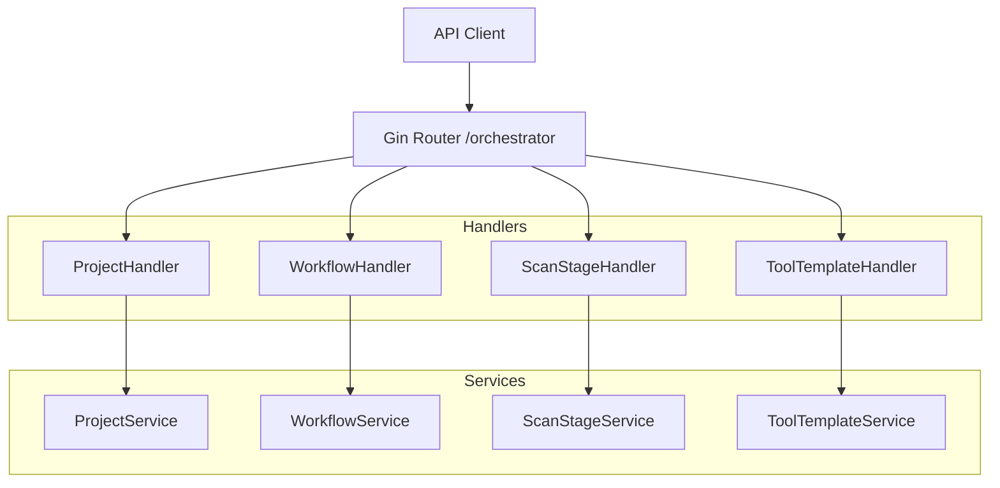

# 设计文档 - Orchestrator_API_Implementation

## 架构概览
本模块遵循项目标准的 Controller-Service-Repository 分层架构。
Handler 层负责 HTTP 请求解析、参数校验、调用 Service 层逻辑，并封装统一响应。

### 整体架构图


## 接口设计

### 1. Project Management (`/projects`)
- `POST /`: 创建项目
- `GET /`: 获取项目列表 (支持分页, name 搜索)
- `GET /:id`: 获取项目详情 (包含关联的 Workflows)
- `PUT /:id`: 更新项目
- `DELETE /:id`: 删除项目
- `PATCH /:id/status`: 更新状态/启用禁用
- `POST /:id/workflows`: 关联工作流
- `DELETE /:id/workflows/:workflow_id`: 移除关联工作流

### 2. Workflow Management (`/workflows`)
- `POST /`: 创建工作流
- `GET /`: 获取工作流列表
- `GET /:id`: 获取详情
- `PUT /:id`: 更新
- `DELETE /:id`: 删除

### 3. ScanStage Management (`/stages`)
- `POST /`: 创建阶段
- `GET /`: 列表
- `GET /:id`: 详情
- `PUT /:id`: 更新
- `DELETE /:id`: 删除

### 4. ToolTemplate Management (`/tool-templates`)
- `POST /`: 创建模板
- `GET /`: 列表
- `GET /:id`: 详情
- `PUT /:id`: 更新
- `DELETE /:id`: 删除

## 核心组件设计

### Handler 定义
所有 Handler 结构体持有对应 Service 的接口或指针。

```go
type ProjectHandler struct {
    service *orchestrator.ProjectService
}

type WorkflowHandler struct {
    service *orchestrator.WorkflowService
}
// ... 其他同理
```

### 依赖注入
在 `internal/app/master/setup/orchestrator.go` 中：
1. 初始化 Repositories
2. 初始化 Services
3. 初始化 Handlers
4. 返回 Handlers 集合供 Router 使用

### 路由注册
在 `internal/app/master/router/orchestrator_routers.go` 中：
接收 Handlers 集合，注册到 Gin Engine。

## 数据交互
- **Request**: 使用 `ShouldBindJSON` 解析 Body。
- **Response**:
  ```go
  type APIResponse struct {
      Code    int         `json:"code"`
      Message string      `json:"message"`
      Data    interface{} `json:"data"`
  }
  ```
- **Error Handling**: 捕获 Service 返回的 error，使用 `logger.LogBusinessError` 记录，并返回适当 HTTP 状态码 (通常 400 或 500)。
