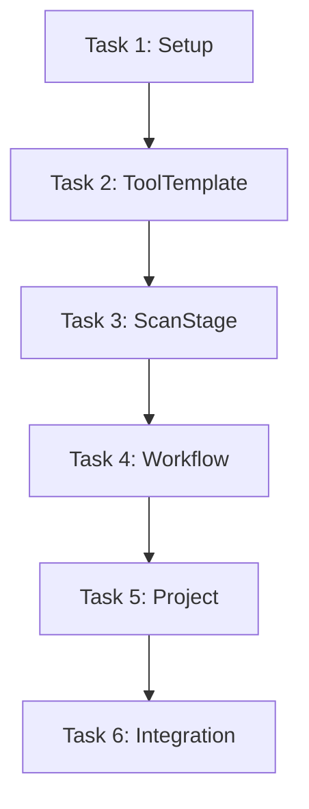

# 任务拆分文档 - Orchestrator_API_Implementation

## 任务列表

### 任务1：基础设施搭建 (Task_1_Setup_Wiring)
#### 输入契约
- 现有 Service 和 Repo 代码
#### 输出契约
- `internal/handler/orchestrator/` 目录
- `internal/app/master/setup/orchestrator.go` (基础结构)
- `internal/app/master/router/orchestrator_routers.go` (基础结构)
#### 实现约束
- 确保包引用正确，无循环依赖。

### 任务2：工具模板接口实现 (Task_2_Handler_ToolTemplate)
#### 输入契约
- `ScanToolTemplateService`
#### 输出契约
- `internal/handler/orchestrator/tool_template_handler.go`
- 路由注册 `/api/v1/orchestrator/tool-templates`
#### 验收标准
- 增删改查接口可用。

### 任务3：扫描阶段接口实现 (Task_3_Handler_ScanStage)
#### 输入契约
- `ScanStageService`
#### 输出契约
- `internal/handler/orchestrator/scan_stage_handler.go`
- 路由注册 `/api/v1/orchestrator/stages`

### 任务4：工作流接口实现 (Task_4_Handler_Workflow)
#### 输入契约
- `WorkflowService`
#### 输出契约
- `internal/handler/orchestrator/workflow_handler.go`
- 路由注册 `/api/v1/orchestrator/workflows`

### 任务5：项目接口实现 (Task_5_Handler_Project)
#### 输入契约
- `ProjectService`
#### 输出契约
- `internal/handler/orchestrator/project_handler.go`
- 路由注册 `/api/v1/orchestrator/projects`
- 包含关联工作流的接口

### 任务6：集成与验证 (Task_6_Integration)
#### 输入契约
- 所有 Handlers
#### 输出契约
- 完整的 `setup/orchestrator.go`
- 完整的 `router/orchestrator_routers.go`
- 编译通过
#### 验收标准
- `go build` 无误
- 简单的路由测试通过

## 依赖关系图

