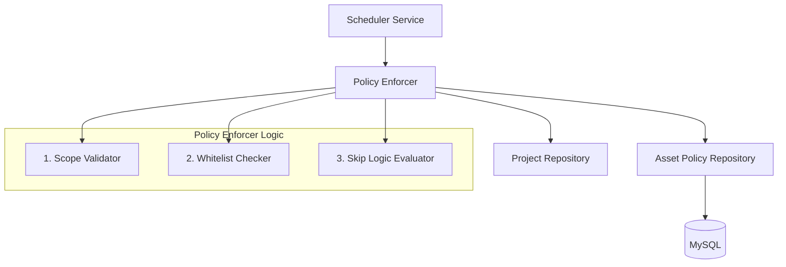

# 设计文档 - Policy Enforcer 重构

## 架构概览

### 组件交互图


## 核心组件设计

### 1. AssetPolicyRepository 扩展
我们需要添加专门用于策略执行的高效查询方法。

**新增接口**:
```go
// GetEnabledWhitelists 获取所有启用的全局白名单和指定Scope的白名单
// 为了性能，这里我们先获取所有全局启用的白名单。
// 未来如果量大，可以增加过滤条件。
func (r *AssetPolicyRepository) GetEnabledWhitelists(ctx context.Context) ([]*asset.AssetWhitelist, error)

// GetEnabledSkipPolicies 获取所有启用的跳过策略
func (r *AssetPolicyRepository) GetEnabledSkipPolicies(ctx context.Context) ([]*asset.AssetSkipPolicy, error)
```

### 2. PolicyEnforcer 结构更新
需要注入 `AssetPolicyRepository`。

```go
type policyEnforcer struct {
    projectRepo *orcrepo.ProjectRepository
    policyRepo  *assetrepo.AssetPolicyRepository // 新增依赖
}

func NewPolicyEnforcer(
    projectRepo *orcrepo.ProjectRepository, 
    policyRepo *assetrepo.AssetPolicyRepository, // 新增参数
) PolicyEnforcer
```

### 3. 数据结构定义 (JSON 解析)

#### Skip Policy Condition Rules
对应 `asset_skip_policies.condition_rules` 字段。

```go
type SkipConditionRules struct {
    // 时间窗口限制: "HH:MM-HH:MM" (每日)
    // 如果当前时间在此范围内，则跳过
    BlockTimeWindows []string `json:"block_time_windows"` 
    
    // 环境标签限制: ["prod", "sensitive"]
    // 如果项目包含任一标签，则跳过
    BlockEnvTags []string `json:"block_env_tags"`
}
```

### 4. 逻辑实现细节

#### WhitelistChecker Logic
1. 调用 `policyRepo.GetEnabledWhitelists` 获取列表。
2. 遍历列表，根据 `TargetType` (`ip`, `domain`, `keyword`) 执行匹配。
   - **IP**: `net.ParseCIDR` 检查包含关系，或 IP 相等检查。
   - **Domain**: `strings.HasSuffix` 检查后缀 (需处理 `.` 前缀)。
   - **Keyword/Exact**: `strings.Contains` 或 `==`。

#### SkipLogicEvaluator Logic
1. 调用 `policyRepo.GetEnabledSkipPolicies` 获取列表。
2. 遍历列表，解析 `ConditionRules` JSON。
3. **时间检查**: 解析 `HH:MM`，比较 `time.Now()`。
4. **标签检查**: 获取 `Project.Tags` (需解析 JSON)，与 `BlockEnvTags` 取交集。
5. 任意规则命中 -> 返回 Error (Skipped)。

## 接口影响
- `NewSchedulerService` 需要传入 `AssetPolicyRepository`。
- `Scheduler` 初始化链条需要更新。
