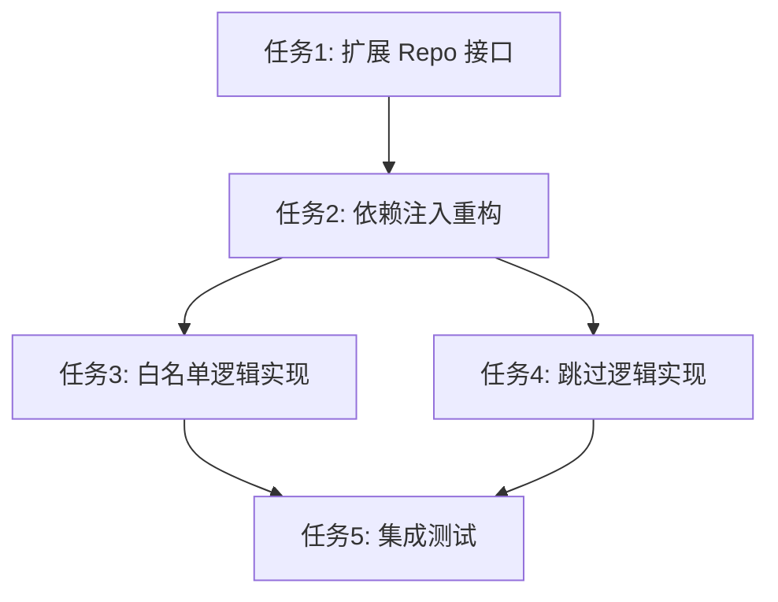

# 任务拆分文档 - Policy Enforcer 重构

## 任务列表

### 任务1：扩展 AssetPolicyRepository 接口
#### 输入契约
- 前置依赖：`internal/model/asset` 模型定义已存在
- 输入数据：无
- 环境依赖：数据库连接正常

#### 输出契约
- 输出数据：
  - `GetEnabledWhitelists(ctx)`: 返回所有启用的白名单规则
  - `GetEnabledSkipPolicies(ctx)`: 返回所有启用的跳过策略
- 交付物：`internal/repo/mysql/asset/asset_policy.go` 中的新增方法
- 验收标准：
  - 能够正确查询到数据库中 `enabled=true` 的记录
  - 单元测试通过，验证 SQL 查询逻辑正确

#### 实现约束
- 技术栈：GORM
- 接口规范：遵循 Repository 模式
- 质量要求：包含错误处理，Context 传递

---

### 任务2：重构 PolicyEnforcer 结构与依赖注入
#### 输入契约
- 前置依赖：任务1完成
- 输入数据：`AssetPolicyRepository` 实例
- 环境依赖：无

#### 输出契约
- 输出数据：无
- 交付物：
  - `internal/service/orchestrator/policy/enforcer.go`：结构体更新
  - `internal/service/orchestrator/scheduler.go`：初始化逻辑更新
- 验收标准：
  - `PolicyEnforcer` 结构体包含 `policyRepo` 字段
  - 调度器初始化时正确注入了 `AssetPolicyRepository`
  - 编译通过，无未使用的字段错误

#### 实现约束
- 技术栈：Go struct, Dependency Injection
- 接口规范：内部接口更新
- 质量要求：保持现有功能不中断

---

### 任务3：实现实时白名单检查 (WhitelistChecker)
#### 输入契约
- 前置依赖：任务2完成
- 输入数据：目标字符串 (IP/域名/URL)
- 环境依赖：数据库中有测试白名单数据

#### 输出契约
- 输出数据：`bool` (是否白名单), `string` (匹配的规则名)
- 交付物：`internal/service/orchestrator/policy/enforcer.go` 中的 `isWhitelisted` 方法重写
- 验收标准：
  - 移除硬编码的 "127.0.0.1" 等检查
  - 调用 Repo 获取规则，并在内存中进行匹配（IP范围、后缀匹配、正则等）
  - 能够正确识别数据库中配置的 IP 范围 (e.g., "192.168.1.1-192.168.1.255")
  - 能够正确识别数据库中配置的域名后缀 (e.g., ".gov.cn")

#### 实现约束
- 技术栈：Go string manipulation, net/ip
- 接口规范：`Check(target string) (bool, error)`
- 质量要求：
  - 性能优化：虽然是实时查库，但应尽量减少不必要的转换
  - 安全性：确保规则匹配准确，避免误杀或漏杀

---

### 任务4：实现动态跳过逻辑 (SkipLogicEvaluator)
#### 输入契约
- 前置依赖：任务2完成
- 输入数据：`model.Project` (包含标签), 当前时间
- 环境依赖：数据库中有测试跳过策略数据

#### 输出契约
- 输出数据：`bool` (是否跳过), `string` (跳过原因)
- 交付物：`internal/service/orchestrator/policy/enforcer.go` 中的 `ShouldSkip` 方法实现
- 验收标准：
  - 解析 `AssetSkipPolicy` 中的 JSON 规则
  - 正确判断当前时间是否在 `block_time_windows` 内
  - 正确判断项目标签是否包含在 `block_env_tags` 内
  - JSON 解析失败时应记录错误但不中断（或默认不跳过，视安全策略而定，建议默认不跳过但报警）

#### 实现约束
- 技术栈：`encoding/json`, `time`
- 接口规范：`ShouldSkip(project *model.Project) (bool, reason string)`
- 质量要求：时间比较需处理时区问题（统一 UTC 或 本地时间）

---

### 任务5：集成测试与验证
#### 输入契约
- 前置依赖：任务3, 任务4完成
- 输入数据：构造的测试项目和目标
- 环境依赖：测试数据库环境

#### 输出契约
- 输出数据：测试报告
- 交付物：`internal/service/orchestrator/policy/enforcer_test.go`
- 验收标准：
  - Case 1: 目标在白名单中 -> 返回 Blocked, ErrorMsg="whitelisted"
  - Case 2: 目标不在白名单 -> 通过
  - Case 3: 当前时间在禁止时间段 -> 返回 Skipped
  - Case 4: 项目包含禁止标签 -> 返回 Skipped
  - Case 5: 正常情况 -> 通过

#### 实现约束
- 技术栈：Go test
- 接口规范：无
- 质量要求：覆盖主要业务场景

## 依赖关系图

