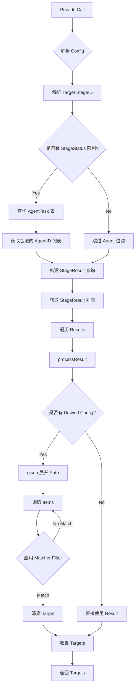

# 设计文档 - PreviousStageProvider 增强

## 架构概览
本次修改主要集中在 `PreviousStageProvider` 组件内部，引入 `matcher` 引擎作为过滤核心，并增强与 `AgentTask` 的关联查询。

## 核心组件设计
### PreviousStageProvider
- **依赖**:
    - `gorm.DB`: 用于查询 `scan_stages`, `agent_tasks`, `stage_results`。
    - `matcher`: 用于执行复杂过滤规则。

### 接口变更
无公开接口签名变更，仅 `Provide` 内部逻辑和 Config 结构体定义变更。

### 数据流
1.  **输入**: `TargetSourceConfig` (JSON)
2.  **处理**:
    - JSON -> `PreviousStageConfig` (含 `StageStatus`)
    - JSON -> `UnwindConfig` (含 `MatchRule`)
    - DB Query -> `AgentTask` (Status Check) -> `StageResult` (Data Fetch)
    - Memory -> `gjson` Parse -> `matcher.Match`
3.  **输出**: `[]Target`

## 异常处理
- **Config 解析失败**: 返回 error。
- **Stage 未找到**: 返回 error。
- **AgentTask 查询失败**: 返回 error。
- **MatchRule 执行错误**: 记录日志并跳过该 Item (Fail-safe) 或返回 error (Strict)。
    - *策略*: 鉴于 Filter 是为了精确筛选，如果 Rule 执行出错（如字段不存在），视为不匹配。

## 性能考虑
- **AgentTask 查询**: 增加了额外的 DB 查询。但在 Stage 级别，通常 AgentTask 数量很少（1-100），开销可忽略。
- **JSON 解析**: `gjson` 性能很高。
- **Matcher**: `matcher` 引擎是内存操作，性能取决于 Rule 复杂度和 Item 数量。对于单机处理通常不是瓶颈。
