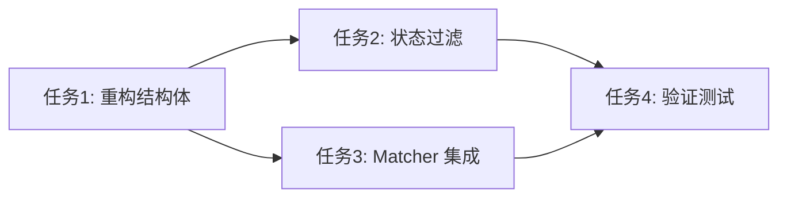

# 任务拆分文档 - PreviousStageProvider 增强

## 任务列表

### 任务1：重构配置结构体
#### 输入契约
- 文件: `internal/service/orchestrator/policy/provider_previous_stage.go`
- 依赖: `neomaster/internal/pkg/matcher`

#### 输出契约
- `PreviousStageConfig` 包含 `StageStatus []string`。
- `UnwindConfig` 的 `Filter` 类型变为 `matcher.MatchRule`。
- 代码编译通过。

### 任务2：实现 StageStatus 过滤逻辑
#### 输入契约
- 上下文包含 `WorkflowID`, `StageID`。
- `PreviousStageConfig` 已解析。

#### 输出契约
- 在 `Provide` 方法中，如果 `StageStatus` 不为空：
    - 查询 `agent_tasks` 表，获取符合状态的 `agent_id` 列表。
    - 查询 `stage_results` 时，增加 `agent_id IN (?)` 条件。
- 只有合法 Agent 产生的结果被获取。

### 任务3：集成 Matcher 引擎
#### 输入契约
- `processResult` 接收 `UnwindConfig` (含 `MatchRule`)。
- `StageResult.Attributes` 包含 JSON 数据。

#### 输出契约
- `processResult` 使用 `gjson` 展开数据。
- 将展开后的项转换为 `map[string]interface{}`。
- 调用 `matcher.Match` 进行过滤。
- 仅返回匹配的 Target。

### 任务4：验证测试
#### 输入契约
- 完成上述所有代码修改。

#### 输出契约
- 创建 `test/20251212/previous_stage_provider_test.go`。
- 使用 SQLite 内存数据库模拟环境。
- 测试用例覆盖：
    - 状态过滤有效性 (Running vs Completed)。
    - 复杂规则过滤有效性 (Nested Rules)。

## 依赖关系图

