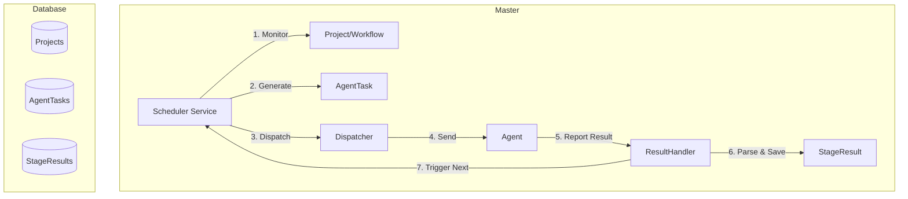

# 设计文档 - Scheduler_Implementation

## 架构概览
### 整体架构图


## 核心组件
### 1. AgentTask Model (New)
- **职责**: 连接 Orchestrator (ScanStage) 和 Agent 的中间实体，记录任务分发状态。
- **位置**: `internal/model/agent/task.go`
- **字段**:
  - `TaskID` (UUID)
  - `AgentID` (Assigned Agent)
  - `ScanStageID` (Source Stage)
  - `InputTarget` (Target for this task)
  - `Status` (Pending/Running/Completed/Failed)
  - `ResultSummary` (Brief result)
  - `RetryCount`

### 2. Scheduler Engine (Service)
- **职责**: 周期性轮询，驱动状态机。
- **位置**: `internal/service/scheduler/engine.go`
- **核心循环**:
  1.  Find running Projects.
  2.  Check current Stage status.
  3.  If Stage is pending/partial, generate Tasks.
  4.  Select Agents (Load Balancing).
  5.  Dispatch Tasks.

### 3. Dispatcher (Service)
- **职责**: 负责与 Agent 的实际通讯。
- **位置**: `internal/service/agent/dispatcher.go`
- **接口**: `Dispatch(task *AgentTask) error`

## 状态机设计
### Project 状态流转
- `Idle` -> `Running` (User Trigger)
- `Running` -> `Paused` (User Trigger)
- `Running` -> `Finished` (All Stages Completed)

### Task 状态流转
- `Pending` (Created, not assigned)
- `Assigned` (Sent to Agent)
- `Running` (Agent Ack)
- `Completed` (Result Received)
- `Failed` (Timeout/Error)

## 接口设计
### Master -> Agent (Task Dispatch)
- **Method**: gRPC/HTTP (TBD, interface abstraction first)
- **Payload**:
  ```json
  {
    "task_id": "uuid",
    "tool_name": "nmap",
    "params": "-sS -p 80",
    "targets": ["192.168.1.1"]
  }
  ```

### Agent -> Master (Result Report)
- **Method**: HTTP POST `/api/v1/agent/callback` (Existing or new)
- **Payload**:
  ```json
  {
    "task_id": "uuid",
    "status": "completed",
    "result": {...}
  }
  ```

## 数据模型
### AgentTask
```go
type AgentTask struct {
    basemodel.BaseModel
    TaskID       string `gorm:"uniqueIndex"`
    ProjectID    uint64
    WorkflowID   uint64
    StageID      uint64
    AgentID      string
    Status       string // pending, assigned, running, completed, failed
    InputTarget  string // JSON
    OutputResult string // JSON (Summary)
    ErrorMsg     string
    StartedAt    *time.Time
    FinishedAt   *time.Time
}
```
