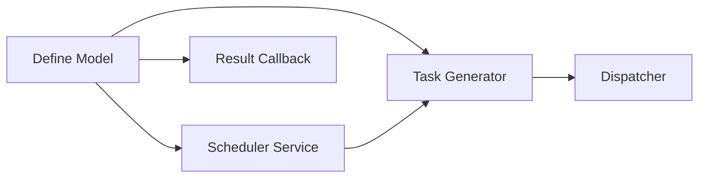

# 任务拆分文档 - Scheduler_Implementation

## 任务列表

### 任务1：定义 AgentTask 模型
#### 输入契约
- 无前置代码依赖
#### 输出契约
- `internal/model/agent/task.go`: 定义 `AgentTask` 结构体。
- 数据库迁移脚本 (自动迁移或 SQL)。
#### 实现约束
- 使用 `gorm`。
- 包含必要的索引 (TaskID, AgentID, Status)。

### 任务2：实现调度器核心服务 (Scheduler Service)
#### 输入契约
- 依赖 `AgentTask` 模型。
- 依赖 `Orchestrator` Service (获取 Project/Stage)。
#### 输出契约
- `internal/service/scheduler/engine.go`: 定义 `SchedulerService` 接口和实现。
- 实现 `Run()` 方法骨架 (Loop)。
#### 实现约束
- 单例模式或作为后台 Goroutine 启动。

### 任务3：实现任务生成逻辑 (Stage -> Tasks)
#### 输入契约
- `SchedulerService` 骨架已存在。
#### 输出契约
- `internal/service/scheduler/generator.go`: 实现从 `ScanStage` 生成 `AgentTask` 的逻辑。
- 支持简单的 Target 切分 (e.g., 1 task per target or batch).
#### 实现约束
- 暂时实现简单的 1-to-1 映射或不切分。

### 任务4：实现任务分发接口 (Dispatcher)
#### 输入契约
- `internal/service/agent/task.go` (Refactor).
#### 输出契约
- 完善 `AssignTask` 方法。
- 定义 `Dispatcher` 接口，支持 Mock。
#### 实现约束
- 优先实现 HTTP 调用的占位符或 Mock，确保调度流程跑通。

### 任务5：实现结果回调处理
#### 输入契约
- `AgentTask` 模型。
#### 输出契约
- `internal/handler/agent/callback.go`: 处理 Agent 汇报的结果。
- 更新 `AgentTask` 状态。
- 保存 `StageResult`。

## 依赖关系图

