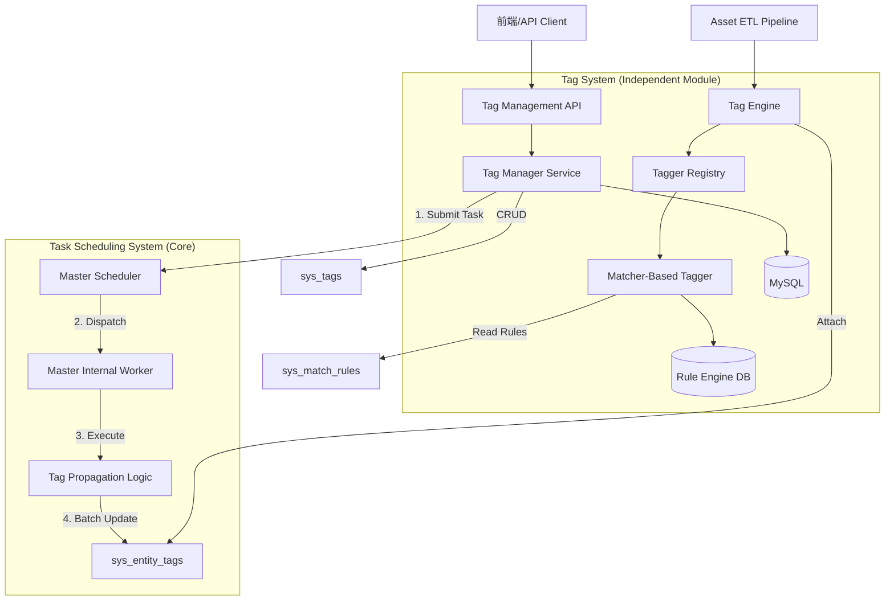

# 设计文档 - 分层标签体系 (Hierarchical Tagging System)

## 架构概览

本设计将标签系统构建为一个独立的服务模块 (`internal/service/tag_system`)，它不依赖具体的业务实体，而是通过接口与外部交互。
**为了充分利用 NeoScan 强大的任务调度能力，规则回溯与全量刷新将作为标准的“任务”进行调度，由 Master 节点的内部 Worker 执行。**

### 模块交互图



### 核心接口设计

```go
// Tagger 接口定义：所有打标器必须实现此接口
type Tagger interface {
    Name() string
    Tag(ctx context.Context, entity map[string]interface{}) ([]uint64, error)
}

// TagService 对外暴露的门面接口
type TagService interface {
    // 基础管理
    CreateTag(...)
    
    // 核心功能：自动打标 (实时)
    // 场景：新资产入库、资产属性变更
    AutoTag(ctx context.Context, entityType string, entityID string, attributes map[string]interface{}) error
    
    // 规则扩散/回溯 (基于任务调度)
    // 提交一个 "TagPropagation" 类型的任务给调度器
    // ruleID: 指定规则ID (若为0则全量刷新)
    SubmitPropagationTask(ctx context.Context, ruleID uint64) (taskID string, error)

    GetTagsByEntity(...)
}
```

## 核心业务流程 (Core Workflows)

### 1. 实时自动打标流程 (Real-time)
(保持不变：ETL -> AutoTag -> DB)

### 2. 规则扩散与回溯流程 (Task-Based Propagation)
**设计理念**: 利用 NeoScan 的核心调度能力，将“规则回溯”视为一种特殊的**系统任务**。
**优势**: 
*   **可视化**: 可以在任务列表中看到打标进度。
*   **可控性**: 支持暂停、重试、超时控制。
*   **灵活性**: 可以创建定时项目 (Cron Project)，每晚执行一次全量标签刷新。

**执行步骤**:

1.  **任务生成 (Producer)**:
    *   **场景 A (触发式)**: 用户修改规则 -> API 调用 `SubmitPropagationTask(ruleID)` -> 生成一个待执行任务。
    *   **场景 B (定时式)**: 用户配置一个 "Tag Refresh Project" (Cron) -> 调度器定期生成 "Tag Propagation Task"。
    
2.  **任务调度 (Scheduler)**:
    *   调度器识别到 `TaskType: "tag_propagation"`。
    *   **关键策略**: 此类任务**不分发给 Agent**，而是分发给 **Master 内部的 Worker**。
    *   *原因*: 这是一个数据密集型操作 (Data-Intensive)，需要大量读取数据库。在 Master (或靠近 DB 的节点) 执行效率最高，避免将海量资产数据传输给 Agent 的网络开销。

3.  **任务执行 (Consumer - Master Internal Worker)**:
    *   **Fetch**: 分页拉取资产数据 (Batch Size: 1000)。
    *   **Match**: 在内存中执行 `MatcherTagger` 逻辑。
    *   **Update**: 批量写入 `sys_entity_tags`。
    *   **Report**: 更新任务进度 (0% -> 100%)。

## 详细设计

### 1. 数据库设计 (MySQL)
(保持不变：sys_tags, sys_match_rules, sys_tag_auto_configs, sys_entity_tags)

### 2. 任务定义 (Task Definition)

**问题分析**: 
目前的 `AgentTask` 强绑定于 "Master -> Agent" 的分发模式。系统级任务（标签回溯、数据清洗）由 Master 本地执行，不需要 AgentID，也不应该进入 Agent 的调度队列。

**决策 (Decision)**:
为了清晰区分任务执行主体，避免字段含义混淆，决定在 `AgentTask` 表中**新增一个字段**，而不是通过 Magic String (如 "LOCAL_MASTER") 来区分。

**Schema 变更**:
在 `agent_tasks` 表中增加：
*   **Field**: `TaskCategory` (string)
*   **Values**:
    *   `"agent"` (Default): 下发给 Agent 执行的任务 (扫描、探测等)。
    *   `"system"`: Master 内部执行的系统任务 (标签回溯、数据清洗)。

**调度逻辑调整**:
1.  **Agent Dispatcher**: 只拉取 `TaskCategory = 'agent'` 的任务。
2.  **System Worker**: 只拉取 `TaskCategory = 'system'` 的任务。

**代码映射**:

```go
const (
    TaskCategoryAgent  = "agent"
    TaskCategorySystem = "system"

    // Task Tool Names (System)
    ToolNameSysTagPropagation = "sys_tag_propagation"
    ToolNameSysAssetCleanup   = "sys_asset_cleanup"
)

// 1. 标签传播任务载荷 (Tag Propagation Payload)
type TagPropagationPayload struct {
    TargetType string            `json:"target_type"` // host, web, network
    Action     string            `json:"action"`      // add, remove
    Tags       []string          `json:"tags"`        // 要添加/移除的标签列表
    Rule       matcher.MatchRule `json:"rule"`        // 匹配规则 (复杂嵌套逻辑)
}

// 2. 资产清洗任务载荷 (Asset Cleanup Payload)
type AssetCleanupPayload struct {
    TargetType string            `json:"target_type"` // host, web, network
    Rule       matcher.MatchRule `json:"rule"`        // 匹配规则 (匹配到的资产将被删除)
}
```

### 3. API 接口规范

| Method | Endpoint | Description |
| :--- | :--- | :--- |
| POST | `/api/v1/rules` | 创建规则 |
| POST | `/api/v1/tag-system/propagate` | 手动触发回溯 (创建任务) |
| GET  | `/api/v1/tasks?type=sys_tag_propagation` | 查看打标任务进度 |

## 迁移与实施
1.  **Phase 1**: 数据库与 Matcher 库准备。
2.  **Phase 2**: 实现 Master 内部的任务执行器 (`InternalTaskWorker`)。
3.  **Phase 3**: 集成调度器，支持 `TagPropagation` 任务分发。
